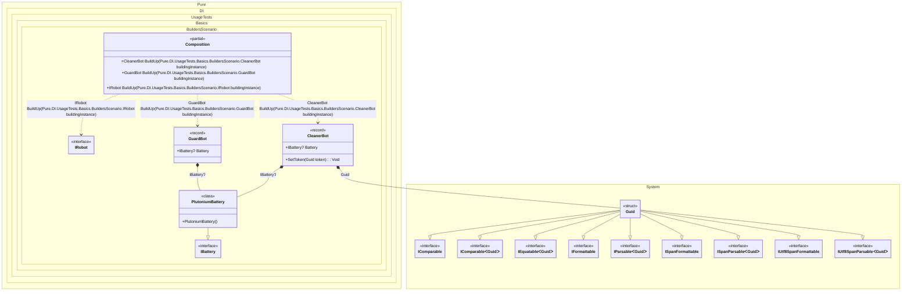

#### Builders

Sometimes you need builders for all types derived from `T` that are known at compile time.


```c#
using Shouldly;
using Pure.DI;

DI.Setup(nameof(Composition))
    .Bind().To(Guid.NewGuid)
    .Bind().To<PlutoniumBattery>()
    // Creates a builder for each type inherited from IRobot.
    // These types must be available at this point in the code.
    .Builders<IRobot>("BuildUp", filter: "*Bot");

var composition = new Composition();

var cleaner = composition.BuildUp(new CleanerBot());
cleaner.Token.ShouldNotBe(Guid.Empty);
cleaner.Battery.ShouldBeOfType<PlutoniumBattery>();

var guard = composition.BuildUp(new GuardBot());
guard.Token.ShouldBe(Guid.Empty);
guard.Battery.ShouldBeOfType<PlutoniumBattery>();

// Uses a common method to build an instance
IRobot robot = new CleanerBot();
robot = composition.BuildUp(robot);
robot.ShouldBeOfType<CleanerBot>();
robot.Token.ShouldNotBe(Guid.Empty);
robot.Battery.ShouldBeOfType<PlutoniumBattery>();

// Uses a safe common method when the runtime subtype may be unknown.
var externalRobot = new ExternalRobot();
composition.TryBuildUp(externalRobot).ShouldBeFalse();
externalRobot.Battery.ShouldBeNull();

// The strict builder still throws for unknown runtime subtypes.
Should.Throw<ArgumentException>(() => composition.BuildUp(externalRobot));

interface IBattery;

class PlutoniumBattery : IBattery;

interface IRobot
{
    Guid Token { get; }

    IBattery? Battery { get; }
}

record CleanerBot : IRobot
{
    public Guid Token { get; private set; } = Guid.Empty;

    // The Dependency attribute specifies to perform an injection
    [Dependency]
    public IBattery? Battery { get; set; }

    [Dependency]
    public void SetToken(Guid token) => Token = token;
}

record GuardBot : IRobot
{
    public Guid Token => Guid.Empty;

    [Dependency]
    public IBattery? Battery { get; set; }
}

record ExternalRobot : IRobot
{
    public Guid Token => Guid.Empty;

    public IBattery? Battery => null;
}
```

<details>
<summary>Running this code sample locally</summary>

- Make sure you have the [.NET SDK 10.0](https://dotnet.microsoft.com/en-us/download/dotnet/10.0) or later installed
```bash
dotnet --list-sdk
```
- Create a net10.0 (or later) console application
```bash
dotnet new console -n Sample
```
- Add references to the NuGet packages
  - [Pure.DI](https://www.nuget.org/packages/Pure.DI)
  - [Shouldly](https://www.nuget.org/packages/Shouldly)
```bash
dotnet add package Pure.DI
dotnet add package Shouldly
```
- Copy the example code into the _Program.cs_ file

You are ready to run the example 🚀
```bash
dotnet run
```

</details>

Important Notes:
- The default builder method name is `BuildUp`
- The first argument to the builder method is always the instance to be built
- `Builders<T>` also generates `TryBuildUp` for safe build-up when the runtime subtype may be unknown

<details>
<summary>The following partial class will be generated</summary>

```c#
partial class Composition
{
  [MethodImpl(MethodImplOptions.AggressiveInlining)]
  public CleanerBot BuildUp(CleanerBot buildingInstance)
  {
    if (buildingInstance is null) throw new ArgumentNullException(nameof(buildingInstance));
    CleanerBot transientCleanerBot;
    CleanerBot localBuildingInstance = buildingInstance;
    Guid transientGuid = Guid.NewGuid();
    localBuildingInstance.Battery = new PlutoniumBattery();
    localBuildingInstance.SetToken(transientGuid);
    transientCleanerBot = localBuildingInstance;
    return transientCleanerBot;
  }

  [MethodImpl(MethodImplOptions.AggressiveInlining)]
  public GuardBot BuildUp(GuardBot buildingInstance)
  {
    if (buildingInstance is null) throw new ArgumentNullException(nameof(buildingInstance));
    GuardBot transientGuardBot;
    GuardBot localBuildingInstance = buildingInstance;
    localBuildingInstance.Battery = new PlutoniumBattery();
    transientGuardBot = localBuildingInstance;
    return transientGuardBot;
  }

  #pragma warning disable CS0162
  [MethodImpl(MethodImplOptions.NoInlining)]
  public IRobot BuildUp(IRobot buildingInstance)
  {
    if (buildingInstance is null) throw new ArgumentNullException(nameof(buildingInstance));
    if (TryBuildUp(buildingInstance))
    {
      return buildingInstance;
    }
    throw new ArgumentException($"Unable to build an instance of typeof type {buildingInstance.GetType()}.", "buildingInstance");
  }
  #pragma warning restore CS0162

  #pragma warning disable CS0162
  [MethodImpl(MethodImplOptions.NoInlining)]
  public bool TryBuildUp(IRobot buildingInstance)
  {
    if (buildingInstance is null) throw new ArgumentNullException(nameof(buildingInstance));
    switch (buildingInstance)
    {
      case CleanerBot CleanerBot:
        BuildUp(CleanerBot);
        return true;
      case GuardBot GuardBot:
        BuildUp(GuardBot);
        return true;
      default:
        return false;
    }
    return false;
  }
  #pragma warning restore CS0162
}
```

</details>

Class diagram:


```mermaid
---
 config:
  class:
   hideEmptyMembersBox: true
---
classDiagram
	Guid --|> IComparable
	Guid --|> IComparableᐸGuidᐳ
	Guid --|> IEquatableᐸGuidᐳ
	Guid --|> IFormattable
	Guid --|> IParsableᐸGuidᐳ
	Guid --|> ISpanFormattable
	Guid --|> ISpanParsableᐸGuidᐳ
	Guid --|> IUtf8SpanFormattable
	Guid --|> IUtf8SpanParsableᐸGuidᐳ
	PlutoniumBattery --|> IBattery
	Composition ..> IRobot : IRobot BuildUp(Pure.DI.UsageTests.Basics.BuildersScenario.IRobot buildingInstance)
	Composition ..> GuardBot : GuardBot BuildUp(Pure.DI.UsageTests.Basics.BuildersScenario.GuardBot buildingInstance)
	Composition ..> CleanerBot : CleanerBot BuildUp(Pure.DI.UsageTests.Basics.BuildersScenario.CleanerBot buildingInstance)
	CleanerBot *-- Guid : Guid
	CleanerBot *-- PlutoniumBattery : IBatteryɁ
	GuardBot *-- PlutoniumBattery : IBatteryɁ
	namespace Pure.DI.UsageTests.Basics.BuildersScenario {
		class CleanerBot {
				<<record>>
			+IBatteryɁ Battery
			+SetToken(Guid token) : Void
		}
		class Composition {
		<<partial>>
		+CleanerBot BuildUp(Pure.DI.UsageTests.Basics.BuildersScenario.CleanerBot buildingInstance)
		+GuardBot BuildUp(Pure.DI.UsageTests.Basics.BuildersScenario.GuardBot buildingInstance)
		+IRobot BuildUp(Pure.DI.UsageTests.Basics.BuildersScenario.IRobot buildingInstance)
		}
		class GuardBot {
				<<record>>
			+IBatteryɁ Battery
		}
		class IBattery {
			<<interface>>
		}
		class IRobot {
				<<interface>>
		}
		class PlutoniumBattery {
				<<class>>
			+PlutoniumBattery()
		}
	}
	namespace System {
		class Guid {
				<<struct>>
		}
		class IComparable {
			<<interface>>
		}
		class IComparableᐸGuidᐳ {
			<<interface>>
		}
		class IEquatableᐸGuidᐳ {
			<<interface>>
		}
		class IFormattable {
			<<interface>>
		}
		class IParsableᐸGuidᐳ {
			<<interface>>
		}
		class ISpanFormattable {
			<<interface>>
		}
		class ISpanParsableᐸGuidᐳ {
			<<interface>>
		}
		class IUtf8SpanFormattable {
			<<interface>>
		}
		class IUtf8SpanParsableᐸGuidᐳ {
			<<interface>>
		}
	}
```

See also:

- [Builder](builder.md)
- [Builders with a name template](builders-with-a-name-template.md)

