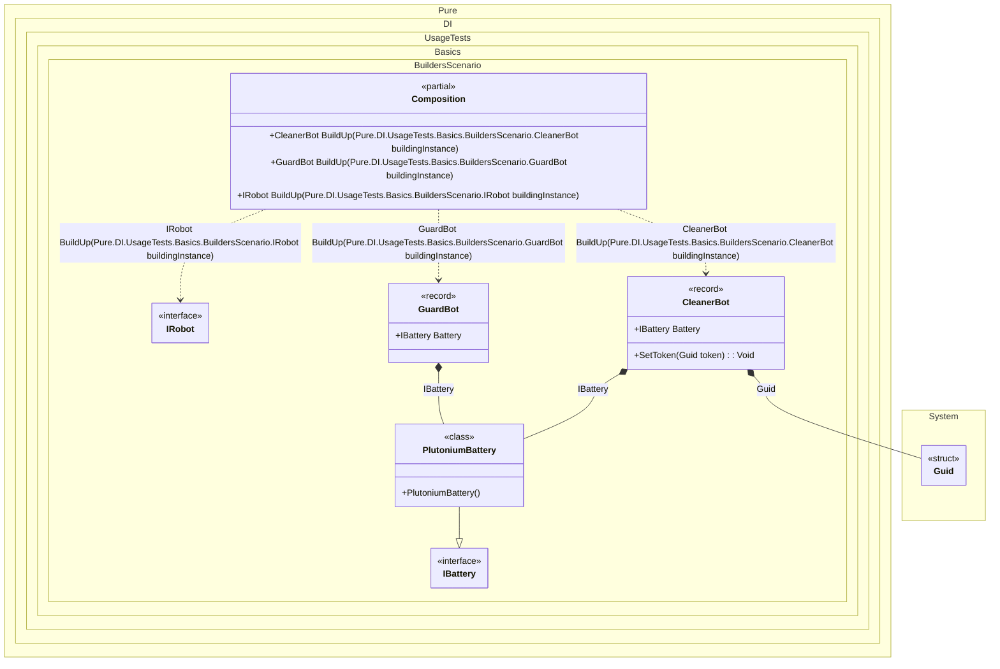

#### Builders

Sometimes you need builders for all types inherited from <see cref=“T”/> available at compile time at the point where the method is called.


```c#
using Shouldly;
using Pure.DI;

DI.Setup(nameof(Composition))
    .Bind().To(_ => Guid.NewGuid())
    .Bind().To<PlutoniumBattery>()
    // Creates a builder for each type inherited from IRobot.
    // These types must be available at this point in the code.
    .Builders<IRobot>("BuildUp");

var composition = new Composition();

var cleaner = composition.BuildUp(new CleanerBot());
cleaner.Token.ShouldNotBe(Guid.Empty);
cleaner.Battery.ShouldBeOfType<PlutoniumBattery>();

var guard = composition.BuildUp(new GuardBot());
guard.Token.ShouldBe(Guid.Empty);
guard.Battery.ShouldBeOfType<PlutoniumBattery>();

// Uses a common method to build an instance
IRobot robot = new CleanerBot();
robot = composition.BuildUp(robot);
robot.ShouldBeOfType<CleanerBot>();
robot.Token.ShouldNotBe(Guid.Empty);
robot.Battery.ShouldBeOfType<PlutoniumBattery>();

interface IBattery;

class PlutoniumBattery : IBattery;

interface IRobot
{
    Guid Token { get; }

    IBattery? Battery { get; }
}

record CleanerBot : IRobot
{
    public Guid Token { get; private set; } = Guid.Empty;

    // The Dependency attribute specifies to perform an injection
    [Dependency]
    public IBattery? Battery { get; set; }

    [Dependency]
    public void SetToken(Guid token) => Token = token;
}

record GuardBot : IRobot
{
    public Guid Token => Guid.Empty;

    [Dependency]
    public IBattery? Battery { get; set; }
}
```

<details>
<summary>Running this code sample locally</summary>

- Make sure you have the [.NET SDK 10.0](https://dotnet.microsoft.com/en-us/download/dotnet/10.0) or later is installed
```bash
dotnet --list-sdk
```
- Create a net10.0 (or later) console application
```bash
dotnet new console -n Sample
```
- Add references to NuGet packages
  - [Pure.DI](https://www.nuget.org/packages/Pure.DI)
  - [Shouldly](https://www.nuget.org/packages/Shouldly)
```bash
dotnet add package Pure.DI
dotnet add package Shouldly
```
- Copy the example code into the _Program.cs_ file

You are ready to run the example 🚀
```bash
dotnet run
```

</details>

Important Notes:
- The default builder method name is `BuildUp`
- The first argument to the builder method is always the instance to be built

The following partial class will be generated:

```c#
partial class Composition
{
#if NET9_0_OR_GREATER
  private readonly Lock _lock;
#else
  private readonly Object _lock;
#endif

  [OrdinalAttribute(256)]
  public Composition()
  {
#if NET9_0_OR_GREATER
    _lock = new Lock();
#else
    _lock = new Object();
#endif
  }

  internal Composition(Composition parentScope)
  {
    _lock = parentScope._lock;
  }

  [MethodImpl(MethodImplOptions.AggressiveInlining)]
  public CleanerBot BuildUp(CleanerBot buildingInstance)
  {
    if (buildingInstance is null) throw new ArgumentNullException(nameof(buildingInstance));
    CleanerBot transientCleanerBot5;
    CleanerBot localBuildingInstance3 = buildingInstance;
    Guid transientGuid8 = Guid.NewGuid();
    localBuildingInstance3.Battery = new PlutoniumBattery();
    localBuildingInstance3.SetToken(transientGuid8);
    transientCleanerBot5 = localBuildingInstance3;
    return transientCleanerBot5;
  }

  [MethodImpl(MethodImplOptions.AggressiveInlining)]
  public GuardBot BuildUp(GuardBot buildingInstance)
  {
    if (buildingInstance is null) throw new ArgumentNullException(nameof(buildingInstance));
    GuardBot transientGuardBot2;
    GuardBot localBuildingInstance2 = buildingInstance;
    localBuildingInstance2.Battery = new PlutoniumBattery();
    transientGuardBot2 = localBuildingInstance2;
    return transientGuardBot2;
  }

  #pragma warning disable CS0162
  [MethodImpl(MethodImplOptions.NoInlining)]
  public IRobot BuildUp(IRobot buildingInstance)
  {
    if (buildingInstance is null) throw new ArgumentNullException(nameof(buildingInstance));
    IRobot transientIRobot;
    IRobot localBuildingInstance1 = buildingInstance;
    switch (localBuildingInstance1)
    {
      case CleanerBot localCleanerBot:
      {
        transientIRobot = BuildUp(localCleanerBot);
        goto transientIRobotFinish;
      }

      case GuardBot localGuardBot:
      {
        transientIRobot = BuildUp(localGuardBot);
        goto transientIRobotFinish;
      }

      default:
        throw new ArgumentException($"Unable to build an instance of typeof type {localBuildingInstance1.GetType()}.", "buildingInstance");
    }

    transientIRobot = localBuildingInstance1;
    transientIRobotFinish:
      ;
    return transientIRobot;
  }
  #pragma warning restore CS0162
}
```

Class diagram:



