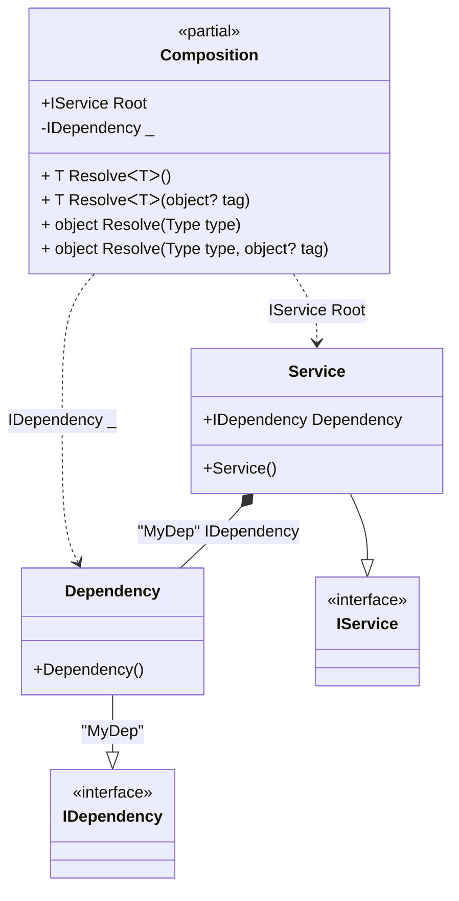

#### Check for a root

[](../tests/Pure.DI.UsageTests/Hints/CheckForRootScenario.cs)

Sometimes you need to check if you can get the root of a composition using the _Resolve_ method before calling it, this example will show you how to do it:


```c#
interface IDependency;

class Dependency : IDependency;

interface IService
{
    IDependency Dependency { get;}
}

class Service : IService
{
    [Tag("MyDep")]
    public required IDependency Dependency { get; init; }
}

partial class Composition
{
    private static readonly HashSet<(Type type, object? tag)> Roots = [];

    // Check that the root can be resolved by Resolve methods
    internal static bool HasRoot(Type type, object? key = default) =>
        Roots.Contains((type, key));

    void Setup() =>
        DI.Setup(nameof(Composition))
            // Specifies to use the partial OnNewRoot method
            // to register each root
            .Hint(Hint.OnNewRoot, "On")

            .Bind("MyDep").To<Dependency>()
            .Bind().To<Service>()

            // Composition roots
            .Root<IDependency>(tag: "MyDep")
            .Root<IService>("Root");

    // Adds a new root to the hash set
    private static partial void OnNewRoot<TContract, T>(
        IResolver<Composition, TContract> resolver,
        string name,
        object? tag,
        Lifetime lifetime) =>
        Roots.Add((typeof(TContract), tag));
}

Composition.HasRoot(typeof(IService)).ShouldBeTrue();
Composition.HasRoot(typeof(IDependency), "MyDep").ShouldBeTrue();
        
Composition.HasRoot(typeof(IDependency)).ShouldBeFalse();
Composition.HasRoot(typeof(IComparable)).ShouldBeFalse();
        
```

For more hints, see [this](README.md#setup-hints) page.

The following partial class will be generated:

```c#
partial class Composition
{
  private readonly Composition _root;

  public Composition()
  {
    _root = this;
  }

  internal Composition(Composition parentScope)
  {
    _root = (parentScope ?? throw new ArgumentNullException(nameof(parentScope)))._root;
  }

  public IService Root
  {
    [MethodImpl(MethodImplOptions.AggressiveInlining)]
    get
    {
      return new Service()
      {
          Dependency = new Dependency()
      };
    }
  }

  private IDependency Root2
  {
    [MethodImpl(MethodImplOptions.AggressiveInlining)]
    get
    {
      return new Dependency();
    }
  }

  [MethodImpl(MethodImplOptions.AggressiveInlining)]
  public T Resolve<T>()
  {
    return Resolver<T>.Value.Resolve(this);
  }

  [MethodImpl(MethodImplOptions.AggressiveInlining)]
  public T Resolve<T>(object? tag)
  {
    return Resolver<T>.Value.ResolveByTag(this, tag);
  }

  [MethodImpl(MethodImplOptions.AggressiveInlining)]
  public object Resolve(Type type)
  {
    var index = (int)(_bucketSize * ((uint)RuntimeHelpers.GetHashCode(type) % 4));
    ref var pair = ref _buckets[index];
    return pair.Key == type ? pair.Value.Resolve(this) : Resolve(type, index);
  }

  [MethodImpl(MethodImplOptions.NoInlining)]
  private object Resolve(Type type, int index)
  {
    var finish = index + _bucketSize;
    while (++index < finish)
    {
      ref var pair = ref _buckets[index];
      if (pair.Key == type)
      {
        return pair.Value.Resolve(this);
      }
    }

    throw new InvalidOperationException($"{CannotResolveMessage} {OfTypeMessage} {type}.");
  }

  [MethodImpl(MethodImplOptions.AggressiveInlining)]
  public object Resolve(Type type, object? tag)
  {
    var index = (int)(_bucketSize * ((uint)RuntimeHelpers.GetHashCode(type) % 4));
    ref var pair = ref _buckets[index];
    return pair.Key == type ? pair.Value.ResolveByTag(this, tag) : Resolve(type, tag, index);
  }

  [MethodImpl(MethodImplOptions.NoInlining)]
  private object Resolve(Type type, object? tag, int index)
  {
    var finish = index + _bucketSize;
    while (++index < finish)
    {
      ref var pair = ref _buckets[index];
      if (pair.Key == type)
      {
        return pair.Value.ResolveByTag(this, tag);
      }
    }

    throw new InvalidOperationException($"{CannotResolveMessage} \"{tag}\" {OfTypeMessage} {type}.");
  }

  private readonly static int _bucketSize;
  private readonly static Pair<Type, IResolver<Composition, object>>[] _buckets;

  private static partial void OnNewRoot<TContract, T>(IResolver<Composition, TContract> resolver, string name, object? tag, Lifetime lifetime);

  static Composition()
  {
    var valResolver_0000 = new Resolver_0000();
    OnNewRoot<IService, Service>(valResolver_0000, "Root", null, Lifetime.Transient);
    Resolver<IService>.Value = valResolver_0000;
    var valResolver_0001 = new Resolver_0001();
    OnNewRoot<IDependency, Dependency>(valResolver_0001, "Root2", "MyDep", Lifetime.Transient);
    Resolver<IDependency>.Value = valResolver_0001;
    _buckets = Buckets<Type, IResolver<Composition, object>>.Create(
      4,
      out _bucketSize,
      new Pair<Type, IResolver<Composition, object>>[2]
      {
         new Pair<Type, IResolver<Composition, object>>(typeof(IService), valResolver_0000)
        ,new Pair<Type, IResolver<Composition, object>>(typeof(IDependency), valResolver_0001)
      });
  }

  private const string CannotResolveMessage = "Cannot resolve composition root ";
  private const string OfTypeMessage = "of type ";

  private class Resolver<T>: IResolver<Composition, T>
  {
    public static IResolver<Composition, T> Value = new Resolver<T>();

    public virtual T Resolve(Composition composite)
    {
      throw new InvalidOperationException($"{CannotResolveMessage}{OfTypeMessage}{typeof(T)}.");
    }

    public virtual T ResolveByTag(Composition composite, object tag)
    {
      throw new InvalidOperationException($"{CannotResolveMessage}\"{tag}\" {OfTypeMessage}{typeof(T)}.");
    }
  }

  private sealed class Resolver_0000: Resolver<IService>
  {
    public override IService Resolve(Composition composition)
    {
      return composition.Root;
    }

    public override IService ResolveByTag(Composition composition, object tag)
    {
      switch (tag)
      {
        case null:
          return composition.Root;

        default:
          return base.ResolveByTag(composition, tag);
      }
    }
  }

  private sealed class Resolver_0001: Resolver<IDependency>
  {
    public override IDependency Resolve(Composition composition)
    {
      return base.Resolve(composition);
    }

    public override IDependency ResolveByTag(Composition composition, object tag)
    {
      switch (tag)
      {
        case "MyDep":
          return composition.Root2;

        default:
          return base.ResolveByTag(composition, tag);
      }
    }
  }
}
```

Class diagram:



