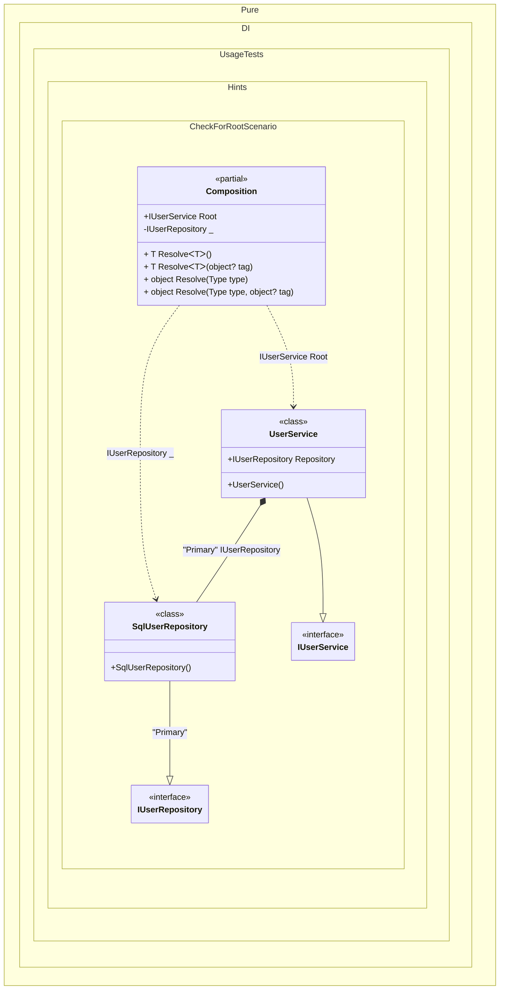

#### Check for a root

Sometimes you need to check if you can get the root of a composition using the _Resolve_ method before calling it, this example will show you how to do it:


```c#
using Shouldly;
using Pure.DI;

// Check if the main user service is registered
Composition.HasRoot(typeof(IUserService)).ShouldBeTrue();

// Check if the root dependency for the repository with the "Primary" tag exists
Composition.HasRoot(typeof(IUserRepository), "Primary").ShouldBeTrue();

// Verify that the abstract repository without a tag is NOT registered as a root
Composition.HasRoot(typeof(IUserRepository)).ShouldBeFalse();
Composition.HasRoot(typeof(IComparable)).ShouldBeFalse();


// Repository interface for user data access
interface IUserRepository;

// Concrete repository implementation (e.g., SQL Database)
class SqlUserRepository : IUserRepository;

// Business service interface
interface IUserService
{
    IUserRepository Repository { get; }
}

// Service requiring a specific repository implementation
class UserService : IUserService
{
    // Use the "Primary" tag to specify which database to use
    [Tag("Primary")]
    public required IUserRepository Repository { get; init; }
}

partial class Composition
{
    private static readonly HashSet<(Type type, object? tag)> Roots = [];

    // The method checks if the type can be resolved without actually creating the object.
    // Useful for diagnostics.
    internal static bool HasRoot(Type type, object? key = null) =>
        Roots.Contains((type, key));

    static void Setup() =>
        DI.Setup()
            // Specifies to use the partial OnNewRoot method to register roots
            .Hint(Hint.OnNewRoot, "On")

            // Registers the repository implementation with the "Primary" tag
            .Bind("Primary").To<SqlUserRepository>()
            .Bind().To<UserService>()

            // Defines composition roots
            .Root<IUserRepository>(tag: "Primary")
            .Root<IUserService>("Root");

    // Adds a new root to the HashSet during code generation
    private static partial void OnNewRoot<TContract, T>(
        IResolver<Composition, TContract> resolver,
        string name,
        object? tag,
        Lifetime lifetime) =>
        Roots.Add((typeof(TContract), tag));
}
```

<details>
<summary>Running this code sample locally</summary>

- Make sure you have the [.NET SDK 10.0](https://dotnet.microsoft.com/en-us/download/dotnet/10.0) or later is installed
```bash
dotnet --list-sdk
```
- Create a net10.0 (or later) console application
```bash
dotnet new console -n Sample
```
- Add references to NuGet packages
  - [Pure.DI](https://www.nuget.org/packages/Pure.DI)
  - [Shouldly](https://www.nuget.org/packages/Shouldly)
```bash
dotnet add package Pure.DI
dotnet add package Shouldly
```
- Copy the example code into the _Program.cs_ file

You are ready to run the example 🚀
```bash
dotnet run
```

</details>

For more hints, see [this](README.md#setup-hints) page.

The following partial class will be generated:

```c#
partial class Composition
{
  [OrdinalAttribute(256)]
  public Composition()
  {
  }

  internal Composition(Composition parentScope)
  {
  }

  public IUserService Root
  {
    [MethodImpl(MethodImplOptions.AggressiveInlining)]
    get
    {
      return new UserService()
      {
        Repository = new SqlUserRepository()
      };
    }
  }

  private IUserRepository Root2
  {
    [MethodImpl(MethodImplOptions.AggressiveInlining)]
    get
    {
      return new SqlUserRepository();
    }
  }

  [MethodImpl(MethodImplOptions.AggressiveInlining)]
  public T Resolve<T>()
  {
    return Resolver<T>.Value.Resolve(this);
  }

  [MethodImpl(MethodImplOptions.AggressiveInlining)]
  public T Resolve<T>(object? tag)
  {
    return Resolver<T>.Value.ResolveByTag(this, tag);
  }

  [MethodImpl(MethodImplOptions.AggressiveInlining)]
  public object Resolve(Type type)
  {
    #if NETCOREAPP3_0_OR_GREATER
    var index = (int)(_bucketSize * (((uint)type.TypeHandle.GetHashCode()) % 4));
    #else
    var index = (int)(_bucketSize * (((uint)RuntimeHelpers.GetHashCode(type)) % 4));
    #endif
    ref var pair = ref _buckets[index];
    return Object.ReferenceEquals(pair.Key, type) ? pair.Value.Resolve(this) : Resolve(type, index);
  }

  [MethodImpl(MethodImplOptions.NoInlining)]
  private object Resolve(Type type, int index)
  {
    var finish = index + _bucketSize;
    while (++index < finish)
    {
      ref var pair = ref _buckets[index];
      if (Object.ReferenceEquals(pair.Key, type))
      {
        return pair.Value.Resolve(this);
      }
    }

    throw new CannotResolveException($"{CannotResolveMessage} {OfTypeMessage} {type}.", type, null);
  }

  [MethodImpl(MethodImplOptions.AggressiveInlining)]
  public object Resolve(Type type, object? tag)
  {
    #if NETCOREAPP3_0_OR_GREATER
    var index = (int)(_bucketSize * (((uint)type.TypeHandle.GetHashCode()) % 4));
    #else
    var index = (int)(_bucketSize * (((uint)RuntimeHelpers.GetHashCode(type)) % 4));
    #endif
    ref var pair = ref _buckets[index];
    return Object.ReferenceEquals(pair.Key, type) ? pair.Value.ResolveByTag(this, tag) : Resolve(type, tag, index);
  }

  [MethodImpl(MethodImplOptions.NoInlining)]
  private object Resolve(Type type, object? tag, int index)
  {
    var finish = index + _bucketSize;
    while (++index < finish)
    {
      ref var pair = ref _buckets[index];
      if (Object.ReferenceEquals(pair.Key, type))
      {
        return pair.Value.ResolveByTag(this, tag);
      }
    }

    throw new CannotResolveException($"{CannotResolveMessage} \"{tag}\" {OfTypeMessage} {type}.", type, tag);
  }

  private readonly static uint _bucketSize;
  private readonly static Pair<IResolver<Composition, object>>[] _buckets;

  private static partial void OnNewRoot<TContract, T>(IResolver<Composition, TContract> resolver, string name, object? tag, Lifetime lifetime);

  static Composition()
  {
    var valResolver_0000 = new Resolver_0000();
    OnNewRoot<IUserService, UserService>(valResolver_0000, "Root", null, Lifetime.Transient);
    Resolver<IUserService>.Value = valResolver_0000;
    var valResolver_0001 = new Resolver_0001();
    OnNewRoot<IUserRepository, SqlUserRepository>(valResolver_0001, "Root2", "Primary", Lifetime.Transient);
    Resolver<IUserRepository>.Value = valResolver_0001;
    _buckets = Buckets<IResolver<Composition, object>>.Create(
      4,
      out _bucketSize,
      new Pair<IResolver<Composition, object>>[2]
      {
         new Pair<IResolver<Composition, object>>(typeof(IUserService), valResolver_0000)
        ,new Pair<IResolver<Composition, object>>(typeof(IUserRepository), valResolver_0001)
      });
  }

  private const string CannotResolveMessage = "Cannot resolve composition root ";
  private const string OfTypeMessage = "of type ";

  private class Resolver<T>: IResolver<Composition, T>
  {
    public static IResolver<Composition, T> Value = new Resolver<T>();

    public virtual T Resolve(Composition composite)
    {
      throw new CannotResolveException($"{CannotResolveMessage}{OfTypeMessage}{typeof(T)}.", typeof(T), null);
    }

    public virtual T ResolveByTag(Composition composite, object tag)
    {
      throw new CannotResolveException($"{CannotResolveMessage}\"{tag}\" {OfTypeMessage}{typeof(T)}.", typeof(T), tag);
    }
  }

  private sealed class Resolver_0000: Resolver<IUserService>
  {
    public override IUserService Resolve(Composition composition)
    {
      return composition.Root;
    }

    public override IUserService ResolveByTag(Composition composition, object tag)
    {
      switch (tag)
      {
        case null:
          return composition.Root;

        default:
          return base.ResolveByTag(composition, tag);
      }
    }
  }

  private sealed class Resolver_0001: Resolver<IUserRepository>
  {
    public override IUserRepository Resolve(Composition composition)
    {
      return base.Resolve(composition);
    }

    public override IUserRepository ResolveByTag(Composition composition, object tag)
    {
      switch (tag)
      {
        case "Primary":
          return composition.Root2;

        default:
          return base.ResolveByTag(composition, tag);
      }
    }
  }
}
```

Class diagram:



