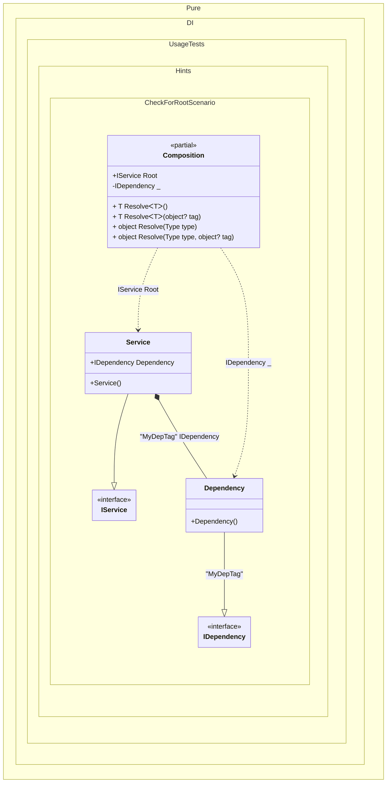

#### Check for a root

[](../tests/Pure.DI.UsageTests/Hints/CheckForRootScenario.cs)

Sometimes you need to check if you can get the root of a composition using the _Resolve_ method before calling it, this example will show you how to do it:


```c#
using Pure.DI;
using Shouldly;

Composition.HasRoot(typeof(IService)).ShouldBeTrue();
Composition.HasRoot(typeof(IDependency), "MyDepTag").ShouldBeTrue();

Composition.HasRoot(typeof(IDependency)).ShouldBeFalse();
Composition.HasRoot(typeof(IComparable)).ShouldBeFalse();


interface IDependency;

class Dependency : IDependency;

interface IService
{
    IDependency Dependency { get; }
}

class Service : IService
{
    [Tag("MyDepTag")]
    public required IDependency Dependency { get; init; }
}

partial class Composition
{
    private static readonly HashSet<(Type type, object? tag)> Roots = [];

    // Check that the root can be resolved by Resolve methods
    internal static bool HasRoot(Type type, object? key = null) =>
        Roots.Contains((type, key));

    static void Setup() =>
        DI.Setup()
            // Specifies to use the partial OnNewRoot method
            // to register each root
            .Hint(Hint.OnNewRoot, "On")
            .Bind("MyDepTag").To<Dependency>()
            .Bind().To<Service>()

            // Composition roots
            .Root<IDependency>(tag: "MyDepTag")
            .Root<IService>("Root");

    // Adds a new root to the hash set
    private static partial void OnNewRoot<TContract, T>(
        IResolver<Composition, TContract> resolver,
        string name,
        object? tag,
        Lifetime lifetime) =>
        Roots.Add((typeof(TContract), tag));
}
```

For more hints, see [this](README.md#setup-hints) page.


Class diagram:



