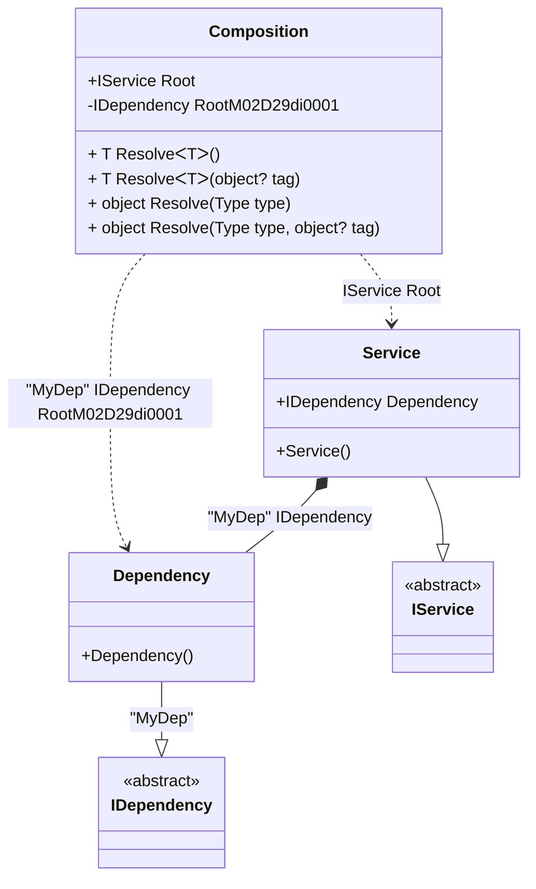

#### Check for a root

[](../tests/Pure.DI.UsageTests/Basics/CheckForRootScenario.cs)

Sometimes you need to check if you can get the root of a composition using the _Resolve_ method before calling it, this example will show you how to do it:

```c#
interface IDependency;

class Dependency : IDependency;

interface IService
{
    IDependency Dependency { get;}
}

class Service : IService
{
    [Tag("MyDep")]
    public required IDependency Dependency { get; init; }
}

partial class Composition
{
    private static readonly HashSet<(Type type, object? tag)> Roots = [];

    // Check that the root can be resolved by Resolve methods
    internal static bool HasRoot(Type type, object? key = default) =>
        Roots.Contains((type, key));

    private static void Setup() =>
        DI.Setup(nameof(Composition))
            // Specifies to use the partial OnNewRoot method
            // to register each root
            .Hint(Hint.OnNewRoot, "On")

            .Bind<IDependency>("MyDep").To<Dependency>()
            .Bind<IService>().To<Service>()

            .Root<IDependency>(tag: "MyDep")
            .Root<IService>("Root");

    // Adds a new root to the hash set
    private static partial void OnNewRoot<TContract, T>(
        IResolver<Composition, TContract> resolver,
        string name,
        object? tag,
        Lifetime lifetime) =>
        Roots.Add((typeof(TContract), tag));
}

Composition.HasRoot(typeof(IService)).ShouldBeTrue();
Composition.HasRoot(typeof(IDependency), "MyDep").ShouldBeTrue();
        
Composition.HasRoot(typeof(IDependency)).ShouldBeFalse();
Composition.HasRoot(typeof(IComparable)).ShouldBeFalse();
        
```

<details open>
<summary>Class Diagram</summary>



</details>

<details>
<summary>Pure.DI-generated partial class Composition</summary><blockquote>

```c#
/// <para>
/// Composition roots:<br/>
/// <list type="table">
/// <listheader>
/// <term>Root</term>
/// <description>Description</description>
/// </listheader>
/// <item>
/// <term>
/// <see cref="Pure.DI.UsageTests.Basics.CheckForRootScenario.Service"/> Root
/// </term>
/// <description>
/// </description>
/// </item>
/// <item>
/// <term>
/// <see cref="Pure.DI.UsageTests.Basics.CheckForRootScenario.Dependency"/> is a private composition root that can be resolved by methods like <see cref="Resolve{T}()"/>.
/// </term>
/// <description>
/// </description>
/// </item>
/// </list>
/// </para>
/// <example>
/// This shows how to get an instance of type <see cref="Pure.DI.UsageTests.Basics.CheckForRootScenario.Service"/> using the composition root <see cref="Root"/>:
/// <code>
/// var composition = new Composition();
/// var instance = composition.Root;
/// </code>
/// </example>
/// <a href="https://mermaid.live/view#pako:eNqdU71uwjAQfhXr5g5pGFLYIKESAwvN6MUkJ2pK4shxkSLEO_AuXfo6vEljOxATUlJ1Odn389133-kOkIgUYQLJjpVlxNlGsoxKmps_CUVWiJIrLnJCPz0vmOmYfvmzxRvKPU-QrIRQV3e0iLDAPMU8qUxkWfv8cco9z3tui0lMVliK3R7Pp-_4fPoy7hdjx4NpYr3FROn36JUotrkrswmXWlsUVwUSVZt_ZIfkccsg0i9ncqtFa4PQlM6JK49xTQmFZVV7KZBW-E6Wq3sb6tPMMrms5ncabobmcO3sBty2jb9_T-5UDr8bTha-O3_bYmS5hWxdKskareeN7UPqZ_p3mBuRpq5UpKv_zZbcGTRO90h8083aWupHUEPHMgDdWeLdRcITZCgzxtP6wg8U1DtmSGFCIWXyg8IRjj9_x1Ze">Class diagram</a><br/>
/// This class was created by <a href="https://github.com/DevTeam/Pure.DI">Pure.DI</a> source code generator.
/// </summary>
/// <seealso cref="Pure.DI.DI.Setup"/>
[global::System.Diagnostics.CodeAnalysis.ExcludeFromCodeCoverage]
partial class Composition
{
  private readonly Composition _rootM02D29di;
  
  /// <summary>
  /// This constructor creates a new instance of <see cref="Composition"/>.
  /// </summary>
  public Composition()
  {
    _rootM02D29di = this;
  }
  
  /// <summary>
  /// This constructor creates a new instance of <see cref="Composition"/> scope based on <paramref name="baseComposition"/>. This allows the <see cref="Lifetime.Scoped"/> life time to be applied.
  /// </summary>
  /// <param name="baseComposition">Base composition.</param>
  internal Composition(Composition baseComposition)
  {
    _rootM02D29di = baseComposition._rootM02D29di;
  }
  
  #region Composition Roots
  public Pure.DI.UsageTests.Basics.CheckForRootScenario.IService Root
  {
    #if NETSTANDARD2_0_OR_GREATER || NETCOREAPP || NET40_OR_GREATER || NET
    [global::System.Diagnostics.Contracts.Pure]
    #endif
    get
    {
      return new Pure.DI.UsageTests.Basics.CheckForRootScenario.Service()
      {
          Dependency = new Pure.DI.UsageTests.Basics.CheckForRootScenario.Dependency()
      };
    }
  }
  
  public Pure.DI.UsageTests.Basics.CheckForRootScenario.IDependency RootM02D29di0001
  {
    #if NETSTANDARD2_0_OR_GREATER || NETCOREAPP || NET40_OR_GREATER || NET
    [global::System.Diagnostics.Contracts.Pure]
    #endif
    get
    {
      return new Pure.DI.UsageTests.Basics.CheckForRootScenario.Dependency();
    }
  }
  #endregion
  
  #region API
  /// <summary>
  /// Resolves the composition root.
  /// </summary>
  /// <typeparam name="T">The type of the composition root.</typeparam>
  /// <returns>A composition root.</returns>
  #if NETSTANDARD2_0_OR_GREATER || NETCOREAPP || NET40_OR_GREATER || NET
  [global::System.Diagnostics.Contracts.Pure]
  #endif
  public T Resolve<T>()
  {
    return ResolverM02D29di<T>.Value.Resolve(this);
  }
  
  /// <summary>
  /// Resolves the composition root by tag.
  /// </summary>
  /// <typeparam name="T">The type of the composition root.</typeparam>
  /// <param name="tag">The tag of a composition root.</param>
  /// <returns>A composition root.</returns>
  #if NETSTANDARD2_0_OR_GREATER || NETCOREAPP || NET40_OR_GREATER || NET
  [global::System.Diagnostics.Contracts.Pure]
  #endif
  public T Resolve<T>(object? tag)
  {
    return ResolverM02D29di<T>.Value.ResolveByTag(this, tag);
  }
  
  /// <summary>
  /// Resolves the composition root.
  /// </summary>
  /// <param name="type">The type of the composition root.</param>
  /// <returns>A composition root.</returns>
  #if NETSTANDARD2_0_OR_GREATER || NETCOREAPP || NET40_OR_GREATER || NET
  [global::System.Diagnostics.Contracts.Pure]
  #endif
  public object Resolve(global::System.Type type)
  {
    var index = (int)(_bucketSizeM02D29di * ((uint)global::System.Runtime.CompilerServices.RuntimeHelpers.GetHashCode(type) % 4));
    var finish = index + _bucketSizeM02D29di;
    do {
      ref var pair = ref _bucketsM02D29di[index];
      if (ReferenceEquals(pair.Key, type))
      {
        return pair.Value.Resolve(this);
      }
    } while (++index < finish);
    
    throw new global::System.InvalidOperationException($"Cannot resolve composition root of type {type}.");
  }
  
  /// <summary>
  /// Resolves the composition root by tag.
  /// </summary>
  /// <param name="type">The type of the composition root.</param>
  /// <param name="tag">The tag of a composition root.</param>
  /// <returns>A composition root.</returns>
  #if NETSTANDARD2_0_OR_GREATER || NETCOREAPP || NET40_OR_GREATER || NET
  [global::System.Diagnostics.Contracts.Pure]
  #endif
  public object Resolve(global::System.Type type, object? tag)
  {
    var index = (int)(_bucketSizeM02D29di * ((uint)global::System.Runtime.CompilerServices.RuntimeHelpers.GetHashCode(type) % 4));
    var finish = index + _bucketSizeM02D29di;
    do {
      ref var pair = ref _bucketsM02D29di[index];
      if (ReferenceEquals(pair.Key, type))
      {
        return pair.Value.ResolveByTag(this, tag);
      }
    } while (++index < finish);
    
    throw new global::System.InvalidOperationException($"Cannot resolve composition root \"{tag}\" of type {type}.");
  }
  #endregion
  
  /// <summary>
  /// This method provides a class diagram in mermaid format. To see this diagram, simply call the method and copy the text to this site https://mermaid.live/.
  /// </summary>
  public override string ToString()
  {
    return
      "classDiagram\n" +
        "  class Composition {\n" +
          "    +IService Root\n" +
          "    -IDependency RootM02D29di0001\n" +
          "    + T ResolveᐸTᐳ()\n" +
          "    + T ResolveᐸTᐳ(object? tag)\n" +
          "    + object Resolve(Type type)\n" +
          "    + object Resolve(Type type, object? tag)\n" +
        "  }\n" +
        "  Dependency --|> IDependency : \"MyDep\" \n" +
        "  class Dependency {\n" +
          "    +Dependency()\n" +
        "  }\n" +
        "  Service --|> IService : \n" +
        "  class Service {\n" +
          "    +Service()\n" +
          "    +IDependency Dependency\n" +
        "  }\n" +
        "  class IDependency {\n" +
          "    <<abstract>>\n" +
        "  }\n" +
        "  class IService {\n" +
          "    <<abstract>>\n" +
        "  }\n" +
        "  Service *--  Dependency : \"MyDep\"  IDependency\n" +
        "  Composition ..> Dependency : \"MyDep\" IDependency RootM02D29di0001\n" +
        "  Composition ..> Service : IService Root";
  }
  
  private readonly static int _bucketSizeM02D29di;
  private readonly static global::Pure.DI.Pair<global::System.Type, global::Pure.DI.IResolver<Composition, object>>[] _bucketsM02D29di;
  
  private static partial void OnNewRoot<TContract, T>(global::Pure.DI.IResolver<Composition, TContract> resolver, string name, object? tag, global::Pure.DI.Lifetime lifetime);
  
  static Composition()
  {
    var valResolverM02D29di_0000 = new ResolverM02D29di_0000();
    OnNewRoot<Pure.DI.UsageTests.Basics.CheckForRootScenario.IService, Pure.DI.UsageTests.Basics.CheckForRootScenario.Service>(valResolverM02D29di_0000, "Root", null, Pure.DI.Lifetime.Transient);
    ResolverM02D29di<Pure.DI.UsageTests.Basics.CheckForRootScenario.IService>.Value = valResolverM02D29di_0000;
    var valResolverM02D29di_0001 = new ResolverM02D29di_0001();
    OnNewRoot<Pure.DI.UsageTests.Basics.CheckForRootScenario.IDependency, Pure.DI.UsageTests.Basics.CheckForRootScenario.Dependency>(valResolverM02D29di_0001, "RootM02D29di0001", "MyDep", Pure.DI.Lifetime.Transient);
    ResolverM02D29di<Pure.DI.UsageTests.Basics.CheckForRootScenario.IDependency>.Value = valResolverM02D29di_0001;
    _bucketsM02D29di = global::Pure.DI.Buckets<global::System.Type, global::Pure.DI.IResolver<Composition, object>>.Create(
      4,
      out _bucketSizeM02D29di,
      new global::Pure.DI.Pair<global::System.Type, global::Pure.DI.IResolver<Composition, object>>[2]
      {
         new global::Pure.DI.Pair<global::System.Type, global::Pure.DI.IResolver<Composition, object>>(typeof(Pure.DI.UsageTests.Basics.CheckForRootScenario.IService), valResolverM02D29di_0000)
        ,new global::Pure.DI.Pair<global::System.Type, global::Pure.DI.IResolver<Composition, object>>(typeof(Pure.DI.UsageTests.Basics.CheckForRootScenario.IDependency), valResolverM02D29di_0001)
      });
  }
  
  #region Resolvers
  private sealed class ResolverM02D29di<T>: global::Pure.DI.IResolver<Composition, T>
  {
    public static global::Pure.DI.IResolver<Composition, T> Value = new ResolverM02D29di<T>();
    
    public T Resolve(Composition composite)
    {
      throw new global::System.InvalidOperationException($"Cannot resolve composition root of type {typeof(T)}.");
    }
    
    public T ResolveByTag(Composition composite, object tag)
    {
      throw new global::System.InvalidOperationException($"Cannot resolve composition root \"{tag}\" of type {typeof(T)}.");
    }
  }
  
  private sealed class ResolverM02D29di_0000: global::Pure.DI.IResolver<Composition, Pure.DI.UsageTests.Basics.CheckForRootScenario.IService>
  {
    public Pure.DI.UsageTests.Basics.CheckForRootScenario.IService Resolve(Composition composition)
    {
      return composition.Root;
    }
    
    public Pure.DI.UsageTests.Basics.CheckForRootScenario.IService ResolveByTag(Composition composition, object tag)
    {
      switch (tag)
      {
        case null:
          return composition.Root;
      }
      throw new global::System.InvalidOperationException($"Cannot resolve composition root \"{tag}\" of type Pure.DI.UsageTests.Basics.CheckForRootScenario.IService.");
    }
  }
  
  private sealed class ResolverM02D29di_0001: global::Pure.DI.IResolver<Composition, Pure.DI.UsageTests.Basics.CheckForRootScenario.IDependency>
  {
    public Pure.DI.UsageTests.Basics.CheckForRootScenario.IDependency Resolve(Composition composition)
    {
      throw new global::System.InvalidOperationException($"Cannot resolve composition root of type Pure.DI.UsageTests.Basics.CheckForRootScenario.IDependency.");
    }
    
    public Pure.DI.UsageTests.Basics.CheckForRootScenario.IDependency ResolveByTag(Composition composition, object tag)
    {
      switch (tag)
      {
        case "MyDep":
          return composition.RootM02D29di0001;
      }
      throw new global::System.InvalidOperationException($"Cannot resolve composition root \"{tag}\" of type Pure.DI.UsageTests.Basics.CheckForRootScenario.IDependency.");
    }
  }
  #endregion
}
```

</blockquote></details>

