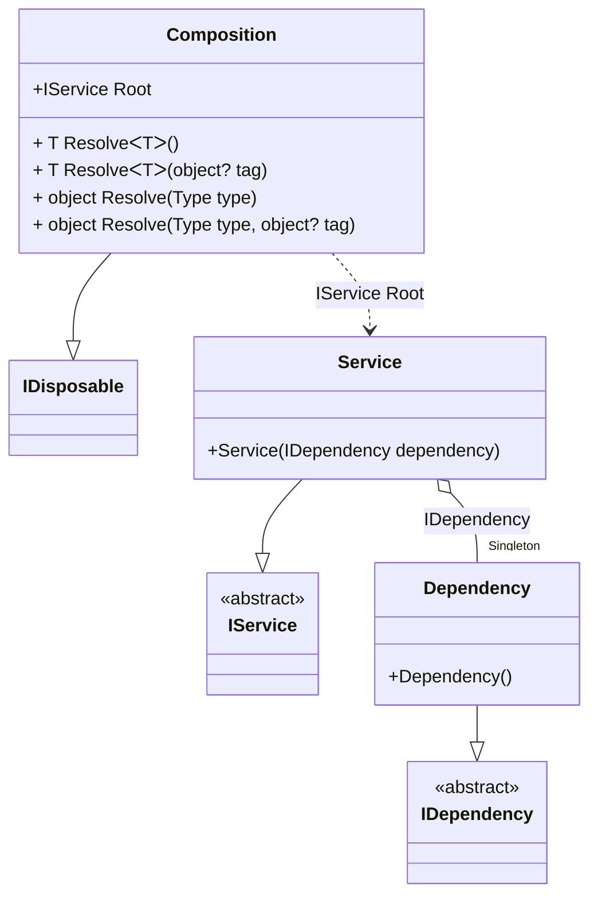

#### Child composition

[](../tests/Pure.DI.UsageTests/Basics/ChildCompositionScenario.cs)

Can use generated classes in hierarchy.

```c#
interface IDependency
{
    bool IsDisposed { get; }
}

class Dependency : IDependency, IDisposable
{
    public bool IsDisposed { get; private set; }

    public void Dispose() => IsDisposed = true;
}

interface IService
{
    IDependency Dependency { get; }
}

class Service : IService
{
    public Service(IDependency dependency) =>
        Dependency = dependency;

    public IDependency Dependency { get; }
}

DI.Setup("Composition")
    .Bind<IDependency>().As(Lifetime.Singleton).To<Dependency>()
    .Bind<IService>().To<Service>().Root<IService>("Root");

var composition = new Composition();
IService serviceFromChild;
using (var childComposition = new Composition(composition))
{
    serviceFromChild = childComposition.Root;
}
        
serviceFromChild.Dependency.IsDisposed.ShouldBeTrue();
        
var service = composition.Root;
using (var childComposition = new Composition(composition))
{
    childComposition.Root.Dependency.ShouldBe(service.Dependency);
}
```

<details open>
<summary>Class Diagram</summary>



</details>

<details>
<summary>Pure.DI-generated partial class Composition</summary><blockquote>

```c#
partial class Composition: global::System.IDisposable
{
  private readonly global::System.IDisposable[] _disposableSingletonsM12D18di;
  private int _disposeIndexM12D18di;
  private Pure.DI.UsageTests.Basics.ChildCompositionScenario.Dependency _singletonM12D18di21;
  
  public Composition()
  {
    _disposableSingletonsM12D18di = new global::System.IDisposable[1];
  }
  
  internal Composition(Composition parent)
  {
    lock (parent._disposableSingletonsM12D18di)
    {
      _disposableSingletonsM12D18di = new global::System.IDisposable[1 - parent._disposeIndexM12D18di];
      _singletonM12D18di21 = parent._singletonM12D18di21;
    }
  }
  
  #region Composition Roots
  public Pure.DI.UsageTests.Basics.ChildCompositionScenario.IService Root
  {
    #if NETSTANDARD2_0_OR_GREATER || NETCOREAPP || NET40_OR_GREATER || NET
    [global::System.Diagnostics.Contracts.Pure]
    #endif
    get
    {
      if (object.ReferenceEquals(_singletonM12D18di21, null))
      {
          _singletonM12D18di21 = new Pure.DI.UsageTests.Basics.ChildCompositionScenario.Dependency();
          _disposableSingletonsM12D18di[_disposeIndexM12D18di++] = _singletonM12D18di21;
      }
      return new Pure.DI.UsageTests.Basics.ChildCompositionScenario.Service(_singletonM12D18di21);
    }
  }
  #endregion
  
  #region API
  #if NETSTANDARD2_0_OR_GREATER || NETCOREAPP || NET40_OR_GREATER || NET
  [global::System.Diagnostics.Contracts.Pure]
  #endif
  public T Resolve<T>()
  {
    return ResolverM12D18di<T>.Value.Resolve(this);
  }
  
  #if NETSTANDARD2_0_OR_GREATER || NETCOREAPP || NET40_OR_GREATER || NET
  [global::System.Diagnostics.Contracts.Pure]
  #endif
  public T Resolve<T>(object? tag)
  {
    return ResolverM12D18di<T>.Value.ResolveByTag(this, tag);
  }
  
  #if NETSTANDARD2_0_OR_GREATER || NETCOREAPP || NET40_OR_GREATER || NET
  [global::System.Diagnostics.Contracts.Pure]
  #endif
  public object Resolve(global::System.Type type)
  {
    var index = (int)(_bucketSizeM12D18di * ((uint)global::System.Runtime.CompilerServices.RuntimeHelpers.GetHashCode(type) % 1));
    var finish = index + _bucketSizeM12D18di;
    do {
      ref var pair = ref _bucketsM12D18di[index];
      if (ReferenceEquals(pair.Key, type))
      {
        return pair.Value.Resolve(this);
      }
    } while (++index < finish);
    
    throw new global::System.InvalidOperationException($"Cannot resolve composition root of type {type}.");
  }
  
  #if NETSTANDARD2_0_OR_GREATER || NETCOREAPP || NET40_OR_GREATER || NET
  [global::System.Diagnostics.Contracts.Pure]
  #endif
  public object Resolve(global::System.Type type, object? tag)
  {
    var index = (int)(_bucketSizeM12D18di * ((uint)global::System.Runtime.CompilerServices.RuntimeHelpers.GetHashCode(type) % 1));
    var finish = index + _bucketSizeM12D18di;
    do {
      ref var pair = ref _bucketsM12D18di[index];
      if (ReferenceEquals(pair.Key, type))
      {
        return pair.Value.ResolveByTag(this, tag);
      }
    } while (++index < finish);
    
    throw new global::System.InvalidOperationException($"Cannot resolve composition root \"{tag}\" of type {type}.");
  }
  #endregion
  
  public void Dispose()
  {
    lock (_disposableSingletonsM12D18di)
    {
      while (_disposeIndexM12D18di > 0)
      {
        var disposableInstance = _disposableSingletonsM12D18di[--_disposeIndexM12D18di];
        try
        {
          disposableInstance.Dispose();
        }
        catch(Exception exception)
        {
          OnDisposeException(disposableInstance, exception);
        }
      }
      
      _singletonM12D18di21 = null;
    }
  }
  
  partial void OnDisposeException<T>(T disposableInstance, Exception exception) where T : global::System.IDisposable;
  
  public override string ToString()
  {
    return
      "classDiagram\n" +
        "  class Composition {\n" +
          "    +IService Root\n" +
          "    + T ResolveᐸTᐳ()\n" +
          "    + T ResolveᐸTᐳ(object? tag)\n" +
          "    + object Resolve(Type type)\n" +
          "    + object Resolve(Type type, object? tag)\n" +
        "  }\n" +
        "  Composition --|> IDisposable\n" +
        "  Service --|> IService : \n" +
        "  class Service {\n" +
          "    +Service(IDependency dependency)\n" +
        "  }\n" +
        "  Dependency --|> IDependency : \n" +
        "  class Dependency {\n" +
          "    +Dependency()\n" +
        "  }\n" +
        "  class IService {\n" +
          "    <<abstract>>\n" +
        "  }\n" +
        "  class IDependency {\n" +
          "    <<abstract>>\n" +
        "  }\n" +
        "  Service o--  \"Singleton\" Dependency : IDependency\n" +
        "  Composition ..> Service : IService Root";
  }
  
  private readonly static int _bucketSizeM12D18di;
  private readonly static global::Pure.DI.Pair<global::System.Type, global::Pure.DI.IResolver<Composition, object>>[] _bucketsM12D18di;
  
  
  static Composition()
  {
    var valResolverM12D18di_0000 = new ResolverM12D18di_0000();
    ResolverM12D18di<Pure.DI.UsageTests.Basics.ChildCompositionScenario.IService>.Value = valResolverM12D18di_0000;
    _bucketsM12D18di = global::Pure.DI.Buckets<global::System.Type, global::Pure.DI.IResolver<Composition, object>>.Create(
      1,
      out _bucketSizeM12D18di,
      new global::Pure.DI.Pair<global::System.Type, global::Pure.DI.IResolver<Composition, object>>[1]
      {
         new global::Pure.DI.Pair<global::System.Type, global::Pure.DI.IResolver<Composition, object>>(typeof(Pure.DI.UsageTests.Basics.ChildCompositionScenario.IService), valResolverM12D18di_0000)
      });
  }
  
  #region Resolvers
  private sealed class ResolverM12D18di<T>: global::Pure.DI.IResolver<Composition, T>
  {
    public static global::Pure.DI.IResolver<Composition, T> Value = new ResolverM12D18di<T>();
    
    public T Resolve(Composition composite)
    {
      throw new global::System.InvalidOperationException($"Cannot resolve composition root of type {typeof(T)}.");
    }
    
    public T ResolveByTag(Composition composite, object tag)
    {
      throw new global::System.InvalidOperationException($"Cannot resolve composition root \"{tag}\" of type {typeof(T)}.");
    }
  }
  
  private sealed class ResolverM12D18di_0000: global::Pure.DI.IResolver<Composition, Pure.DI.UsageTests.Basics.ChildCompositionScenario.IService>
  {
    public Pure.DI.UsageTests.Basics.ChildCompositionScenario.IService Resolve(Composition composition)
    {
      return composition.Root;
    }
    
    public Pure.DI.UsageTests.Basics.ChildCompositionScenario.IService ResolveByTag(Composition composition, object tag)
    {
      if (Equals(tag, null)) return composition.Root;;
      throw new global::System.InvalidOperationException($"Cannot resolve composition root \"{tag}\" of type Pure.DI.UsageTests.Basics.ChildCompositionScenario.IService.");
    }
  }
  #endregion
}
```

</blockquote></details>

