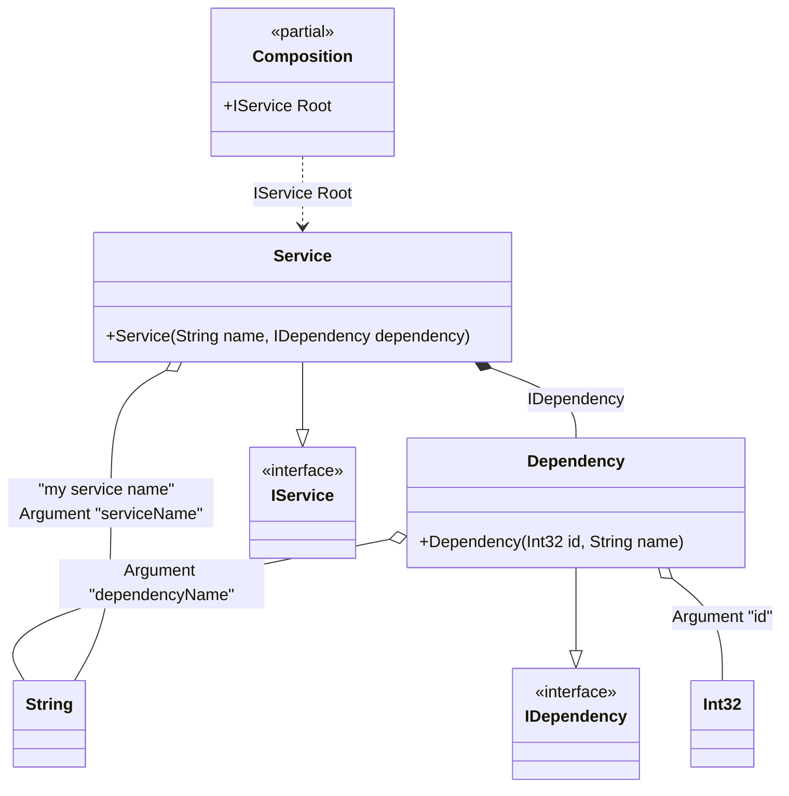

#### Class arguments

[](../tests/Pure.DI.UsageTests/Basics/ClassArgumentsScenario.cs)

Sometimes you need to pass some state to a composition class to use it when resolving dependencies. To do this, just use the `Arg<T>(string argName)` method, specify the type of argument and its name. You can also specify a tag for each argument. You can then use them as dependencies when building the object graph. If you have multiple arguments of the same type, just use tags to distinguish them. The values of the arguments are manipulated when you create a composition class by calling its constructor. It is important to remember that only those arguments that are used in the object graph will appear in the constructor. Arguments that are not involved will not be added to the constructor arguments.


```c#
interface IDependency
{
    int Id { get; }

    string Name { get; }
}

class Dependency(int id, string name) : IDependency
{
    public int Id { get; } = id;

    public string Name { get; } = name;
}

interface IService
{
    string Name { get; }

    IDependency Dependency { get; }
}

class Service(
    // The tag allows to specify the injection point accurately.
    // This is useful, for example, when the type is the same.
    [Tag("my service name")] string name,
    IDependency dependency) : IService
{
    public string Name { get; } = name;

    public IDependency Dependency { get; } = dependency;
}

DI.Setup(nameof(Composition))
    .Bind<IDependency>().To<Dependency>()
    .Bind<IService>().To<Service>()

    // Composition root
    .Root<IService>("Root")

    // Some kind of identifier
    .Arg<int>("id")

    // An argument can be tagged (e.g., tag "my service name")
    // to be injectable by type and this tag
    .Arg<string>("serviceName", "my service name")

    .Arg<string>("dependencyName");

var composition = new Composition(id: 123, serviceName: "Abc", dependencyName: "Xyz");
        
// service = new Service("Abc", new Dependency(123, "Xyz"));
var service = composition.Root;
        
service.Name.ShouldBe("Abc");
service.Dependency.Id.ShouldBe(123);
service.Dependency.Name.ShouldBe("Xyz");
```

The following partial class will be generated:

```c#
partial class Composition
{
  private readonly Composition _root;

  private readonly int _arg_id;
  private readonly string _arg_serviceName;
  private readonly string _arg_dependencyName;

  public Composition(int id, string serviceName, string dependencyName)
  {
    _arg_id = id;
    _arg_serviceName = serviceName ?? throw new ArgumentNullException(nameof(serviceName));
    _arg_dependencyName = dependencyName ?? throw new ArgumentNullException(nameof(dependencyName));
    _root = this;
  }

  internal Composition(Composition parentScope)
  {
    _root = (parentScope ?? throw new ArgumentNullException(nameof(parentScope)))._root;
    _arg_id = _root._arg_id;
    _arg_serviceName = _root._arg_serviceName;
    _arg_dependencyName = _root._arg_dependencyName;
  }

  public IService Root
  {
    [MethodImpl(MethodImplOptions.AggressiveInlining)]
    get
    {
      return new Service(_arg_serviceName, new Dependency(_arg_id, _arg_dependencyName));
    }
  }
}
```

Class diagram:



