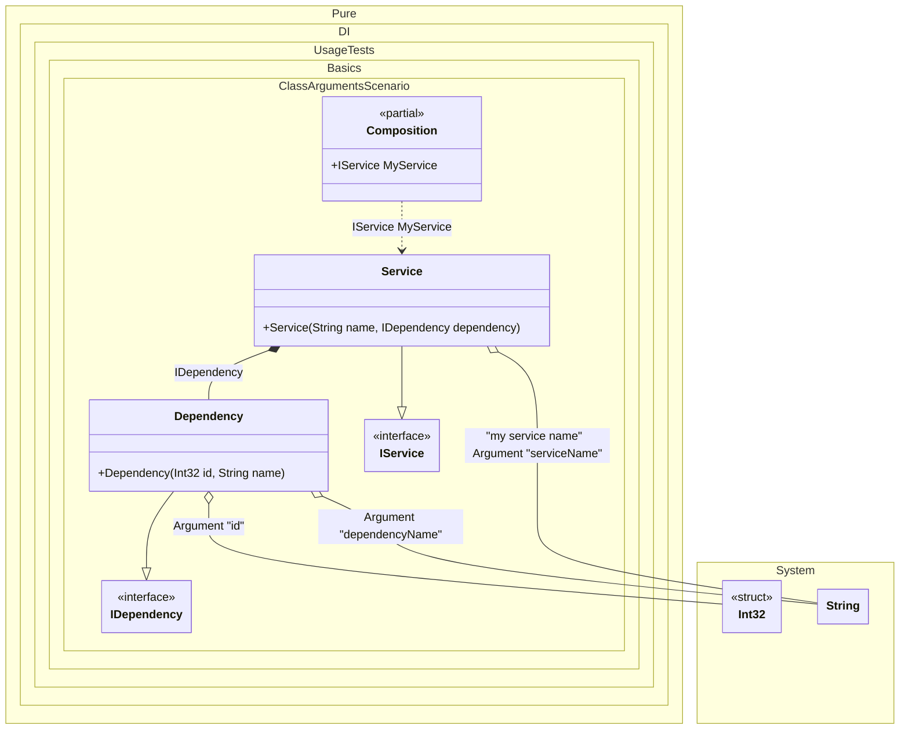

#### Class arguments

Sometimes you need to pass some state to a composition class to use it when resolving dependencies. To do this, just use the `Arg<T>(string argName)` method, specify the type of argument and its name. You can also specify a tag for each argument. You can then use them as dependencies when building the object graph. If you have multiple arguments of the same type, just use tags to distinguish them. The values of the arguments are manipulated when you create a composition class by calling its constructor. It is important to remember that only those arguments that are used in the object graph will appear in the constructor. Arguments that are not involved will not be added to the constructor arguments.
> [!NOTE]
> Actually, class arguments work like normal bindings. The difference is that they bind to the values of the arguments. These values will be injected wherever they are required.


```c#
using Shouldly;
using Pure.DI;

DI.Setup(nameof(Composition))
    .Bind<IDependency>().To<Dependency>()
    .Bind<IService>().To<Service>()

    // Composition root "MyRoot"
    .Root<IService>("MyService")

    // Some kind of identifier
    .Arg<int>("id")

    // An argument can be tagged (e.g., tag "my service name")
    // to be injectable by type and this tag
    .Arg<string>("serviceName", "my service name")
    .Arg<string>("dependencyName");

var composition = new Composition(id: 123, serviceName: "Abc", dependencyName: "Xyz");

// service = new Service("Abc", new Dependency(123, "Xyz"));
var service = composition.MyService;

service.Name.ShouldBe("Abc");
service.Dependency.Id.ShouldBe(123);
service.Dependency.Name.ShouldBe("Xyz");

interface IDependency
{
    int Id { get; }

    string Name { get; }
}

class Dependency(int id, string name) : IDependency
{
    public int Id { get; } = id;

    public string Name { get; } = name;
}

interface IService
{
    string Name { get; }

    IDependency Dependency { get; }
}

class Service(
    // The tag allows to specify the injection point accurately.
    // This is useful, for example, when the type is the same.
    [Tag("my service name")] string name,
    IDependency dependency) : IService
{
    public string Name { get; } = name;

    public IDependency Dependency { get; } = dependency;
}
```

<details>
<summary>Running this code sample locally</summary>

- Make sure you have the [.NET SDK 9.0](https://dotnet.microsoft.com/en-us/download/dotnet/9.0) or later is installed
```bash
dotnet --list-sdk
```
- Create a net9.0 (or later) console application
```bash
dotnet new console -n Sample
```
- Add references to NuGet packages
  - [Pure.DI](https://www.nuget.org/packages/Pure.DI)
  - [Shouldly](https://www.nuget.org/packages/Shouldly)
```bash
dotnet add package Pure.DI
dotnet add package Shouldly
```
- Copy the example code into the _Program.cs_ file

You are ready to run the example 🚀
```bash
dotnet run
```

</details>

The following partial class will be generated:

```c#
partial class Composition
{
  private readonly Composition _root;

  private readonly int _argId;
  private readonly string _argServiceName;
  private readonly string _argDependencyName;

  [OrdinalAttribute(128)]
  public Composition(int id, string serviceName, string dependencyName)
  {
    _argId = id;
    _argServiceName = serviceName ?? throw new ArgumentNullException(nameof(serviceName));
    _argDependencyName = dependencyName ?? throw new ArgumentNullException(nameof(dependencyName));
    _root = this;
  }

  internal Composition(Composition parentScope)
  {
    _root = (parentScope ?? throw new ArgumentNullException(nameof(parentScope)))._root;
    _argId = _root._argId;
    _argServiceName = _root._argServiceName;
    _argDependencyName = _root._argDependencyName;
  }

  public IService MyService
  {
    [MethodImpl(MethodImplOptions.AggressiveInlining)]
    get
    {
      return new Service(_argServiceName, new Dependency(_argId, _argDependencyName));
    }
  }
}
```

Class diagram:



