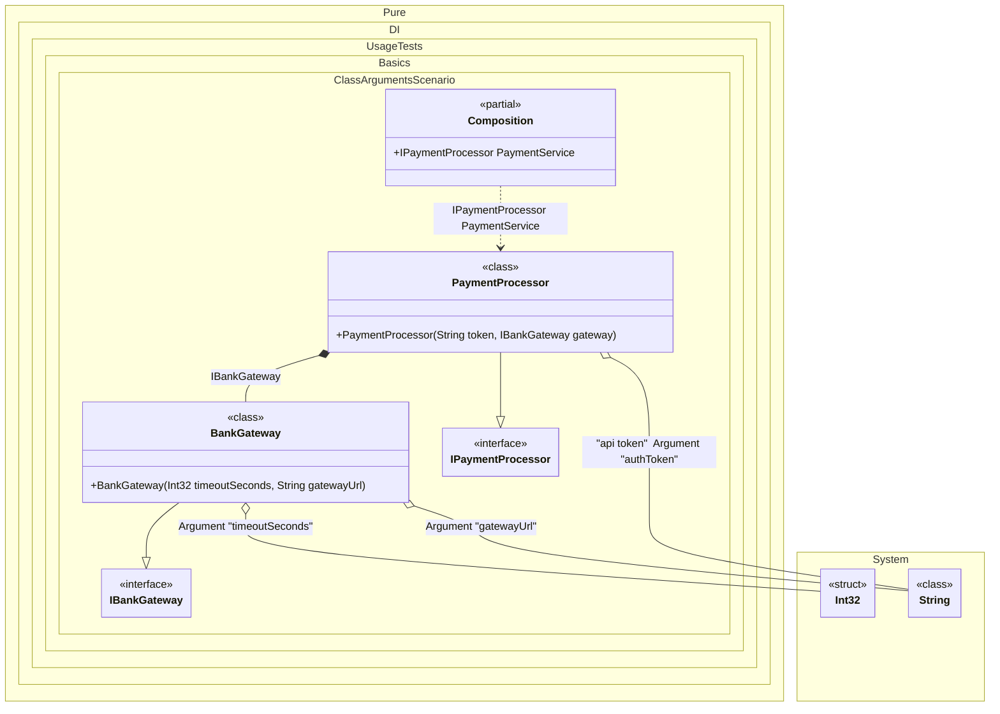

#### Class arguments

Sometimes you need to pass some state to a composition class to use it when resolving dependencies. To do this, just use the `Arg<T>(string argName)` method, specify the type of argument and its name. You can also specify a tag for each argument. You can then use them as dependencies when building the object graph. If you have multiple arguments of the same type, just use tags to distinguish them. The values of the arguments are manipulated when you create a composition class by calling its constructor. It is important to remember that only those arguments that are used in the object graph will appear in the constructor. Arguments that are not involved will not be added to the constructor arguments.
> [!NOTE]
> Actually, class arguments work like normal bindings. The difference is that they bind to the values of the arguments. These values will be injected wherever they are required.


```c#
using Shouldly;
using Pure.DI;

DI.Setup(nameof(Composition))
    .Bind<IBankGateway>().To<BankGateway>()
    .Bind<IPaymentProcessor>().To<PaymentProcessor>()

    // Composition root "PaymentService"
    .Root<IPaymentProcessor>("PaymentService")

    // Argument: Connection timeout (e.g., from config)
    .Arg<int>("timeoutSeconds")

    // Argument: API Token (using a tag to distinguish from other strings)
    .Arg<string>("authToken", "api token")

    // Argument: Bank gateway address
    .Arg<string>("gatewayUrl");

// Create the composition, passing real settings from "outside"
var composition = new Composition(
    timeoutSeconds: 30,
    authToken: "secret_token_123",
    gatewayUrl: "https://api.bank.com/v1");

var paymentService = composition.PaymentService;

paymentService.Token.ShouldBe("secret_token_123");
paymentService.Gateway.Timeout.ShouldBe(30);
paymentService.Gateway.Url.ShouldBe("https://api.bank.com/v1");

interface IBankGateway
{
    int Timeout { get; }

    string Url { get; }
}

// Simulation of a bank gateway client
class BankGateway(int timeoutSeconds, string gatewayUrl) : IBankGateway
{
    public int Timeout { get; } = timeoutSeconds;

    public string Url { get; } = gatewayUrl;
}

interface IPaymentProcessor
{
    string Token { get; }

    IBankGateway Gateway { get; }
}

// Payment processing service
class PaymentProcessor(
    // The tag allows specifying exactly which string to inject here
    [Tag("api token")] string token,
    IBankGateway gateway) : IPaymentProcessor
{
    public string Token { get; } = token;

    public IBankGateway Gateway { get; } = gateway;
}
```

<details>
<summary>Running this code sample locally</summary>

- Make sure you have the [.NET SDK 10.0](https://dotnet.microsoft.com/en-us/download/dotnet/10.0) or later is installed
```bash
dotnet --list-sdk
```
- Create a net10.0 (or later) console application
```bash
dotnet new console -n Sample
```
- Add references to NuGet packages
  - [Pure.DI](https://www.nuget.org/packages/Pure.DI)
  - [Shouldly](https://www.nuget.org/packages/Shouldly)
```bash
dotnet add package Pure.DI
dotnet add package Shouldly
```
- Copy the example code into the _Program.cs_ file

You are ready to run the example 🚀
```bash
dotnet run
```

</details>

The following partial class will be generated:

```c#
partial class Composition
{
#if NET9_0_OR_GREATER
  private readonly Lock _lock;
#else
  private readonly Object _lock;
#endif

  private readonly int _argTimeoutSeconds;
  private readonly string _argAuthToken;
  private readonly string _argGatewayUrl;

  [OrdinalAttribute(128)]
  public Composition(int timeoutSeconds, string authToken, string gatewayUrl)
  {
    _argTimeoutSeconds = timeoutSeconds;
    _argAuthToken = authToken ?? throw new ArgumentNullException(nameof(authToken));
    _argGatewayUrl = gatewayUrl ?? throw new ArgumentNullException(nameof(gatewayUrl));
#if NET9_0_OR_GREATER
    _lock = new Lock();
#else
    _lock = new Object();
#endif
  }

  internal Composition(Composition parentScope)
  {
    _argTimeoutSeconds = parentScope._argTimeoutSeconds;
    _argAuthToken = parentScope._argAuthToken;
    _argGatewayUrl = parentScope._argGatewayUrl;
    _lock = parentScope._lock;
  }

  public IPaymentProcessor PaymentService
  {
    [MethodImpl(MethodImplOptions.AggressiveInlining)]
    get
    {
      return new PaymentProcessor(_argAuthToken, new BankGateway(_argTimeoutSeconds, _argGatewayUrl));
    }
  }
}
```

Class diagram:



