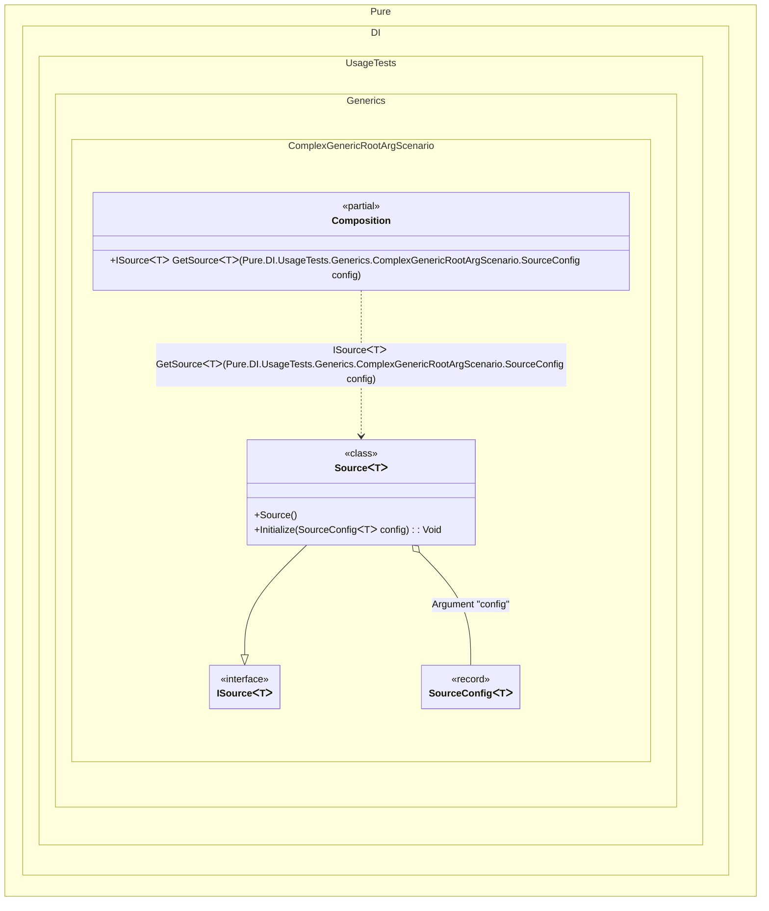

#### Complex generic root arguments


```c#
using Shouldly;
using Pure.DI;

DI.Setup(nameof(Composition))
    // Defines a generic root argument 'config' of type SourceConfig<T>.
    // This allows passing specific configuration when resolving ISource<T>.
    .RootArg<SourceConfig<TT>>("config")
    .Bind<ISource<TT2>>().To<Source<TT2>>()

    // Composition root that creates a source for a specific type.
    // The 'GetSource' method will accept 'SourceConfig<T>' as an argument.
    .Root<ISource<TT3>>("GetSource");

var composition = new Composition();

// Resolve a source for 'int', passing specific configuration
var source = composition.GetSource<int>(
    new SourceConfig<int>(33, "IntSource"));

source.Value.ShouldBe(33);
source.Name.ShouldBe("IntSource");

// Represents configuration for a data source, including a default value
record SourceConfig<T>(T DefaultValue, string SourceName);

interface ISource<out T>
{
    T? Value { get; }
    string Name { get; }
}

class Source<T> : ISource<T>
{
    // The Dependency attribute specifies to perform an injection.
    // We use method injection to initialize the source with configuration
    // passed from the composition root.
    [Dependency]
    public void Initialize(SourceConfig<T> config)
    {
        Value = config.DefaultValue;
        Name = config.SourceName;
    }

    public T? Value { get; private set; }

    public string Name { get; private set; } = "";
}
```

<details>
<summary>Running this code sample locally</summary>

- Make sure you have the [.NET SDK 10.0](https://dotnet.microsoft.com/en-us/download/dotnet/10.0) or later is installed
```bash
dotnet --list-sdk
```
- Create a net10.0 (or later) console application
```bash
dotnet new console -n Sample
```
- Add references to NuGet packages
  - [Pure.DI](https://www.nuget.org/packages/Pure.DI)
  - [Shouldly](https://www.nuget.org/packages/Shouldly)
```bash
dotnet add package Pure.DI
dotnet add package Shouldly
```
- Copy the example code into the _Program.cs_ file

You are ready to run the example 🚀
```bash
dotnet run
```

</details>

The following partial class will be generated:

```c#
partial class Composition
{
#if NET9_0_OR_GREATER
  private readonly Lock _lock = new Lock();
#else
  private readonly Object _lock = new Object();
#endif

  [MethodImpl(MethodImplOptions.AggressiveInlining)]
  public ISource<T> GetSource<T>(SourceConfig<T> config)
  {
    if (config is null) throw new ArgumentNullException(nameof(config));
    var transientSource = new Source<T>();
    transientSource.Initialize(config);
    return transientSource;
  }
}
```

Class diagram:



