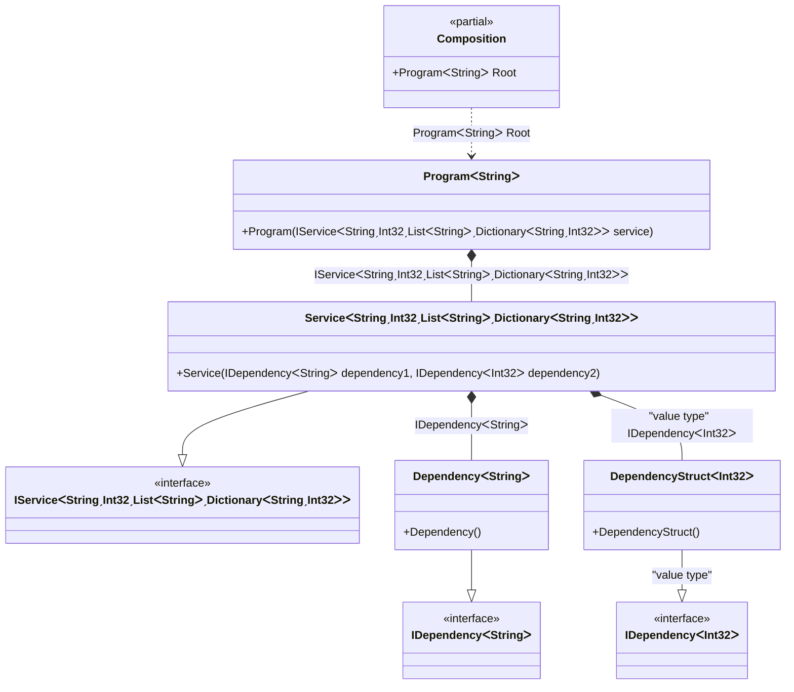

#### Complex generics

[](../tests/Pure.DI.UsageTests/Generics/ComplexGenericsScenario.cs)

Defining generic type arguments using particular marker types like ```TT``` in this sample is a distinguishing and outstanding feature. This allows binding complex generic types with nested generic types and with any type constraints. For instance ```IService<T1, T2, TList, TDictionary> where T2: struct where TList: IList<T1> where TDictionary: IDictionary<T1, T2> { }``` and its binding to the some implementation ```.Bind<IService<TT1, TTS2, TTList<TT1>, TTDictionary<TT1, TTS2>>>().To<Service<TT1, TTS2, TTList<TT1>, TTDictionary<TT1, TTS2>>>()``` with all checks and code-generation at the compile time. It is clear that this example is exaggerated, it just demonstrates the ease of working with marker types like ```TT, TTEnumerable, TTSet``` and etc. for binding complex generic types.


```c#
interface IDependency<T>;

class Dependency<T> : IDependency<T>;

readonly record struct DependencyStruct<T> : IDependency<T>
    where T : struct;

interface IService<T1, T2, TList, TDictionary>
    where T2 : struct
    where TList : IList<T1>
    where TDictionary : IDictionary<T1, T2>
{
    IDependency<T1> Dependency1 { get; }

    IDependency<T2> Dependency2 { get; }
}

class Service<T1, T2, TList, TDictionary>(
    IDependency<T1> dependency1,
    [Tag("value type")] IDependency<T2> dependency2)
    : IService<T1, T2, TList, TDictionary>
    where T2 : struct
    where TList : IList<T1>
    where TDictionary : IDictionary<T1, T2>
{
    public IDependency<T1> Dependency1 { get; } = dependency1;

    public IDependency<T2> Dependency2 { get; } = dependency2;
}

class Program<T>(IService<T, int, List<T>, Dictionary<T, int>> service)
    where T : notnull
{
    public IService<T, int, List<T>, Dictionary<T, int>> Service { get; } = service;
}

DI.Setup(nameof(Composition))
    // This hint indicates to not generate methods such as Resolve
    .Hint(Hint.Resolve, "Off")
    .Bind<IDependency<TT>>().To<Dependency<TT>>()
    .Bind<IDependency<TTS>>("value type").To<DependencyStruct<TTS>>()
    .Bind<IService<TT1, TTS2, TTList<TT1>, TTDictionary<TT1, TTS2>>>()
    .To<Service<TT1, TTS2, TTList<TT1>, TTDictionary<TT1, TTS2>>>()

    // Composition root
    .Root<Program<string>>("Root");

var composition = new Composition();
var program = composition.Root;
var service = program.Service;
service.ShouldBeOfType<Service<string, int, List<string>, Dictionary<string, int>>>();
service.Dependency1.ShouldBeOfType<Dependency<string>>();
service.Dependency2.ShouldBeOfType<DependencyStruct<int>>();
```

It can also be useful in a very simple scenario where, for example, the sequence of type arguments does not match the sequence of arguments of the contract that implements the type.

The following partial class will be generated:

```c#
partial class Composition
{
  private readonly Composition _root;

  [OrdinalAttribute(20)]
  public Composition()
  {
    _root = this;
  }

  internal Composition(Composition parentScope)
  {
    _root = (parentScope ?? throw new ArgumentNullException(nameof(parentScope)))._root;
  }

  public Program<string> Root
  {
    [MethodImpl(MethodImplOptions.AggressiveInlining)]
    get
    {
      return new Program<string>(new Service<string, int, List<string>, Dictionary<string, int>>(new Dependency<string>(), new DependencyStruct<int>()));
    }
  }
}
```

Class diagram:



