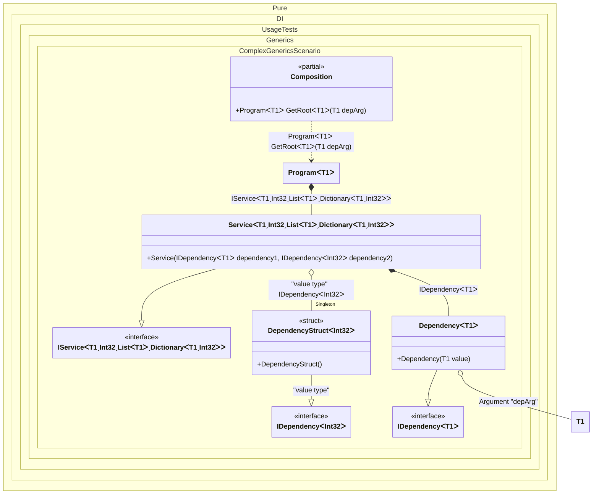

#### Complex generics

[](../tests/Pure.DI.UsageTests/Generics/ComplexGenericsScenario.cs)

Defining generic type arguments using particular marker types like ```TT``` in this sample is a distinguishing and outstanding feature. This allows binding complex generic types with nested generic types and with any type constraints. For instance ```IService<T1, T2, TList, TDictionary> where T2: struct where TList: IList<T1> where TDictionary: IDictionary<T1, T2> { }``` and its binding to the some implementation ```.Bind<IService<TT1, TTS2, TTList<TT1>, TTDictionary<TT1, TTS2>>>().To<Service<TT1, TTS2, TTList<TT1>, TTDictionary<TT1, TTS2>>>()``` with all checks and code-generation at the compile time. It is clear that this example is exaggerated, it just demonstrates the ease of working with marker types like ```TT, TTEnumerable, TTSet``` and etc. for binding complex generic types.


```c#
using Shouldly;
using Pure.DI;

DI.Setup(nameof(Composition))
    // This hint indicates to not generate methods such as Resolve
    .Hint(Hint.Resolve, "Off")
    .RootArg<TT>("depArg")
    .Bind<IDependency<TT>>().To<Dependency<TT>>()
    .Bind<IDependency<TTS>>("value type")
        .As(Lifetime.Singleton)
        .To<DependencyStruct<TTS>>()
    .Bind<IService<TT1, TTS2, TTList<TT1>, TTDictionary<TT1, TTS2>>>()
        .To<Service<TT1, TTS2, TTList<TT1>, TTDictionary<TT1, TTS2>>>()

    // Composition root
    .Root<Program<TT>>("GetRoot");

var composition = new Composition();
var program = composition.GetRoot<string>(depArg: "some value");
var service = program.Service;
service.ShouldBeOfType<Service<string, int, List<string>, Dictionary<string, int>>>();
service.Dependency1.ShouldBeOfType<Dependency<string>>();
service.Dependency2.ShouldBeOfType<DependencyStruct<int>>();

interface IDependency<T>;

class Dependency<T>(T value) : IDependency<T>;

readonly record struct DependencyStruct<T> : IDependency<T>
    where T : struct;

interface IService<T1, T2, TList, TDictionary>
    where T2 : struct
    where TList : IList<T1>
    where TDictionary : IDictionary<T1, T2>
{
    IDependency<T1> Dependency1 { get; }

    IDependency<T2> Dependency2 { get; }
}

class Service<T1, T2, TList, TDictionary>(
    IDependency<T1> dependency1,
    [Tag("value type")] IDependency<T2> dependency2)
    : IService<T1, T2, TList, TDictionary>
    where T2 : struct
    where TList : IList<T1>
    where TDictionary : IDictionary<T1, T2>
{
    public IDependency<T1> Dependency1 { get; } = dependency1;

    public IDependency<T2> Dependency2 { get; } = dependency2;
}

class Program<T>(IService<T, int, List<T>, Dictionary<T, int>> service)
    where T : notnull
{
    public IService<T, int, List<T>, Dictionary<T, int>> Service { get; } = service;
}
```

<details>
<summary>Running this code sample locally</summary>

- Make sure you have the [.NET SDK 9.0](https://dotnet.microsoft.com/en-us/download/dotnet/9.0) or later is installed
- Create a net9.0 (or later) console application
- Add references to NuGet packages
  - [Pure.DI](https://www.nuget.org/packages/Pure.DI)
  - [Shouldly](https://www.nuget.org/packages/Shouldly)
- Copy the example code into the _Program.cs_ file

You are ready to run the example!

</details>

It can also be useful in a very simple scenario where, for example, the sequence of type arguments does not match the sequence of arguments of the contract that implements the type.


Class diagram:



