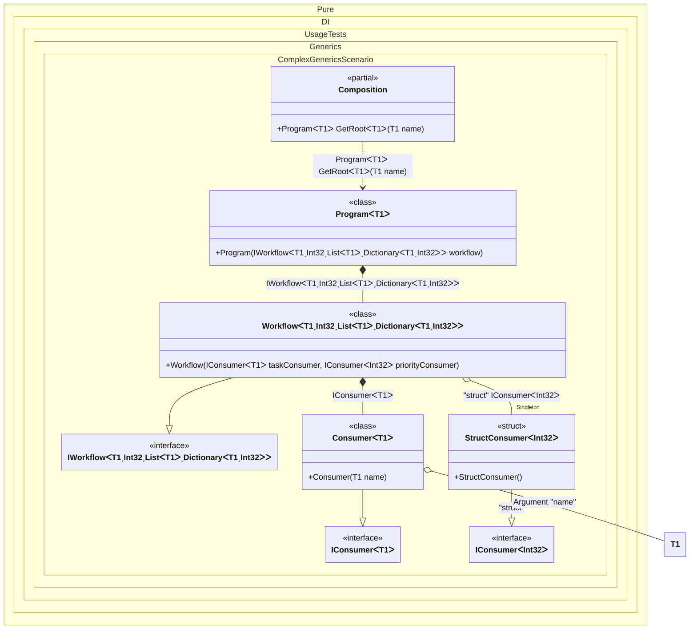

#### Complex generics

Defining generic type arguments using particular marker types like ```TT``` in this sample is a distinguishing and outstanding feature. This allows binding complex generic types with nested generic types and with any type constraints. For instance ```IService<T1, T2, TList, TDictionary> where T2: struct where TList: IList<T1> where TDictionary: IDictionary<T1, T2> { }``` and its binding to the some implementation ```.Bind<IService<TT1, TTS2, TTList<TT1>, TTDictionary<TT1, TTS2>>>().To<Service<TT1, TTS2, TTList<TT1>, TTDictionary<TT1, TTS2>>>()``` with all checks and code-generation at the compile time. It is clear that this example is exaggerated, it just demonstrates the ease of working with marker types like ```TT, TTEnumerable, TTSet``` and etc. for binding complex generic types.


```c#
using Shouldly;
using Pure.DI;

DI.Setup(nameof(Composition))
    // This hint indicates to not generate methods such as Resolve
    .Hint(Hint.Resolve, "Off")
    .RootArg<TT>("name")
    .Bind<IConsumer<TT>>().To<Consumer<TT>>()
    .Bind<IConsumer<TTS>>("struct")
    .As(Lifetime.Singleton)
    .To<StructConsumer<TTS>>()
    .Bind<IWorkflow<TT1, TTS2, TTList<TT1>, TTDictionary<TT1, TTS2>>>()
    .To<Workflow<TT1, TTS2, TTList<TT1>, TTDictionary<TT1, TTS2>>>()

    // Composition root
    .Root<Program<TT>>("GetRoot");

var composition = new Composition();
var program = composition.GetRoot<string>(name: "Super Task");
var workflow = program.Workflow;
workflow.ShouldBeOfType<Workflow<string, int, List<string>, Dictionary<string, int>>>();
workflow.TaskConsumer.ShouldBeOfType<Consumer<string>>();
workflow.PriorityConsumer.ShouldBeOfType<StructConsumer<int>>();

interface IConsumer<T>;

class Consumer<T>(T name) : IConsumer<T>;

readonly record struct StructConsumer<T> : IConsumer<T>
    where T : struct;

interface IWorkflow<TTask, TPriority, TTaskList, TTaskPriorities>
    where TPriority : struct
    where TTaskList : IList<TTask>
    where TTaskPriorities : IDictionary<TTask, TPriority>
{
    IConsumer<TTask> TaskConsumer { get; }

    IConsumer<TPriority> PriorityConsumer { get; }
}

class Workflow<TTask, TPriority, TTaskList, TTaskPriorities>(
    IConsumer<TTask> taskConsumer,
    [Tag("struct")] IConsumer<TPriority> priorityConsumer)
    : IWorkflow<TTask, TPriority, TTaskList, TTaskPriorities>
    where TPriority : struct
    where TTaskList : IList<TTask>
    where TTaskPriorities : IDictionary<TTask, TPriority>
{
    public IConsumer<TTask> TaskConsumer { get; } = taskConsumer;

    public IConsumer<TPriority> PriorityConsumer { get; } = priorityConsumer;
}

class Program<T>(IWorkflow<T, int, List<T>, Dictionary<T, int>> workflow)
    where T : notnull
{
    public IWorkflow<T, int, List<T>, Dictionary<T, int>> Workflow { get; } = workflow;
}
```

<details>
<summary>Running this code sample locally</summary>

- Make sure you have the [.NET SDK 10.0](https://dotnet.microsoft.com/en-us/download/dotnet/10.0) or later is installed
```bash
dotnet --list-sdk
```
- Create a net10.0 (or later) console application
```bash
dotnet new console -n Sample
```
- Add references to NuGet packages
  - [Pure.DI](https://www.nuget.org/packages/Pure.DI)
  - [Shouldly](https://www.nuget.org/packages/Shouldly)
```bash
dotnet add package Pure.DI
dotnet add package Shouldly
```
- Copy the example code into the _Program.cs_ file

You are ready to run the example 🚀
```bash
dotnet run
```

</details>

It can also be useful in a very simple scenario where, for example, the sequence of type arguments does not match the sequence of arguments of the contract that implements the type.

The following partial class will be generated:

```c#
partial class Composition
{
  private readonly Composition _root;
#if NET9_0_OR_GREATER
  private readonly Lock _lock;
#else
  private readonly Object _lock;
#endif

  private StructConsumer<int> _singletonStructConsumer59;
  private bool _singletonStructConsumer59Created;

  [OrdinalAttribute(256)]
  public Composition()
  {
    _root = this;
#if NET9_0_OR_GREATER
    _lock = new Lock();
#else
    _lock = new Object();
#endif
  }

  internal Composition(Composition parentScope)
  {
    _root = (parentScope ?? throw new ArgumentNullException(nameof(parentScope)))._root;
    _lock = parentScope._lock;
  }

  [MethodImpl(MethodImplOptions.AggressiveInlining)]
  public Program<T1> GetRoot<T1>(T1 name)
    where T1: notnull
  {
    if (name is null) throw new ArgumentNullException(nameof(name));
    if (!_root._singletonStructConsumer59Created)
      lock (_lock)
        if (!_root._singletonStructConsumer59Created)
        {
          _root._singletonStructConsumer59 = new StructConsumer<int>();
          Thread.MemoryBarrier();
          _root._singletonStructConsumer59Created = true;
        }

    return new Program<T1>(new Workflow<T1, int, List<T1>, Dictionary<T1, int>>(new Consumer<T1>(name), _root._singletonStructConsumer59));
  }
}
```

Class diagram:



