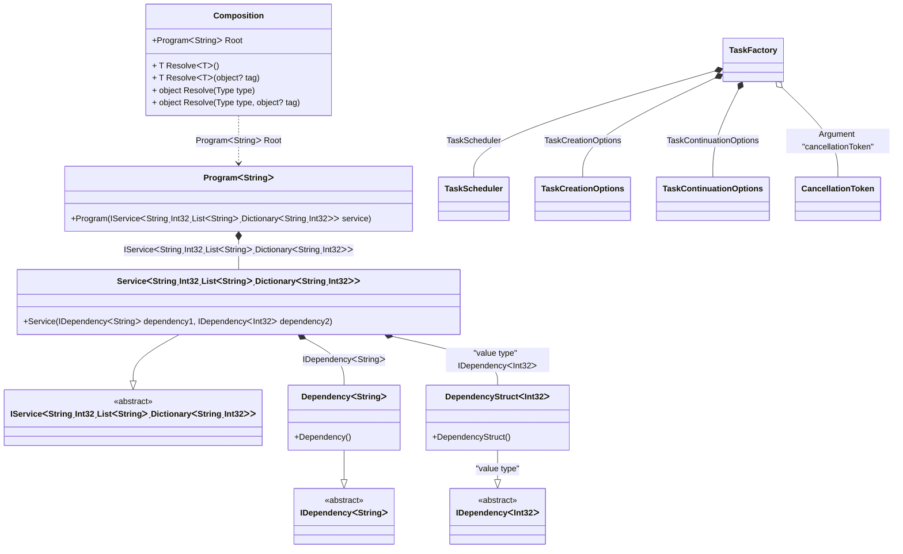

#### Complex generics

[](../tests/Pure.DI.UsageTests/Basics/ComplexGenericsScenario.cs)

Defining generic type arguments using particular marker types like ```TT``` in this sample is a distinguishing and outstanding feature. This allows binding complex generic types with nested generic types and with any type constraints. For instance ```IService<T1, T2, TList, TDictionary> where T2: struct where TList: IList<T1> where TDictionary: IDictionary<T1, T2> { }``` and its binding to the some implementation ```.Bind<IService<TT1, TTS2, TTList<TT1>, TTDictionary<TT1, TTS2>>>().To<Service<TT1, TTS2, TTList<TT1>, TTDictionary<TT1, TTS2>>>()``` with all checks and code-generation at the compile time. It is clear that this example is exaggerated, it just demonstrates the ease of working with marker types like ```TT, TTEnumerable, TTSet``` and etc. for binding complex generic types.

```c#
interface IDependency<T>;

class Dependency<T> : IDependency<T>;

readonly record struct DependencyStruct<T> : IDependency<T>
    where T: struct;

interface IService<T1, T2, TList, TDictionary>
    where T2: struct
    where TList: IList<T1>
    where TDictionary: IDictionary<T1, T2>
{
    IDependency<T1> Dependency1 { get; }

    IDependency<T2> Dependency2 { get; }
}

class Service<T1, T2, TList, TDictionary>(
    IDependency<T1> dependency1,
    [Tag("value type")] IDependency<T2> dependency2)
    : IService<T1, T2, TList, TDictionary>
    where T2 : struct
    where TList : IList<T1>
    where TDictionary : IDictionary<T1, T2>
{
    public IDependency<T1> Dependency1 { get; } = dependency1;

    public IDependency<T2> Dependency2 { get; } = dependency2;
}

class Program<T>(IService<T, int, List<T>, Dictionary<T, int>> service)
    where T : notnull
{
    public IService<T, int, List<T>, Dictionary<T, int>> Service { get; } = service;
}

DI.Setup("Composition")
    .Bind<IDependency<TT>>().To<Dependency<TT>>()
    .Bind<IDependency<TTS>>("value type").To<DependencyStruct<TTS>>()
    .Bind<IService<TT1, TTS2, TTList<TT1>, TTDictionary<TT1, TTS2>>>()
        .To<Service<TT1, TTS2, TTList<TT1>, TTDictionary<TT1, TTS2>>>()
    .Root<Program<string>>("Root");

var composition = new Composition();
var program = composition.Root;
var service = program.Service;
service.ShouldBeOfType<Service<string, int, List<string>, Dictionary<string, int>>>();
service.Dependency1.ShouldBeOfType<Dependency<string>>();
service.Dependency2.ShouldBeOfType<DependencyStruct<int>>();
```

<details open>
<summary>Class Diagram</summary>



</details>

<details>
<summary>Pure.DI-generated partial class Composition</summary><blockquote>

```c#
partial class Composition
{
  private readonly global::System.IDisposable[] _disposableSingletonsM01D14di;
  
  public Composition()
  {
    _disposableSingletonsM01D14di = new global::System.IDisposable[0];
  }
  
  internal Composition(Composition parent)
  {
    _disposableSingletonsM01D14di = new global::System.IDisposable[0];
  }
  
  #region Composition Roots
  public Pure.DI.UsageTests.Basics.ComplexGenericsScenario.Program<string> Root
  {
    #if NETSTANDARD2_0_OR_GREATER || NETCOREAPP || NET40_OR_GREATER || NET
    [global::System.Diagnostics.Contracts.Pure]
    #endif
    get
    {
      return new Pure.DI.UsageTests.Basics.ComplexGenericsScenario.Program<string>(new Pure.DI.UsageTests.Basics.ComplexGenericsScenario.Service<string, int, System.Collections.Generic.List<string>, System.Collections.Generic.Dictionary<string, int>>(new Pure.DI.UsageTests.Basics.ComplexGenericsScenario.Dependency<string>(), new Pure.DI.UsageTests.Basics.ComplexGenericsScenario.DependencyStruct<int>()));
    }
  }
  #endregion
  
  #region API
  #if NETSTANDARD2_0_OR_GREATER || NETCOREAPP || NET40_OR_GREATER || NET
  [global::System.Diagnostics.Contracts.Pure]
  #endif
  public T Resolve<T>()
  {
    return ResolverM01D14di<T>.Value.Resolve(this);
  }
  
  #if NETSTANDARD2_0_OR_GREATER || NETCOREAPP || NET40_OR_GREATER || NET
  [global::System.Diagnostics.Contracts.Pure]
  #endif
  public T Resolve<T>(object? tag)
  {
    return ResolverM01D14di<T>.Value.ResolveByTag(this, tag);
  }
  
  #if NETSTANDARD2_0_OR_GREATER || NETCOREAPP || NET40_OR_GREATER || NET
  [global::System.Diagnostics.Contracts.Pure]
  #endif
  public object Resolve(global::System.Type type)
  {
    var index = (int)(_bucketSizeM01D14di * ((uint)global::System.Runtime.CompilerServices.RuntimeHelpers.GetHashCode(type) % 1));
    var finish = index + _bucketSizeM01D14di;
    do {
      ref var pair = ref _bucketsM01D14di[index];
      if (ReferenceEquals(pair.Key, type))
      {
        return pair.Value.Resolve(this);
      }
    } while (++index < finish);
    
    throw new global::System.InvalidOperationException($"Cannot resolve composition root of type {type}.");
  }
  
  #if NETSTANDARD2_0_OR_GREATER || NETCOREAPP || NET40_OR_GREATER || NET
  [global::System.Diagnostics.Contracts.Pure]
  #endif
  public object Resolve(global::System.Type type, object? tag)
  {
    var index = (int)(_bucketSizeM01D14di * ((uint)global::System.Runtime.CompilerServices.RuntimeHelpers.GetHashCode(type) % 1));
    var finish = index + _bucketSizeM01D14di;
    do {
      ref var pair = ref _bucketsM01D14di[index];
      if (ReferenceEquals(pair.Key, type))
      {
        return pair.Value.ResolveByTag(this, tag);
      }
    } while (++index < finish);
    
    throw new global::System.InvalidOperationException($"Cannot resolve composition root \"{tag}\" of type {type}.");
  }
  #endregion
  
  public override string ToString()
  {
    return
      "classDiagram\n" +
        "  class Composition {\n" +
          "    +ProgramᐸStringᐳ Root\n" +
          "    + T ResolveᐸTᐳ()\n" +
          "    + T ResolveᐸTᐳ(object? tag)\n" +
          "    + object Resolve(Type type)\n" +
          "    + object Resolve(Type type, object? tag)\n" +
        "  }\n" +
        "  class ProgramᐸStringᐳ {\n" +
          "    +Program(IServiceᐸStringˏInt32ˏListᐸStringᐳˏDictionaryᐸStringˏInt32ᐳᐳ service)\n" +
        "  }\n" +
        "  class TaskScheduler\n" +
        "  class TaskCreationOptions\n" +
        "  class TaskContinuationOptions\n" +
        "  class TaskFactory\n" +
        "  class CancellationToken\n" +
        "  ServiceᐸStringˏInt32ˏListᐸStringᐳˏDictionaryᐸStringˏInt32ᐳᐳ --|> IServiceᐸStringˏInt32ˏListᐸStringᐳˏDictionaryᐸStringˏInt32ᐳᐳ : \n" +
        "  class ServiceᐸStringˏInt32ˏListᐸStringᐳˏDictionaryᐸStringˏInt32ᐳᐳ {\n" +
          "    +Service(IDependencyᐸStringᐳ dependency1, IDependencyᐸInt32ᐳ dependency2)\n" +
        "  }\n" +
        "  DependencyᐸStringᐳ --|> IDependencyᐸStringᐳ : \n" +
        "  class DependencyᐸStringᐳ {\n" +
          "    +Dependency()\n" +
        "  }\n" +
        "  DependencyStructᐸInt32ᐳ --|> IDependencyᐸInt32ᐳ : \"value type\" \n" +
        "  class DependencyStructᐸInt32ᐳ {\n" +
          "    +DependencyStruct()\n" +
        "  }\n" +
        "  class IServiceᐸStringˏInt32ˏListᐸStringᐳˏDictionaryᐸStringˏInt32ᐳᐳ {\n" +
          "    <<abstract>>\n" +
        "  }\n" +
        "  class IDependencyᐸStringᐳ {\n" +
          "    <<abstract>>\n" +
        "  }\n" +
        "  class IDependencyᐸInt32ᐳ {\n" +
          "    <<abstract>>\n" +
        "  }\n" +
        "  ProgramᐸStringᐳ *--  ServiceᐸStringˏInt32ˏListᐸStringᐳˏDictionaryᐸStringˏInt32ᐳᐳ : IServiceᐸStringˏInt32ˏListᐸStringᐳˏDictionaryᐸStringˏInt32ᐳᐳ\n" +
        "  TaskFactory o-- CancellationToken : Argument \"cancellationToken\"\n" +
        "  TaskFactory *--  TaskCreationOptions : TaskCreationOptions\n" +
        "  TaskFactory *--  TaskContinuationOptions : TaskContinuationOptions\n" +
        "  TaskFactory *--  TaskScheduler : TaskScheduler\n" +
        "  Composition ..> ProgramᐸStringᐳ : ProgramᐸStringᐳ Root\n" +
        "  ServiceᐸStringˏInt32ˏListᐸStringᐳˏDictionaryᐸStringˏInt32ᐳᐳ *--  DependencyᐸStringᐳ : IDependencyᐸStringᐳ\n" +
        "  ServiceᐸStringˏInt32ˏListᐸStringᐳˏDictionaryᐸStringˏInt32ᐳᐳ *--  DependencyStructᐸInt32ᐳ : \"value type\"  IDependencyᐸInt32ᐳ";
  }
  
  private readonly static int _bucketSizeM01D14di;
  private readonly static global::Pure.DI.Pair<global::System.Type, global::Pure.DI.IResolver<Composition, object>>[] _bucketsM01D14di;
  
  static Composition()
  {
    var valResolverM01D14di_0000 = new ResolverM01D14di_0000();
    ResolverM01D14di<Pure.DI.UsageTests.Basics.ComplexGenericsScenario.Program<string>>.Value = valResolverM01D14di_0000;
    _bucketsM01D14di = global::Pure.DI.Buckets<global::System.Type, global::Pure.DI.IResolver<Composition, object>>.Create(
      1,
      out _bucketSizeM01D14di,
      new global::Pure.DI.Pair<global::System.Type, global::Pure.DI.IResolver<Composition, object>>[1]
      {
         new global::Pure.DI.Pair<global::System.Type, global::Pure.DI.IResolver<Composition, object>>(typeof(Pure.DI.UsageTests.Basics.ComplexGenericsScenario.Program<string>), valResolverM01D14di_0000)
      });
  }
  
  #region Resolvers
  private sealed class ResolverM01D14di<T>: global::Pure.DI.IResolver<Composition, T>
  {
    public static global::Pure.DI.IResolver<Composition, T> Value = new ResolverM01D14di<T>();
    
    public T Resolve(Composition composite)
    {
      throw new global::System.InvalidOperationException($"Cannot resolve composition root of type {typeof(T)}.");
    }
    
    public T ResolveByTag(Composition composite, object tag)
    {
      throw new global::System.InvalidOperationException($"Cannot resolve composition root \"{tag}\" of type {typeof(T)}.");
    }
  }
  
  private sealed class ResolverM01D14di_0000: global::Pure.DI.IResolver<Composition, Pure.DI.UsageTests.Basics.ComplexGenericsScenario.Program<string>>
  {
    public Pure.DI.UsageTests.Basics.ComplexGenericsScenario.Program<string> Resolve(Composition composition)
    {
      return composition.Root;
    }
    
    public Pure.DI.UsageTests.Basics.ComplexGenericsScenario.Program<string> ResolveByTag(Composition composition, object tag)
    {
      switch (tag)
      {
        case null:
          return composition.Root;
      }
      throw new global::System.InvalidOperationException($"Cannot resolve composition root \"{tag}\" of type Pure.DI.UsageTests.Basics.ComplexGenericsScenario.Program<string>.");
    }
  }
  #endregion
}
```

</blockquote></details>


It can also be useful in a very simple scenario where, for example, the sequence of type arguments does not match the sequence of arguments of the contract that implements the type.
