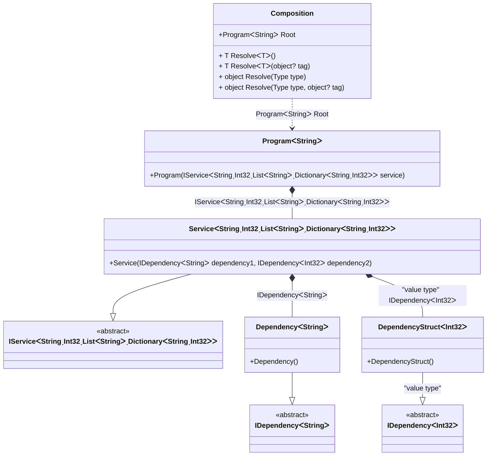

#### Complex generics

[](../tests/Pure.DI.UsageTests/Generics/ComplexGenericsScenario.cs)

Defining generic type arguments using particular marker types like ```TT``` in this sample is a distinguishing and outstanding feature. This allows binding complex generic types with nested generic types and with any type constraints. For instance ```IService<T1, T2, TList, TDictionary> where T2: struct where TList: IList<T1> where TDictionary: IDictionary<T1, T2> { }``` and its binding to the some implementation ```.Bind<IService<TT1, TTS2, TTList<TT1>, TTDictionary<TT1, TTS2>>>().To<Service<TT1, TTS2, TTList<TT1>, TTDictionary<TT1, TTS2>>>()``` with all checks and code-generation at the compile time. It is clear that this example is exaggerated, it just demonstrates the ease of working with marker types like ```TT, TTEnumerable, TTSet``` and etc. for binding complex generic types.

```c#
interface IDependency<T>;

class Dependency<T> : IDependency<T>;

readonly record struct DependencyStruct<T> : IDependency<T>
    where T: struct;

interface IService<T1, T2, TList, TDictionary>
    where T2: struct
    where TList: IList<T1>
    where TDictionary: IDictionary<T1, T2>
{
    IDependency<T1> Dependency1 { get; }

    IDependency<T2> Dependency2 { get; }
}

class Service<T1, T2, TList, TDictionary>(
    IDependency<T1> dependency1,
    [Tag("value type")] IDependency<T2> dependency2)
    : IService<T1, T2, TList, TDictionary>
    where T2 : struct
    where TList : IList<T1>
    where TDictionary : IDictionary<T1, T2>
{
    public IDependency<T1> Dependency1 { get; } = dependency1;

    public IDependency<T2> Dependency2 { get; } = dependency2;
}

class Program<T>(IService<T, int, List<T>, Dictionary<T, int>> service)
    where T : notnull
{
    public IService<T, int, List<T>, Dictionary<T, int>> Service { get; } = service;
}

DI.Setup(nameof(Composition))
    .Bind<IDependency<TT>>().To<Dependency<TT>>()
    .Bind<IDependency<TTS>>("value type").To<DependencyStruct<TTS>>()
    .Bind<IService<TT1, TTS2, TTList<TT1>, TTDictionary<TT1, TTS2>>>()
        .To<Service<TT1, TTS2, TTList<TT1>, TTDictionary<TT1, TTS2>>>()

    // Composition root
    .Root<Program<string>>("Root");

var composition = new Composition();
var program = composition.Root;
var service = program.Service;
service.ShouldBeOfType<Service<string, int, List<string>, Dictionary<string, int>>>();
service.Dependency1.ShouldBeOfType<Dependency<string>>();
service.Dependency2.ShouldBeOfType<DependencyStruct<int>>();
```

It can also be useful in a very simple scenario where, for example, the sequence of type arguments does not match the sequence of arguments of the contract that implements the type.

<details open>
<summary>Class Diagram</summary>



</details>

<details>
<summary>Pure.DI-generated partial class Composition</summary><blockquote>

```c#
partial class Composition
{
  private readonly Composition _root;

  public Composition()
  {
    _root = this;
  }

  internal Composition(Composition baseComposition)
  {
    _root = baseComposition._root;
  }

  public Program<string> Root
  {
    [MethodImpl((MethodImplOptions)0x100)]
    get
    {
      return new Program<string>(new Service<string, int, List<string>, Dictionary<string, int>>(new Dependency<string>(), new DependencyStruct<int>()));
    }
  }

  [MethodImpl((MethodImplOptions)0x100)]
  public T Resolve<T>()
  {
    return Resolver<T>.Value.Resolve(this);
  }

  [MethodImpl((MethodImplOptions)0x100)]
  public T Resolve<T>(object? tag)
  {
    return Resolver<T>.Value.ResolveByTag(this, tag);
  }

  [MethodImpl((MethodImplOptions)0x100)]
  public object Resolve(Type type)
  {
    var index = (int)(_bucketSize * ((uint)RuntimeHelpers.GetHashCode(type) % 1));
    ref var pair = ref _buckets[index];
    return pair.Key == type ? pair.Value.Resolve(this) : Resolve(type, index);
  }

  [MethodImpl((MethodImplOptions)0x8)]
  private object Resolve(Type type, int index)
  {
    var finish = index + _bucketSize;
    while (++index < finish)
    {
      ref var pair = ref _buckets[index];
      if (pair.Key == type)
      {
        return pair.Value.Resolve(this);
      }
    }

    throw new InvalidOperationException($"Cannot resolve composition root of type {type}.");
  }

  [MethodImpl((MethodImplOptions)0x100)]
  public object Resolve(Type type, object? tag)
  {
    var index = (int)(_bucketSize * ((uint)RuntimeHelpers.GetHashCode(type) % 1));
    ref var pair = ref _buckets[index];
    return pair.Key == type ? pair.Value.ResolveByTag(this, tag) : Resolve(type, tag, index);
  }

  [MethodImpl((MethodImplOptions)0x8)]
  private object Resolve(Type type, object? tag, int index)
  {
    var finish = index + _bucketSize;
    while (++index < finish)
    {
      ref var pair = ref _buckets[index];
      if (pair.Key == type)
      {
        return pair.Value.ResolveByTag(this, tag);
      }
    }

    throw new InvalidOperationException($"Cannot resolve composition root \"{tag}\" of type {type}.");
  }

  public override string ToString()
  {
    return
      "classDiagram\n" +
        "  class Composition {\n" +
          "    +ProgramᐸStringᐳ Root\n" +
          "    + T ResolveᐸTᐳ()\n" +
          "    + T ResolveᐸTᐳ(object? tag)\n" +
          "    + object Resolve(Type type)\n" +
          "    + object Resolve(Type type, object? tag)\n" +
        "  }\n" +
        "  class ProgramᐸStringᐳ {\n" +
          "    +Program(IServiceᐸStringˏInt32ˏListᐸStringᐳˏDictionaryᐸStringˏInt32ᐳᐳ service)\n" +
        "  }\n" +
        "  ServiceᐸStringˏInt32ˏListᐸStringᐳˏDictionaryᐸStringˏInt32ᐳᐳ --|> IServiceᐸStringˏInt32ˏListᐸStringᐳˏDictionaryᐸStringˏInt32ᐳᐳ : \n" +
        "  class ServiceᐸStringˏInt32ˏListᐸStringᐳˏDictionaryᐸStringˏInt32ᐳᐳ {\n" +
          "    +Service(IDependencyᐸStringᐳ dependency1, IDependencyᐸInt32ᐳ dependency2)\n" +
        "  }\n" +
        "  DependencyᐸStringᐳ --|> IDependencyᐸStringᐳ : \n" +
        "  class DependencyᐸStringᐳ {\n" +
          "    +Dependency()\n" +
        "  }\n" +
        "  DependencyStructᐸInt32ᐳ --|> IDependencyᐸInt32ᐳ : \"value type\" \n" +
        "  class DependencyStructᐸInt32ᐳ {\n" +
          "    +DependencyStruct()\n" +
        "  }\n" +
        "  class IServiceᐸStringˏInt32ˏListᐸStringᐳˏDictionaryᐸStringˏInt32ᐳᐳ {\n" +
          "    <<abstract>>\n" +
        "  }\n" +
        "  class IDependencyᐸStringᐳ {\n" +
          "    <<abstract>>\n" +
        "  }\n" +
        "  class IDependencyᐸInt32ᐳ {\n" +
          "    <<abstract>>\n" +
        "  }\n" +
        "  ProgramᐸStringᐳ *--  ServiceᐸStringˏInt32ˏListᐸStringᐳˏDictionaryᐸStringˏInt32ᐳᐳ : IServiceᐸStringˏInt32ˏListᐸStringᐳˏDictionaryᐸStringˏInt32ᐳᐳ\n" +
        "  Composition ..> ProgramᐸStringᐳ : ProgramᐸStringᐳ Root\n" +
        "  ServiceᐸStringˏInt32ˏListᐸStringᐳˏDictionaryᐸStringˏInt32ᐳᐳ *--  DependencyᐸStringᐳ : IDependencyᐸStringᐳ\n" +
        "  ServiceᐸStringˏInt32ˏListᐸStringᐳˏDictionaryᐸStringˏInt32ᐳᐳ *--  DependencyStructᐸInt32ᐳ : \"value type\"  IDependencyᐸInt32ᐳ";
  }

  private readonly static int _bucketSize;
  private readonly static Pair<Type, IResolver<Composition, object>>[] _buckets;

  static Composition()
  {
    var valResolver_0000 = new Resolver_0000();
    Resolver<Program<string>>.Value = valResolver_0000;
    _buckets = Buckets<Type, IResolver<Composition, object>>.Create(
      1,
      out _bucketSize,
      new Pair<Type, IResolver<Composition, object>>[1]
      {
         new Pair<Type, IResolver<Composition, object>>(typeof(Program<string>), valResolver_0000)
      });
  }

  private class Resolver<T>: IResolver<Composition, T>
  {
    private const string CannotResolve = "Cannot resolve composition root ";
    private const string OfType = "of type ";
    public static IResolver<Composition, T> Value = new Resolver<T>();

    public virtual T Resolve(Composition composite)
    {
      throw new InvalidOperationException($"{CannotResolve}{OfType}{typeof(T)}.");
    }

    public virtual T ResolveByTag(Composition composite, object tag)
    {
      throw new InvalidOperationException($"{CannotResolve}\"{tag}\" {OfType}{typeof(T)}.");
    }
  }

  private sealed class Resolver_0000: Resolver<Program<string>>
  {
    public override Program<string> Resolve(Composition composition)
    {
      return composition.Root;
    }

    public override Program<string> ResolveByTag(Composition composition, object tag)
    {
      switch (tag)
      {
        case null:
          return composition.Root;
        default:
          return base.ResolveByTag(composition, tag);
      }
    }
  }
}
```

</blockquote></details>

