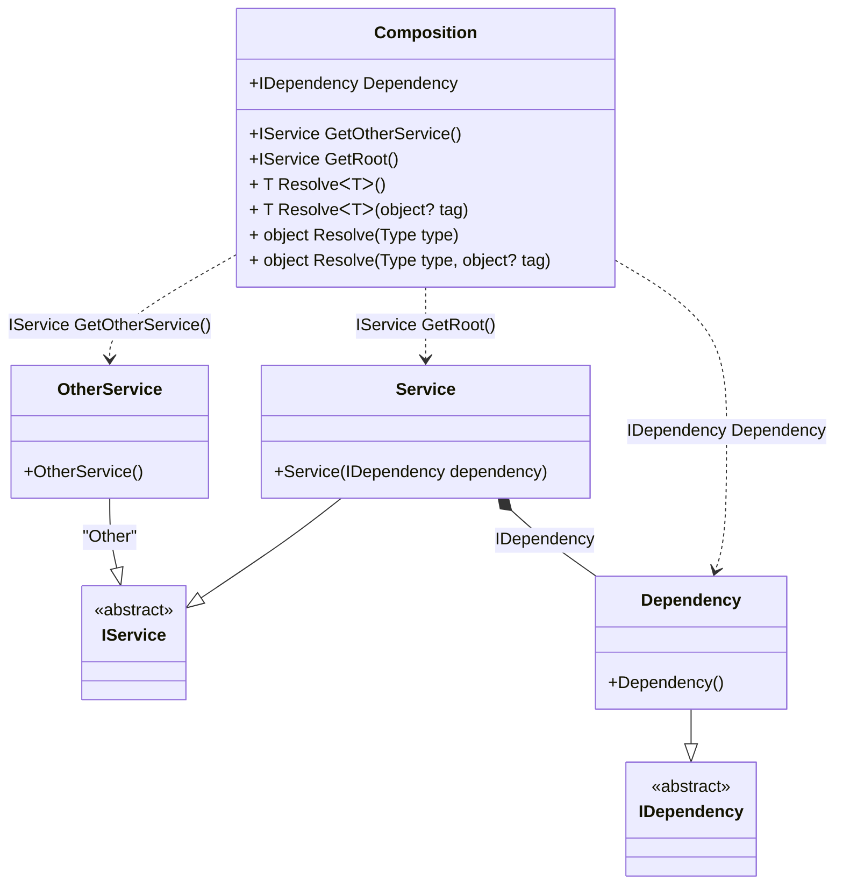

#### Composition root kinds

[](../tests/Pure.DI.UsageTests/Advanced/CompositionRootKindsScenario.cs)

```c#
interface IDependency;

class Dependency : IDependency;

interface IService;

class Service : IService
{
    public Service(IDependency dependency) { }
}

class OtherService : IService;

partial class Composition
{
    void Setup() =>
        DI.Setup(nameof(Composition))
            .Bind<IService>().To<Service>()
            .Bind<IService>("Other").To<OtherService>()
            .Bind<IDependency>().To<Dependency>()

            // Creates a public root method named "GetOtherService"
            .Root<IService>("GetOtherService", "Other", RootKinds.Public | RootKinds.Method)

            // Creates a private partial root method named "GetRoot"
            .Root<IService>("GetRoot", kind: RootKinds.Private | RootKinds.Partial | RootKinds.Method)

            // Creates a internal static root named "Dependency"
            .Root<IDependency>("Dependency", kind: RootKinds.Internal | RootKinds.Static);

    private partial IService GetRoot();

    public IService Root => GetRoot();
}

var composition = new Composition();
var service = composition.Root;
var otherService = composition.GetOtherService();
var dependency = Composition.Dependency;
```

<details open>
<summary>Class Diagram</summary>



</details>

<details>
<summary>Pure.DI-generated partial class Composition</summary><blockquote>

```c#
partial class Composition
{
  private readonly Composition _rootM04D27di;

  public Composition()
  {
    _rootM04D27di = this;
  }

  internal Composition(Composition baseComposition)
  {
    _rootM04D27di = baseComposition._rootM04D27di;
  }

  [MethodImpl((MethodImplOptions)0x100)]
  private partial IService GetRoot()
  {
    return new Service(new Dependency());
  }

  [MethodImpl((MethodImplOptions)0x100)]
  public IService GetOtherService()
  {
    return new OtherService();
  }

  internal static IDependency Dependency
  {
    [MethodImpl((MethodImplOptions)0x100)]
    get
    {
      return new Dependency();
    }
  }

  [MethodImpl((MethodImplOptions)0x100)]
  public T Resolve<T>()
  {
    return ResolverM04D27di<T>.Value.Resolve(this);
  }

  [MethodImpl((MethodImplOptions)0x100)]
  public T Resolve<T>(object? tag)
  {
    return ResolverM04D27di<T>.Value.ResolveByTag(this, tag);
  }

  [MethodImpl((MethodImplOptions)0x100)]
  public object Resolve(Type type)
  {
    var index = (int)(_bucketSizeM04D27di * ((uint)RuntimeHelpers.GetHashCode(type) % 4));
    ref var pair = ref _bucketsM04D27di[index];
    return pair.Key == type ? pair.Value.Resolve(this) : ResolveM04D27di(type, index);
  }

  [MethodImpl((MethodImplOptions)0x8)]
  private object ResolveM04D27di(Type type, int index)
  {
    var finish = index + _bucketSizeM04D27di;
    while (++index < finish)
    {
      ref var pair = ref _bucketsM04D27di[index];
      if (pair.Key == type)
      {
        return pair.Value.Resolve(this);
      }
    }

    throw new InvalidOperationException($"Cannot resolve composition root of type {type}.");
  }

  [MethodImpl((MethodImplOptions)0x100)]
  public object Resolve(Type type, object? tag)
  {
    var index = (int)(_bucketSizeM04D27di * ((uint)RuntimeHelpers.GetHashCode(type) % 4));
    ref var pair = ref _bucketsM04D27di[index];
    return pair.Key == type ? pair.Value.ResolveByTag(this, tag) : ResolveM04D27di(type, tag, index);
  }

  [MethodImpl((MethodImplOptions)0x8)]
  private object ResolveM04D27di(Type type, object? tag, int index)
  {
    var finish = index + _bucketSizeM04D27di;
    while (++index < finish)
    {
      ref var pair = ref _bucketsM04D27di[index];
      if (pair.Key == type)
      {
        return pair.Value.ResolveByTag(this, tag);
      }
    }

    throw new InvalidOperationException($"Cannot resolve composition root \"{tag}\" of type {type}.");
  }

  public override string ToString()
  {
    return
      "classDiagram\n" +
        "  class Composition {\n" +
          "    +IDependency Dependency\n" +
          "    +IService GetOtherService()\n" +
          "    +IService GetRoot()\n" +
          "    + T ResolveᐸTᐳ()\n" +
          "    + T ResolveᐸTᐳ(object? tag)\n" +
          "    + object Resolve(Type type)\n" +
          "    + object Resolve(Type type, object? tag)\n" +
        "  }\n" +
        "  Service --|> IService : \n" +
        "  class Service {\n" +
          "    +Service(IDependency dependency)\n" +
        "  }\n" +
        "  OtherService --|> IService : \"Other\" \n" +
        "  class OtherService {\n" +
          "    +OtherService()\n" +
        "  }\n" +
        "  Dependency --|> IDependency : \n" +
        "  class Dependency {\n" +
          "    +Dependency()\n" +
        "  }\n" +
        "  class IService {\n" +
          "    <<abstract>>\n" +
        "  }\n" +
        "  class IDependency {\n" +
          "    <<abstract>>\n" +
        "  }\n" +
        "  Service *--  Dependency : IDependency\n" +
        "  Composition ..> OtherService : IService GetOtherService()\n" +
        "  Composition ..> Service : IService GetRoot()\n" +
        "  Composition ..> Dependency : IDependency Dependency";
  }

  private readonly static int _bucketSizeM04D27di;
  private readonly static Pair<Type, IResolver<Composition, object>>[] _bucketsM04D27di;

  static Composition()
  {
    var valResolverM04D27di_0000 = new ResolverM04D27di_0000();
    ResolverM04D27di<IService>.Value = valResolverM04D27di_0000;
    var valResolverM04D27di_0001 = new ResolverM04D27di_0001();
    ResolverM04D27di<IDependency>.Value = valResolverM04D27di_0001;
    _bucketsM04D27di = Buckets<Type, IResolver<Composition, object>>.Create(
      4,
      out _bucketSizeM04D27di,
      new Pair<Type, IResolver<Composition, object>>[2]
      {
         new Pair<Type, IResolver<Composition, object>>(typeof(IService), valResolverM04D27di_0000)
        ,new Pair<Type, IResolver<Composition, object>>(typeof(IDependency), valResolverM04D27di_0001)
      });
  }

  private sealed class ResolverM04D27di<T>: IResolver<Composition, T>
  {
    public static IResolver<Composition, T> Value = new ResolverM04D27di<T>();

    public T Resolve(Composition composite)
    {
      throw new InvalidOperationException($"Cannot resolve composition root of type {typeof(T)}.");
    }

    public T ResolveByTag(Composition composite, object tag)
    {
      throw new InvalidOperationException($"Cannot resolve composition root \"{tag}\" of type {typeof(T)}.");
    }
  }

  private sealed class ResolverM04D27di_0000: IResolver<Composition, IService>
  {
    public IService Resolve(Composition composition)
    {
      return composition.GetRoot();
    }

    public IService ResolveByTag(Composition composition, object tag)
    {
      switch (tag)
      {
        case "Other":
          return composition.GetOtherService();
        case null:
          return composition.GetRoot();
        default:
          throw new InvalidOperationException($"Cannot resolve composition root \"{tag}\" of type IService.");
      }
    }
  }

  private sealed class ResolverM04D27di_0001: IResolver<Composition, IDependency>
  {
    public IDependency Resolve(Composition composition)
    {
      return Composition.Dependency;
    }

    public IDependency ResolveByTag(Composition composition, object tag)
    {
      switch (tag)
      {
        case null:
          return Composition.Dependency;
        default:
          throw new InvalidOperationException($"Cannot resolve composition root \"{tag}\" of type IDependency.");
      }
    }
  }
}
```

</blockquote></details>

