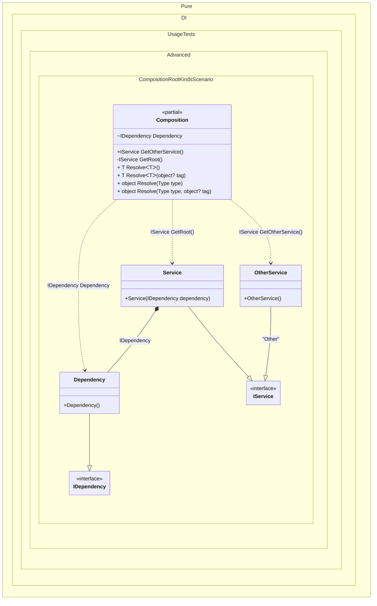

#### Composition root kinds

[](../tests/Pure.DI.UsageTests/Advanced/CompositionRootKindsScenario.cs)


```c#
using Pure.DI;
using static Pure.DI.RootKinds;

var composition = new Composition();
var service = composition.Root;
var otherService = composition.GetOtherService();
var dependency = Composition.Dependency;

interface IDependency;

class Dependency : IDependency;

interface IService;

class Service : IService
{
    public Service(IDependency dependency)
    {
    }
}

class OtherService : IService;

partial class Composition
{
    void Setup() =>
        DI.Setup(nameof(Composition))
            .Bind<IService>().To<Service>()
            .Bind<IService>("Other").To<OtherService>()
            .Bind<IDependency>().To<Dependency>()

            // Creates a public root method named "GetOtherService"
            .Root<IService>("GetOtherService", "Other", Public | Method)

            // Creates a private partial root method named "GetRoot"
            .Root<IService>("GetRoot", kind: Private | Partial | Method)

            // Creates a internal static root named "Dependency"
            .Root<IDependency>("Dependency", kind: Internal | Static);

    private partial IService GetRoot();

    public IService Root => GetRoot();
}
```

<details>
<summary>Running this code sample locally</summary>

- Make sure you have the [.NET SDK 9.0](https://dotnet.microsoft.com/en-us/download/dotnet/9.0) or later is installed
```bash
dotnet --list-sdk
```
- Create a net9.0 (or later) console application
```bash
dotnet new console -n Sample
```
- Add reference to NuGet package
  - [Pure.DI](https://www.nuget.org/packages/Pure.DI)
```bash
dotnet add package Pure.DI
```
- Copy the example code into the _Program.cs_ file

You are ready to run the example 🚀
```bash
dotnet run
```

</details>

The following partial class will be generated:

```c#
partial class Composition
{
  private readonly Composition _root;

  [OrdinalAttribute(256)]
  public Composition()
  {
    _root = this;
  }

  internal Composition(Composition parentScope)
  {
    _root = (parentScope ?? throw new ArgumentNullException(nameof(parentScope)))._root;
  }

  [MethodImpl(MethodImplOptions.AggressiveInlining)]
  private partial IService GetRoot()
  {
    return new Service(new Dependency());
  }

  [MethodImpl(MethodImplOptions.AggressiveInlining)]
  public IService GetOtherService()
  {
    return new OtherService();
  }

  internal static IDependency Dependency
  {
    [MethodImpl(MethodImplOptions.AggressiveInlining)]
    get
    {
      return new Dependency();
    }
  }

  [MethodImpl(MethodImplOptions.AggressiveInlining)]
  public T Resolve<T>()
  {
    return Resolver<T>.Value.Resolve(this);
  }

  [MethodImpl(MethodImplOptions.AggressiveInlining)]
  public T Resolve<T>(object? tag)
  {
    return Resolver<T>.Value.ResolveByTag(this, tag);
  }

  [MethodImpl(MethodImplOptions.AggressiveInlining)]
  public object Resolve(Type type)
  {
    var index = (int)(_bucketSize * ((uint)RuntimeHelpers.GetHashCode(type) % 4));
    ref var pair = ref _buckets[index];
    return pair.Key == type ? pair.Value.Resolve(this) : Resolve(type, index);
  }

  [MethodImpl(MethodImplOptions.NoInlining)]
  private object Resolve(Type type, int index)
  {
    var finish = index + _bucketSize;
    while (++index < finish)
    {
      ref var pair = ref _buckets[index];
      if (pair.Key == type)
      {
        return pair.Value.Resolve(this);
      }
    }

    throw new InvalidOperationException($"{CannotResolveMessage} {OfTypeMessage} {type}.");
  }

  [MethodImpl(MethodImplOptions.AggressiveInlining)]
  public object Resolve(Type type, object? tag)
  {
    var index = (int)(_bucketSize * ((uint)RuntimeHelpers.GetHashCode(type) % 4));
    ref var pair = ref _buckets[index];
    return pair.Key == type ? pair.Value.ResolveByTag(this, tag) : Resolve(type, tag, index);
  }

  [MethodImpl(MethodImplOptions.NoInlining)]
  private object Resolve(Type type, object? tag, int index)
  {
    var finish = index + _bucketSize;
    while (++index < finish)
    {
      ref var pair = ref _buckets[index];
      if (pair.Key == type)
      {
        return pair.Value.ResolveByTag(this, tag);
      }
    }

    throw new InvalidOperationException($"{CannotResolveMessage} \"{tag}\" {OfTypeMessage} {type}.");
  }

  private readonly static int _bucketSize;
  private readonly static Pair<Type, IResolver<Composition, object>>[] _buckets;

  static Composition()
  {
    var valResolver_0000 = new Resolver_0000();
    Resolver<IService>.Value = valResolver_0000;
    var valResolver_0001 = new Resolver_0001();
    Resolver<IDependency>.Value = valResolver_0001;
    _buckets = Buckets<Type, IResolver<Composition, object>>.Create(
      4,
      out _bucketSize,
      new Pair<Type, IResolver<Composition, object>>[2]
      {
         new Pair<Type, IResolver<Composition, object>>(typeof(IService), valResolver_0000)
        ,new Pair<Type, IResolver<Composition, object>>(typeof(IDependency), valResolver_0001)
      });
  }

  private const string CannotResolveMessage = "Cannot resolve composition root ";
  private const string OfTypeMessage = "of type ";

  private class Resolver<T>: IResolver<Composition, T>
  {
    public static IResolver<Composition, T> Value = new Resolver<T>();

    public virtual T Resolve(Composition composite)
    {
      throw new InvalidOperationException($"{CannotResolveMessage}{OfTypeMessage}{typeof(T)}.");
    }

    public virtual T ResolveByTag(Composition composite, object tag)
    {
      throw new InvalidOperationException($"{CannotResolveMessage}\"{tag}\" {OfTypeMessage}{typeof(T)}.");
    }
  }

  private sealed class Resolver_0000: Resolver<IService>
  {
    public override IService Resolve(Composition composition)
    {
      return composition.GetRoot();
    }

    public override IService ResolveByTag(Composition composition, object tag)
    {
      switch (tag)
      {
        case "Other":
          return composition.GetOtherService();

        case null:
          return composition.GetRoot();

        default:
          return base.ResolveByTag(composition, tag);
      }
    }
  }

  private sealed class Resolver_0001: Resolver<IDependency>
  {
    public override IDependency Resolve(Composition composition)
    {
      return Composition.Dependency;
    }

    public override IDependency ResolveByTag(Composition composition, object tag)
    {
      switch (tag)
      {
        case null:
          return Composition.Dependency;

        default:
          return base.ResolveByTag(composition, tag);
      }
    }
  }
}
```

Class diagram:



