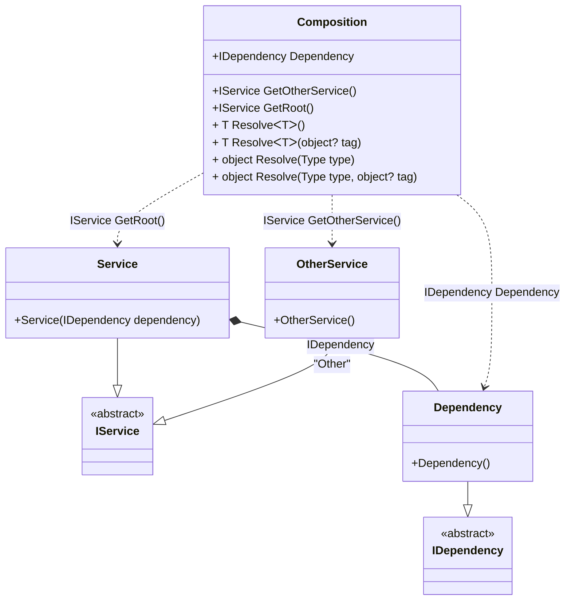

#### Composition root kinds

[](../tests/Pure.DI.UsageTests/Advanced/CompositionRootKindsScenario.cs)

```c#
interface IDependency;

class Dependency : IDependency;

interface IService;

class Service : IService
{
    public Service(IDependency dependency) { }
}

class OtherService : IService;

partial class Composition
{
    private static void Setup() =>
        DI.Setup(nameof(Composition))
            .Bind<IService>().To<Service>()
                // Creates a private partial root method named "GetRoot"
                .Root<IService>("GetRoot", kind: RootKinds.Private | RootKinds.Partial | RootKinds.Method)
            .Bind<IService>("Other").To<OtherService>()
                // Creates a public root method named "GetOtherService"
                .Root<IService>("GetOtherService", "Other", RootKinds.Public | RootKinds.Method)
            .Bind<IDependency>().To<Dependency>()
                // Creates a internal static root named "Dependency"
                .Root<IDependency>("Dependency", kind: RootKinds.Internal | RootKinds.Static);

    private partial IService GetRoot();

    public IService Root => GetRoot();
}

var composition = new Composition();
var service = composition.Root;
var otherService = composition.GetOtherService();
var dependency = Composition.Dependency;
```

<details open>
<summary>Class Diagram</summary>



</details>

<details>
<summary>Pure.DI-generated partial class Composition</summary><blockquote>

```c#
/// <para>
/// <b>Composition roots</b><br/>
/// <list type="table">
/// <listheader>
/// <term>Root</term>
/// <description>Description</description>
/// </listheader>
/// <item>
/// <term>
/// <see cref="Pure.DI.UsageTests.Advanced.CompositionRootKindsScenario.IDependency"/> <see cref="Dependency"/><br/>or using <see cref="Resolve{T}()"/> method: <c>Resolve&lt;Pure.DI.UsageTests.Advanced.CompositionRootKindsScenario.IDependency&gt;()</c>
/// </term>
/// <description>
/// Creates a internal static root named "Dependency"
/// </description>
/// </item>
/// <item>
/// <term>
/// <see cref="Pure.DI.UsageTests.Advanced.CompositionRootKindsScenario.IService"/> <see cref="GetOtherService()"/><br/>or using <see cref="Resolve{T}(object)"/> method: <c>Resolve&lt;Pure.DI.UsageTests.Advanced.CompositionRootKindsScenario.IService&gt;("Other")</c>
/// </term>
/// <description>
/// Creates a public root method named "GetOtherService"
/// </description>
/// </item>
/// <item>
/// <term>
/// <see cref="Pure.DI.UsageTests.Advanced.CompositionRootKindsScenario.IService"/> <see cref="GetRoot()"/><br/>or using <see cref="Resolve{T}()"/> method: <c>Resolve&lt;Pure.DI.UsageTests.Advanced.CompositionRootKindsScenario.IService&gt;()</c>
/// </term>
/// <description>
/// Creates a private partial root method named "GetRoot"
/// </description>
/// </item>
/// </list>
/// </para>
/// </summary>
/// <example>
/// This shows how to get an instance of type <see cref="Pure.DI.UsageTests.Advanced.CompositionRootKindsScenario.Dependency"/> using the composition root <see cref="Dependency"/>:
/// <code>
/// var composition = new Composition();
/// var instance = composition.Dependency;
/// </code>
/// </example>
/// <a href="https://mermaid.live/view#pako:eNqdVM1uwjAMfhXL5x0QHLpxg5ZNO01iPeYSWot1o02VZkgI8Q68yy57Hd5kbVrWNP0bu1iObH_-7C_JEQMREs4x2PEs8yK-lTxmkiX6DK6IU5FFKhIJsM_JxFkWscKbLp89SikJKQkOULtG_JXkPgoInki9qDeS1VlH77V96M5eC6G6s8CHNWVit6fL-du_nL9uShObdwo08uwRFN-2ysqEa21Z5B9SApWbf2S7MNzS8QrvOrmOebV1XF23gt_d6PMCan3MgKlNY9WmUGEtVAcTU6Yb6KCuY2gQayGZ7MZuQ0nGYN1PxUpqLMeKmQyM-9rbvwRpDFtDzEoGLt9kSvJK4VVlu2B6yfwdqSHMwtwJQHsPRsei2H7JU92itPkiLUnHXuMIWkt9C3LoAoxADw5q_UN4hzHJmEdh_sEdGeZdY2I4Zxhy-cHwhKcfcgSuPA">Class diagram</a><br/>
/// This class was created by <a href="https://github.com/DevTeam/Pure.DI">Pure.DI</a> source code generator.
/// <seealso cref="Pure.DI.DI.Setup"/>
/// <seealso cref="Pure.DI.IConfiguration.Bind(object[])"/>
/// <seealso cref="Pure.DI.IConfiguration.Bind{T}(object[])"/>
[global::System.Diagnostics.CodeAnalysis.ExcludeFromCodeCoverage]
partial class Composition
{
  private readonly Composition _rootM03D15di;
  
  /// <summary>
  /// This constructor creates a new instance of <see cref="Composition"/>.
  /// </summary>
  public Composition()
  {
    _rootM03D15di = this;
  }
  
  /// <summary>
  /// This constructor creates a new instance of <see cref="Composition"/> scope based on <paramref name="baseComposition"/>. This allows the <see cref="Lifetime.Scoped"/> life time to be applied.
  /// </summary>
  /// <param name="baseComposition">Base composition.</param>
  internal Composition(Composition baseComposition)
  {
    _rootM03D15di = baseComposition._rootM03D15di;
  }
  
  #region Composition Roots
  /// <summary>
  /// Creates a private partial root method named "GetRoot"
  /// </summary>
  /// <example>
  /// This shows how to get an instance of type <see cref="Pure.DI.UsageTests.Advanced.CompositionRootKindsScenario.Service"/>:
  /// <code>
  /// var composition = new Composition();
  /// var instance = composition.GetRoot();
  /// </code>
  /// </example>
  #if NETSTANDARD2_0_OR_GREATER || NETCOREAPP || NET40_OR_GREATER || NET
  [global::System.Diagnostics.Contracts.Pure]
  #endif
  private partial Pure.DI.UsageTests.Advanced.CompositionRootKindsScenario.IService GetRoot()
  {
    return new Pure.DI.UsageTests.Advanced.CompositionRootKindsScenario.Service(new Pure.DI.UsageTests.Advanced.CompositionRootKindsScenario.Dependency());
  }
  
  /// <summary>
  /// Creates a public root method named "GetOtherService"
  /// </summary>
  /// <example>
  /// This shows how to get an instance of type <see cref="Pure.DI.UsageTests.Advanced.CompositionRootKindsScenario.OtherService"/>:
  /// <code>
  /// var composition = new Composition();
  /// var instance = composition.GetOtherService();
  /// </code>
  /// </example>
  #if NETSTANDARD2_0_OR_GREATER || NETCOREAPP || NET40_OR_GREATER || NET
  [global::System.Diagnostics.Contracts.Pure]
  #endif
  public Pure.DI.UsageTests.Advanced.CompositionRootKindsScenario.IService GetOtherService()
  {
    return new Pure.DI.UsageTests.Advanced.CompositionRootKindsScenario.OtherService();
  }
  
  /// <summary>
  /// Creates a internal static root named "Dependency"
  /// </summary>
  /// <example>
  /// This shows how to get an instance of type <see cref="Pure.DI.UsageTests.Advanced.CompositionRootKindsScenario.Dependency"/>:
  /// <code>
  /// var composition = new Composition();
  /// var instance = composition.Dependency;
  /// </code>
  /// </example>
  internal static Pure.DI.UsageTests.Advanced.CompositionRootKindsScenario.IDependency Dependency
  {
    #if NETSTANDARD2_0_OR_GREATER || NETCOREAPP || NET40_OR_GREATER || NET
    [global::System.Diagnostics.Contracts.Pure]
    #endif
    get
    {
      return new Pure.DI.UsageTests.Advanced.CompositionRootKindsScenario.Dependency();
    }
  }
  #endregion
  
  #region API
  /// <summary>
  /// Resolves the composition root.
  /// </summary>
  /// <typeparam name="T">The type of the composition root.</typeparam>
  /// <returns>A composition root.</returns>
  #if NETSTANDARD2_0_OR_GREATER || NETCOREAPP || NET40_OR_GREATER || NET
  [global::System.Diagnostics.Contracts.Pure]
  #endif
  public T Resolve<T>()
  {
    return ResolverM03D15di<T>.Value.Resolve(this);
  }
  
  /// <summary>
  /// Resolves the composition root by tag.
  /// </summary>
  /// <typeparam name="T">The type of the composition root.</typeparam>
  /// <param name="tag">The tag of a composition root.</param>
  /// <returns>A composition root.</returns>
  #if NETSTANDARD2_0_OR_GREATER || NETCOREAPP || NET40_OR_GREATER || NET
  [global::System.Diagnostics.Contracts.Pure]
  #endif
  public T Resolve<T>(object? tag)
  {
    return ResolverM03D15di<T>.Value.ResolveByTag(this, tag);
  }
  
  /// <summary>
  /// Resolves the composition root.
  /// </summary>
  /// <param name="type">The type of the composition root.</param>
  /// <returns>A composition root.</returns>
  #if NETSTANDARD2_0_OR_GREATER || NETCOREAPP || NET40_OR_GREATER || NET
  [global::System.Diagnostics.Contracts.Pure]
  #endif
  public object Resolve(global::System.Type type)
  {
    var index = (int)(_bucketSizeM03D15di * ((uint)global::System.Runtime.CompilerServices.RuntimeHelpers.GetHashCode(type) % 4));
    var finish = index + _bucketSizeM03D15di;
    do {
      ref var pair = ref _bucketsM03D15di[index];
      if (ReferenceEquals(pair.Key, type))
      {
        return pair.Value.Resolve(this);
      }
    } while (++index < finish);
    
    throw new global::System.InvalidOperationException($"Cannot resolve composition root of type {type}.");
  }
  
  /// <summary>
  /// Resolves the composition root by tag.
  /// </summary>
  /// <param name="type">The type of the composition root.</param>
  /// <param name="tag">The tag of a composition root.</param>
  /// <returns>A composition root.</returns>
  #if NETSTANDARD2_0_OR_GREATER || NETCOREAPP || NET40_OR_GREATER || NET
  [global::System.Diagnostics.Contracts.Pure]
  #endif
  public object Resolve(global::System.Type type, object? tag)
  {
    var index = (int)(_bucketSizeM03D15di * ((uint)global::System.Runtime.CompilerServices.RuntimeHelpers.GetHashCode(type) % 4));
    var finish = index + _bucketSizeM03D15di;
    do {
      ref var pair = ref _bucketsM03D15di[index];
      if (ReferenceEquals(pair.Key, type))
      {
        return pair.Value.ResolveByTag(this, tag);
      }
    } while (++index < finish);
    
    throw new global::System.InvalidOperationException($"Cannot resolve composition root \"{tag}\" of type {type}.");
  }
  #endregion
  
  /// <summary>
  /// This method provides a class diagram in mermaid format. To see this diagram, simply call the method and copy the text to this site https://mermaid.live/.
  /// </summary>
  public override string ToString()
  {
    return
      "classDiagram\n" +
        "  class Composition {\n" +
          "    +IDependency Dependency\n" +
          "    +IService GetOtherService()\n" +
          "    +IService GetRoot()\n" +
          "    + T ResolveᐸTᐳ()\n" +
          "    + T ResolveᐸTᐳ(object? tag)\n" +
          "    + object Resolve(Type type)\n" +
          "    + object Resolve(Type type, object? tag)\n" +
        "  }\n" +
        "  Service --|> IService : \n" +
        "  class Service {\n" +
          "    +Service(IDependency dependency)\n" +
        "  }\n" +
        "  OtherService --|> IService : \"Other\" \n" +
        "  class OtherService {\n" +
          "    +OtherService()\n" +
        "  }\n" +
        "  Dependency --|> IDependency : \n" +
        "  class Dependency {\n" +
          "    +Dependency()\n" +
        "  }\n" +
        "  class IService {\n" +
          "    <<abstract>>\n" +
        "  }\n" +
        "  class IDependency {\n" +
          "    <<abstract>>\n" +
        "  }\n" +
        "  Service *--  Dependency : IDependency\n" +
        "  Composition ..> Service : IService GetRoot()\n" +
        "  Composition ..> OtherService : IService GetOtherService()\n" +
        "  Composition ..> Dependency : IDependency Dependency";
  }
  
  private readonly static int _bucketSizeM03D15di;
  private readonly static global::Pure.DI.Pair<global::System.Type, global::Pure.DI.IResolver<Composition, object>>[] _bucketsM03D15di;
  
  static Composition()
  {
    var valResolverM03D15di_0000 = new ResolverM03D15di_0000();
    ResolverM03D15di<Pure.DI.UsageTests.Advanced.CompositionRootKindsScenario.IService>.Value = valResolverM03D15di_0000;
    var valResolverM03D15di_0001 = new ResolverM03D15di_0001();
    ResolverM03D15di<Pure.DI.UsageTests.Advanced.CompositionRootKindsScenario.IDependency>.Value = valResolverM03D15di_0001;
    _bucketsM03D15di = global::Pure.DI.Buckets<global::System.Type, global::Pure.DI.IResolver<Composition, object>>.Create(
      4,
      out _bucketSizeM03D15di,
      new global::Pure.DI.Pair<global::System.Type, global::Pure.DI.IResolver<Composition, object>>[2]
      {
         new global::Pure.DI.Pair<global::System.Type, global::Pure.DI.IResolver<Composition, object>>(typeof(Pure.DI.UsageTests.Advanced.CompositionRootKindsScenario.IService), valResolverM03D15di_0000)
        ,new global::Pure.DI.Pair<global::System.Type, global::Pure.DI.IResolver<Composition, object>>(typeof(Pure.DI.UsageTests.Advanced.CompositionRootKindsScenario.IDependency), valResolverM03D15di_0001)
      });
  }
  
  #region Resolvers
  private sealed class ResolverM03D15di<T>: global::Pure.DI.IResolver<Composition, T>
  {
    public static global::Pure.DI.IResolver<Composition, T> Value = new ResolverM03D15di<T>();
    
    public T Resolve(Composition composite)
    {
      throw new global::System.InvalidOperationException($"Cannot resolve composition root of type {typeof(T)}.");
    }
    
    public T ResolveByTag(Composition composite, object tag)
    {
      throw new global::System.InvalidOperationException($"Cannot resolve composition root \"{tag}\" of type {typeof(T)}.");
    }
  }
  
  private sealed class ResolverM03D15di_0000: global::Pure.DI.IResolver<Composition, Pure.DI.UsageTests.Advanced.CompositionRootKindsScenario.IService>
  {
    public Pure.DI.UsageTests.Advanced.CompositionRootKindsScenario.IService Resolve(Composition composition)
    {
      return composition.GetRoot();
    }
    
    public Pure.DI.UsageTests.Advanced.CompositionRootKindsScenario.IService ResolveByTag(Composition composition, object tag)
    {
      switch (tag)
      {
        case "Other":
          return composition.GetOtherService();
        case null:
          return composition.GetRoot();
      }
      throw new global::System.InvalidOperationException($"Cannot resolve composition root \"{tag}\" of type Pure.DI.UsageTests.Advanced.CompositionRootKindsScenario.IService.");
    }
  }
  
  private sealed class ResolverM03D15di_0001: global::Pure.DI.IResolver<Composition, Pure.DI.UsageTests.Advanced.CompositionRootKindsScenario.IDependency>
  {
    public Pure.DI.UsageTests.Advanced.CompositionRootKindsScenario.IDependency Resolve(Composition composition)
    {
      return Composition.Dependency;
    }
    
    public Pure.DI.UsageTests.Advanced.CompositionRootKindsScenario.IDependency ResolveByTag(Composition composition, object tag)
    {
      switch (tag)
      {
        case null:
          return Composition.Dependency;
      }
      throw new global::System.InvalidOperationException($"Cannot resolve composition root \"{tag}\" of type Pure.DI.UsageTests.Advanced.CompositionRootKindsScenario.IDependency.");
    }
  }
  #endregion
}
```

</blockquote></details>

