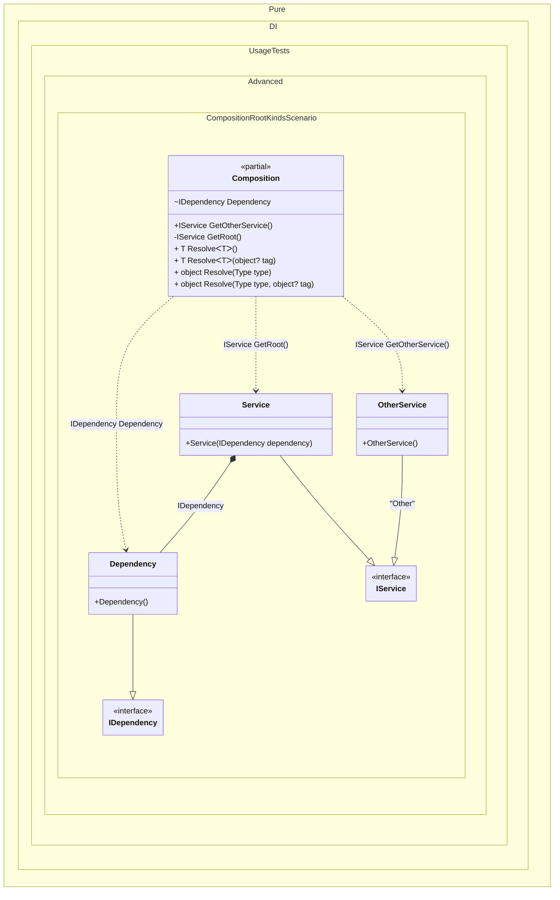

#### Composition root kinds

[](../tests/Pure.DI.UsageTests/Advanced/CompositionRootKindsScenario.cs)


```c#
using Pure.DI;
using static Pure.DI.RootKinds;

var composition = new Composition();
var service = composition.Root;
var otherService = composition.GetOtherService();
var dependency = Composition.Dependency;

interface IDependency;

class Dependency : IDependency;

interface IService;

class Service : IService
{
    public Service(IDependency dependency)
    {
    }
}

class OtherService : IService;

partial class Composition
{
    void Setup() =>
        DI.Setup(nameof(Composition))
            .Bind<IService>().To<Service>()
            .Bind<IService>("Other").To<OtherService>()
            .Bind<IDependency>().To<Dependency>()

            // Creates a public root method named "GetOtherService"
            .Root<IService>("GetOtherService", "Other", Public | Method)

            // Creates a private partial root method named "GetRoot"
            .Root<IService>("GetRoot", kind: Private | Partial | Method)

            // Creates a internal static root named "Dependency"
            .Root<IDependency>("Dependency", kind: Internal | Static);

    private partial IService GetRoot();

    public IService Root => GetRoot();
}
```

<details>
<summary>Running this code sample locally</summary>

- Make sure you have the [.NET SDK 9.0](https://dotnet.microsoft.com/en-us/download/dotnet/9.0) or later is installed
- Create a net9.0 (or later) console application
- Add reference to NuGet package
  - [Pure.DI](https://www.nuget.org/packages/Pure.DI)
- Copy the example code into the _Program.cs_ file

You are ready to run the example!

</details>


Class diagram:



