#### Composition root kinds


```c#
using Pure.DI;
using static Pure.DI.RootKinds;

var composition = new Composition();
var paymentService = composition.PaymentService;
var cashPaymentService = composition.GetCashPaymentService();
var validator = Composition.Validator;

interface ICreditCardValidator;

class LuhnValidator : ICreditCardValidator;

interface IPaymentService;

class CardPaymentService : IPaymentService
{
    public CardPaymentService(ICreditCardValidator validator)
    {
    }
}

class CashPaymentService : IPaymentService;

partial class Composition
{
    void Setup() =>
        DI.Setup(nameof(Composition))
            .Bind<IPaymentService>().To<CardPaymentService>()
            .Bind<IPaymentService>("Cash").To<CashPaymentService>()
            .Bind<ICreditCardValidator>().To<LuhnValidator>()

            // Creates a public root method named "GetCashPaymentService"
            .Root<IPaymentService>("GetCashPaymentService", "Cash", Public | Method)

            // Creates a private partial root method named "GetCardPaymentService"
            .Root<IPaymentService>("GetCardPaymentService", kind: Private | Partial | Method)

            // Creates an internal static root named "Validator"
            .Root<ICreditCardValidator>("Validator", kind: Internal | Static);

    private partial IPaymentService GetCardPaymentService();

    public IPaymentService PaymentService => GetCardPaymentService();
}
```

<details>
<summary>Running this code sample locally</summary>

- Make sure you have the [.NET SDK 10.0](https://dotnet.microsoft.com/en-us/download/dotnet/10.0) or later is installed
```bash
dotnet --list-sdk
```
- Create a net10.0 (or later) console application
```bash
dotnet new console -n Sample
```
- Add reference to NuGet package
  - [Pure.DI](https://www.nuget.org/packages/Pure.DI)
```bash
dotnet add package Pure.DI
```
- Copy the example code into the _Program.cs_ file

You are ready to run the example 🚀
```bash
dotnet run
```

</details>

The following partial class will be generated:

```c#
partial class Composition
{
  [OrdinalAttribute(256)]
  public Composition()
  {
  }

  internal Composition(Composition parentScope)
  {
  }

  [MethodImpl(MethodImplOptions.AggressiveInlining)]
  private partial IPaymentService GetCardPaymentService()
  {
    return new CardPaymentService(new LuhnValidator());
  }

  [MethodImpl(MethodImplOptions.AggressiveInlining)]
  public IPaymentService GetCashPaymentService()
  {
    return new CashPaymentService();
  }

  internal static ICreditCardValidator Validator
  {
    [MethodImpl(MethodImplOptions.AggressiveInlining)]
    get
    {
      return new LuhnValidator();
    }
  }

  [MethodImpl(MethodImplOptions.AggressiveInlining)]
  public T Resolve<T>()
  {
    return Resolver<T>.Value.Resolve(this);
  }

  [MethodImpl(MethodImplOptions.AggressiveInlining)]
  public T Resolve<T>(object? tag)
  {
    return Resolver<T>.Value.ResolveByTag(this, tag);
  }

  [MethodImpl(MethodImplOptions.AggressiveInlining)]
  public object Resolve(Type type)
  {
    #if NETCOREAPP3_0_OR_GREATER
    var index = (int)(_bucketSize * (((uint)type.TypeHandle.GetHashCode()) % 4));
    #else
    var index = (int)(_bucketSize * (((uint)RuntimeHelpers.GetHashCode(type)) % 4));
    #endif
    ref var pair = ref _buckets[index];
    return Object.ReferenceEquals(pair.Key, type) ? pair.Value.Resolve(this) : Resolve(type, index);
  }

  [MethodImpl(MethodImplOptions.NoInlining)]
  private object Resolve(Type type, int index)
  {
    var finish = index + _bucketSize;
    while (++index < finish)
    {
      ref var pair = ref _buckets[index];
      if (Object.ReferenceEquals(pair.Key, type))
      {
        return pair.Value.Resolve(this);
      }
    }

    throw new CannotResolveException($"{CannotResolveMessage} {OfTypeMessage} {type}.", type, null);
  }

  [MethodImpl(MethodImplOptions.AggressiveInlining)]
  public object Resolve(Type type, object? tag)
  {
    #if NETCOREAPP3_0_OR_GREATER
    var index = (int)(_bucketSize * (((uint)type.TypeHandle.GetHashCode()) % 4));
    #else
    var index = (int)(_bucketSize * (((uint)RuntimeHelpers.GetHashCode(type)) % 4));
    #endif
    ref var pair = ref _buckets[index];
    return Object.ReferenceEquals(pair.Key, type) ? pair.Value.ResolveByTag(this, tag) : Resolve(type, tag, index);
  }

  [MethodImpl(MethodImplOptions.NoInlining)]
  private object Resolve(Type type, object? tag, int index)
  {
    var finish = index + _bucketSize;
    while (++index < finish)
    {
      ref var pair = ref _buckets[index];
      if (Object.ReferenceEquals(pair.Key, type))
      {
        return pair.Value.ResolveByTag(this, tag);
      }
    }

    throw new CannotResolveException($"{CannotResolveMessage} \"{tag}\" {OfTypeMessage} {type}.", type, tag);
  }

  private readonly static uint _bucketSize;
  private readonly static Pair<IResolver<Composition, object>>[] _buckets;

  static Composition()
  {
    var valResolver_0000 = new Resolver_0000();
    Resolver<IPaymentService>.Value = valResolver_0000;
    var valResolver_0001 = new Resolver_0001();
    Resolver<ICreditCardValidator>.Value = valResolver_0001;
    _buckets = Buckets<IResolver<Composition, object>>.Create(
      4,
      out _bucketSize,
      new Pair<IResolver<Composition, object>>[2]
      {
         new Pair<IResolver<Composition, object>>(typeof(IPaymentService), valResolver_0000)
        ,new Pair<IResolver<Composition, object>>(typeof(ICreditCardValidator), valResolver_0001)
      });
  }

  private const string CannotResolveMessage = "Cannot resolve composition root ";
  private const string OfTypeMessage = "of type ";

  private class Resolver<T>: IResolver<Composition, T>
  {
    public static IResolver<Composition, T> Value = new Resolver<T>();

    public virtual T Resolve(Composition composite)
    {
      throw new CannotResolveException($"{CannotResolveMessage}{OfTypeMessage}{typeof(T)}.", typeof(T), null);
    }

    public virtual T ResolveByTag(Composition composite, object tag)
    {
      throw new CannotResolveException($"{CannotResolveMessage}\"{tag}\" {OfTypeMessage}{typeof(T)}.", typeof(T), tag);
    }
  }

  private sealed class Resolver_0000: Resolver<IPaymentService>
  {
    public override IPaymentService Resolve(Composition composition)
    {
      return composition.GetCardPaymentService();
    }

    public override IPaymentService ResolveByTag(Composition composition, object tag)
    {
      switch (tag)
      {
        case "Cash":
          return composition.GetCashPaymentService();

        case null:
          return composition.GetCardPaymentService();

        default:
          return base.ResolveByTag(composition, tag);
      }
    }
  }

  private sealed class Resolver_0001: Resolver<ICreditCardValidator>
  {
    public override ICreditCardValidator Resolve(Composition composition)
    {
      return Composition.Validator;
    }

    public override ICreditCardValidator ResolveByTag(Composition composition, object tag)
    {
      switch (tag)
      {
        case null:
          return Composition.Validator;

        default:
          return base.ResolveByTag(composition, tag);
      }
    }
  }
}
```

Class diagram:

```mermaid
---
 config:
  maxTextSize: 2147483647
  maxEdges: 2147483647
  class:
   hideEmptyMembersBox: true
---
classDiagram
	CardPaymentService --|> IPaymentService
	CashPaymentService --|> IPaymentService : "Cash" 
	LuhnValidator --|> ICreditCardValidator
	Composition ..> LuhnValidator : ICreditCardValidator Validator
	Composition ..> CardPaymentService : IPaymentService GetCardPaymentService()
	Composition ..> CashPaymentService : IPaymentService GetCashPaymentService()
	CardPaymentService *--  LuhnValidator : ICreditCardValidator
	namespace Pure.DI.UsageTests.Advanced.CompositionRootKindsScenario {
		class CardPaymentService {
				<<class>>
			+CardPaymentService(ICreditCardValidator validator)
		}
		class CashPaymentService {
				<<class>>
			+CashPaymentService()
		}
		class Composition {
		<<partial>>
		-IPaymentService GetCardPaymentService()
		+IPaymentService GetCashPaymentService()
		~ICreditCardValidator Validator
		+ T ResolveᐸTᐳ()
		+ T ResolveᐸTᐳ(object? tag)
		+ object Resolve(Type type)
		+ object Resolve(Type type, object? tag)
		}
		class ICreditCardValidator {
			<<interface>>
		}
		class IPaymentService {
			<<interface>>
		}
		class LuhnValidator {
				<<class>>
			+LuhnValidator()
		}
	}
```



