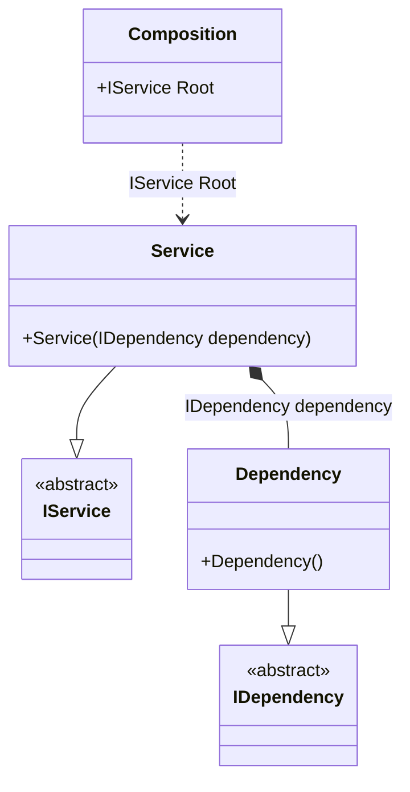

#### Composition root

[](../tests/Pure.DI.UsageTests/Basics/CompositionRootScenario.cs)

This example demonstrates the most efficient way to create a composition root. There is no limit to the number of roots, but consider limiting this number. Ideally, an application would like to have a single composition root.

```c#
internal interface IDependency { }

internal class Dependency : IDependency { }

internal interface IService { }

internal class Service : IService
{
    public Service(IDependency dependency)
    {
    }
}

DI.Setup("Composition")
    .Bind<IDependency>().To<Dependency>()
    .Bind<IService>().To<Service>()
    .Root<IService>("Root");

var composition = new Composition();
var service = composition.Root;
```

<details open>
<summary>Class Diagram</summary>



</details>

<details>
<summary>Generated Code</summary>

```c#
partial class Composition
{
  public Composition()
  {
  }
  
  internal Composition(Composition parent)
  {
  }
  
  #region Composition Roots
  public Pure.DI.UsageTests.Basics.CompositionRootScenario.IService Root
  {
    [global::System.Runtime.CompilerServices.MethodImpl((global::System.Runtime.CompilerServices.MethodImplOptions)0x300)]
    get
    {
      Pure.DI.UsageTests.Basics.CompositionRootScenario.Dependency v52Local3F4E1C = new Pure.DI.UsageTests.Basics.CompositionRootScenario.Dependency();
      Pure.DI.UsageTests.Basics.CompositionRootScenario.Service v51Local3F4E1C = new Pure.DI.UsageTests.Basics.CompositionRootScenario.Service(v52Local3F4E1C);
      return v51Local3F4E1C;
    }
  }
  #endregion
  
  
  public override string ToString()
  {
    return
      "classDiagram\n" +
        "  class Composition {\n" +
          "    +IService Root\n" +
        "  }\n" +
        "  Service --|> IService : \n" +
        "  class Service {\n" +
          "    +Service(IDependency dependency)\n" +
        "  }\n" +
        "  Dependency --|> IDependency : \n" +
        "  class Dependency {\n" +
          "    +Dependency()\n" +
        "  }\n" +
        "  class IService {\n" +
          "    <<abstract>>\n" +
        "  }\n" +
        "  class IDependency {\n" +
          "    <<abstract>>\n" +
        "  }\n" +
        "  Service *--  Dependency : IDependency dependency\n" +
        "  Composition ..> Service : IService Root";
  }
}
```

</details>


The name of the composition root is arbitrarily chosen according to its purpose, but must be limited by C# property naming conventions. Actually, the property _Root_ looks like:
```c#
public IService Root
{
  get
  {
    return new Service(new Dependency());
  }
}
```
To avoid generating _Resolve_ methods just add a comment `// Resolve = Off` before a _Setup_ method:
```c#
// Resolve = Off
DI.Setup("Composition")
  .Bind<IDependency>().To<Dependency>()
  ...
```
This can be done if these methods are not needed, in case only certain composition roots are used. It's not significant then, but it will help save resources during compilation.
