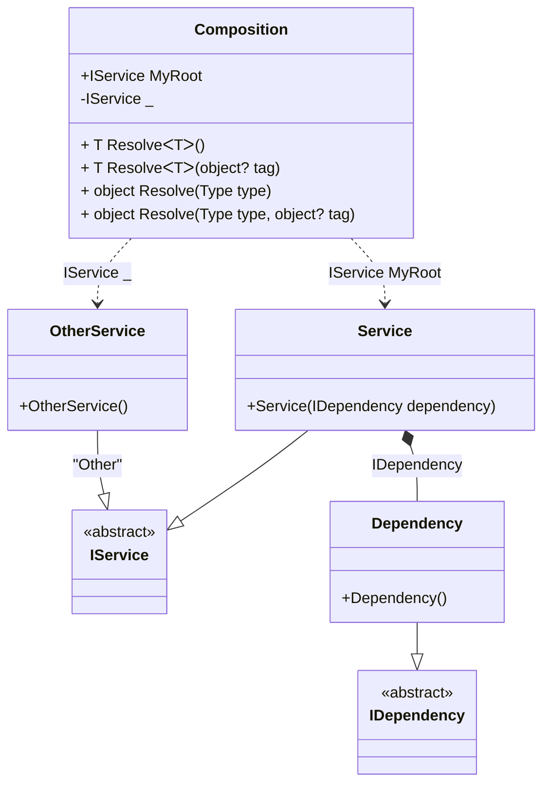

#### Composition roots simplified

[](../tests/Pure.DI.UsageTests/Basics/CompositionRootsSimplifiedScenario.cs)

You can use `RootBind<T>()` method in order to reduce repetitions.

```c#
interface IDependency;

class Dependency : IDependency;

interface IService;

class Service(IDependency dependency) : IService;

class OtherService : IService;

DI.Setup(nameof(Composition))
    // Specifies to create a regular public composition root
    // of type "IService" with the name "MyRoot" and
    // it's the equivalent of statements
    // .Bind<IService>().To<Service>().Root<IService>("MyRoot")
    .RootBind<IService>("MyRoot").To<Service>()

    // Specifies to create a private composition root
    // that is only accessible from "Resolve()" methods and
    // it's the equivalent of statements
    // .Bind<IService>("Other").To<OtherService>().Root<IService>("MyRoot")
    .RootBind<IService>(tags: "Other").To<OtherService>()

    .Bind().To<Dependency>();

var composition = new Composition();
        
// service = new Service(new Dependency());
var service = composition.MyRoot;
        
// someOtherService = new OtherService();
var someOtherService = composition.Resolve<IService>("Other");
```

<details open>
<summary>Class Diagram</summary>



</details>

<details>
<summary>Pure.DI-generated partial class Composition</summary><blockquote>

```c#
partial class Composition
{
  private readonly Composition _rootM04D03di;
  
  public Composition()
  {
    _rootM04D03di = this;
  }
  
  internal Composition(Composition baseComposition)
  {
    _rootM04D03di = baseComposition._rootM04D03di;
  }
  
  public Pure.DI.UsageTests.Basics.CompositionRootsSimplifiedScenario.IService MyRoot
  {
    get
    {
      return new Pure.DI.UsageTests.Basics.CompositionRootsSimplifiedScenario.Service(new Pure.DI.UsageTests.Basics.CompositionRootsSimplifiedScenario.Dependency());
    }
  }
  
  public Pure.DI.UsageTests.Basics.CompositionRootsSimplifiedScenario.IService RootM04D03di0002
  {
    get
    {
      return new Pure.DI.UsageTests.Basics.CompositionRootsSimplifiedScenario.OtherService();
    }
  }
  
  public T Resolve<T>()
  {
    return ResolverM04D03di<T>.Value.Resolve(this);
  }
  
  public T Resolve<T>(object? tag)
  {
    return ResolverM04D03di<T>.Value.ResolveByTag(this, tag);
  }
  
  public object Resolve(global::System.Type type)
  {
    var index = (int)(_bucketSizeM04D03di * ((uint)global::System.Runtime.CompilerServices.RuntimeHelpers.GetHashCode(type) % 1));
    var finish = index + _bucketSizeM04D03di;
    do {
      ref var pair = ref _bucketsM04D03di[index];
      if (pair.Key == type)
      {
        return pair.Value.Resolve(this);
      }
    } while (++index < finish);
    
    throw new global::System.InvalidOperationException($"Cannot resolve composition root of type {type}.");
  }
  
  public object Resolve(global::System.Type type, object? tag)
  {
    var index = (int)(_bucketSizeM04D03di * ((uint)global::System.Runtime.CompilerServices.RuntimeHelpers.GetHashCode(type) % 1));
    var finish = index + _bucketSizeM04D03di;
    do {
      ref var pair = ref _bucketsM04D03di[index];
      if (pair.Key == type)
      {
        return pair.Value.ResolveByTag(this, tag);
      }
    } while (++index < finish);
    
    throw new global::System.InvalidOperationException($"Cannot resolve composition root \"{tag}\" of type {type}.");
  }
  
  public override string ToString()
  {
    return
      "classDiagram\n" +
        "  class Composition {\n" +
          "    +IService MyRoot\n" +
          "    -IService _\n" +
          "    + T ResolveᐸTᐳ()\n" +
          "    + T ResolveᐸTᐳ(object? tag)\n" +
          "    + object Resolve(Type type)\n" +
          "    + object Resolve(Type type, object? tag)\n" +
        "  }\n" +
        "  Service --|> IService : \n" +
        "  class Service {\n" +
          "    +Service(IDependency dependency)\n" +
        "  }\n" +
        "  OtherService --|> IService : \"Other\" \n" +
        "  class OtherService {\n" +
          "    +OtherService()\n" +
        "  }\n" +
        "  Dependency --|> IDependency : \n" +
        "  class Dependency {\n" +
          "    +Dependency()\n" +
        "  }\n" +
        "  class IService {\n" +
          "    <<abstract>>\n" +
        "  }\n" +
        "  class IDependency {\n" +
          "    <<abstract>>\n" +
        "  }\n" +
        "  Service *--  Dependency : IDependency\n" +
        "  Composition ..> Service : IService MyRoot\n" +
        "  Composition ..> OtherService : IService _";
  }
  
  private readonly static int _bucketSizeM04D03di;
  private readonly static global::Pure.DI.Pair<global::System.Type, global::Pure.DI.IResolver<Composition, object>>[] _bucketsM04D03di;
  
  static Composition()
  {
    var valResolverM04D03di_0000 = new ResolverM04D03di_0000();
    ResolverM04D03di<Pure.DI.UsageTests.Basics.CompositionRootsSimplifiedScenario.IService>.Value = valResolverM04D03di_0000;
    _bucketsM04D03di = global::Pure.DI.Buckets<global::System.Type, global::Pure.DI.IResolver<Composition, object>>.Create(
      1,
      out _bucketSizeM04D03di,
      new global::Pure.DI.Pair<global::System.Type, global::Pure.DI.IResolver<Composition, object>>[1]
      {
         new global::Pure.DI.Pair<global::System.Type, global::Pure.DI.IResolver<Composition, object>>(typeof(Pure.DI.UsageTests.Basics.CompositionRootsSimplifiedScenario.IService), valResolverM04D03di_0000)
      });
  }
  
  private sealed class ResolverM04D03di<T>: global::Pure.DI.IResolver<Composition, T>
  {
    public static global::Pure.DI.IResolver<Composition, T> Value = new ResolverM04D03di<T>();
    
    public T Resolve(Composition composite)
    {
      throw new global::System.InvalidOperationException($"Cannot resolve composition root of type {typeof(T)}.");
    }
    
    public T ResolveByTag(Composition composite, object tag)
    {
      throw new global::System.InvalidOperationException($"Cannot resolve composition root \"{tag}\" of type {typeof(T)}.");
    }
  }
  
  private sealed class ResolverM04D03di_0000: global::Pure.DI.IResolver<Composition, Pure.DI.UsageTests.Basics.CompositionRootsSimplifiedScenario.IService>
  {
    public Pure.DI.UsageTests.Basics.CompositionRootsSimplifiedScenario.IService Resolve(Composition composition)
    {
      return composition.MyRoot;
    }
    
    public Pure.DI.UsageTests.Basics.CompositionRootsSimplifiedScenario.IService ResolveByTag(Composition composition, object tag)
    {
      switch (tag)
      {
        case "Other":
          return composition.RootM04D03di0002;
        case null:
          return composition.MyRoot;
      }
      throw new global::System.InvalidOperationException($"Cannot resolve composition root \"{tag}\" of type Pure.DI.UsageTests.Basics.CompositionRootsSimplifiedScenario.IService.");
    }
  }
}
```

</blockquote></details>

