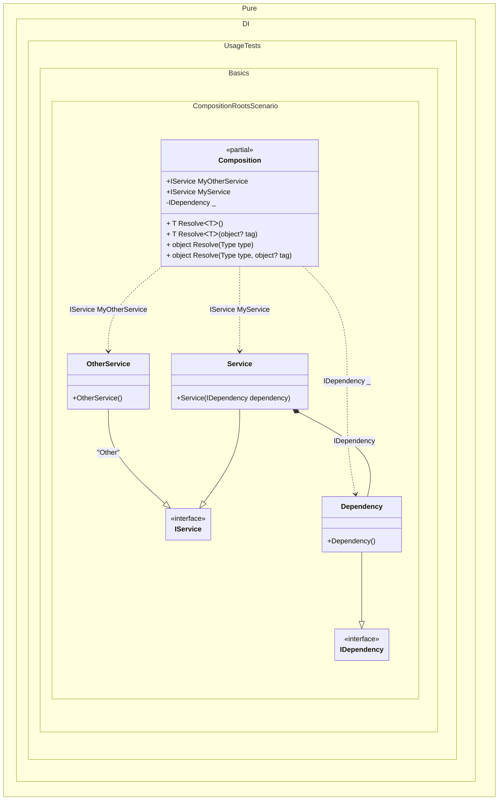

#### Composition roots

[](../tests/Pure.DI.UsageTests/Basics/CompositionRootsScenario.cs)

This example demonstrates several ways to create a composition root.
> [!TIP]
> There is no limit to the number of roots, but you should consider limiting the number of roots. Ideally, an application should have a single composition root.

If you use classic DI containers, the composition is created dynamically every time you call a method similar to `T Resolve<T>()` or `object GetService(Type type)`. The root of the composition there is simply the root type of the composition of objects in memory T or Type type. There can be as many of these as you like. In the case of Pure.DI, the number of composition roots is limited because for each composition root a separate property or method is created at compile time. Therefore, each root is defined explicitly by calling the `Root(string rootName)` method.


```c#
using Pure.DI;

DI.Setup(nameof(Composition))
    .Bind<IService>().To<Service>()
    .Bind<IService>("Other").To<OtherService>()
    .Bind<IDependency>().To<Dependency>()

    // Specifies to create a regular public composition root
    // of type "IService" with the name "MyService"
    .Root<IService>("MyService")

    // Specifies to create a private composition root
    // that is only accessible from "Resolve()" methods
    .Root<IDependency>()

    // Specifies to create a regular public composition root
    // of type "IService" with the name "MyOtherService"
    // using the "Other" tag
    .Root<IService>("MyOtherService", "Other");

var composition = new Composition();

// service = new Service(new Dependency());
var service = composition.MyService;

// someOtherService = new OtherService();
var someOtherService = composition.MyOtherService;

// All and only the roots of the composition
// can be obtained by Resolve method
var dependency = composition.Resolve<IDependency>();
        
// including tagged ones
var tagged = composition.Resolve<IService>("Other");

interface IDependency;

class Dependency : IDependency;

interface IService;

class Service(IDependency dependency) : IService;

class OtherService : IService;
```

The name of the root of a composition is arbitrarily chosen depending on its purpose, but should be restricted by the property naming conventions in C# since it is the same name as a property in the composition class. In reality, the _Root_ property has the form:
```c#
public IService Root
{
  get
  {
    return new Service(new Dependency());
  }
}
```
To avoid generating _Resolve_ methods just add a comment `// Resolve = Off` before a _Setup_ method:
```c#
// Resolve = Off
DI.Setup("Composition")
  .Bind<IDependency>().To<Dependency>()
  ...
```
This can be done if these methods are not needed, in case only certain composition roots are used. It's not significant then, but it will help save resources during compilation.


Class diagram:



