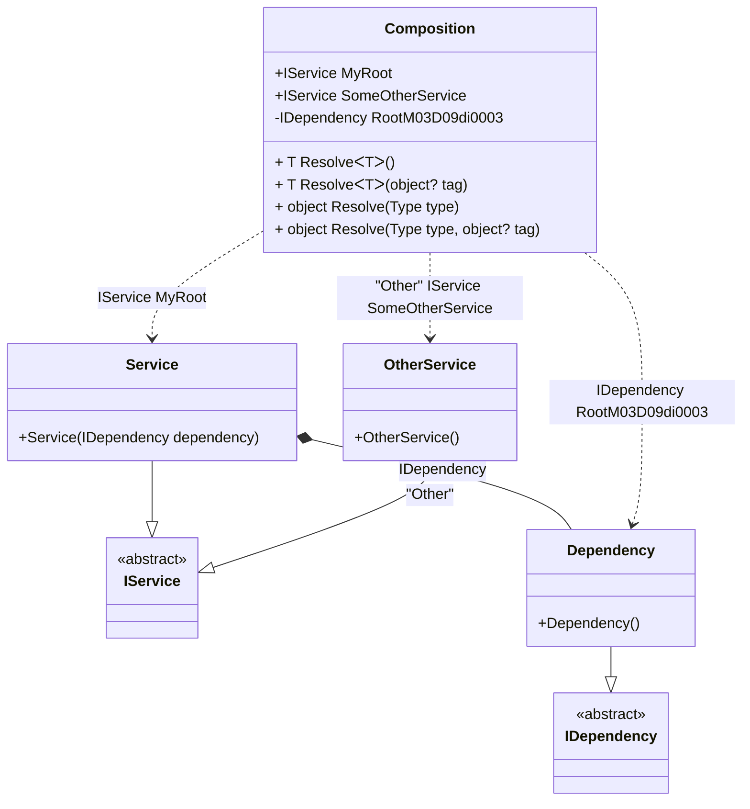

#### Composition roots

[](../tests/Pure.DI.UsageTests/Basics/CompositionRootsScenario.cs)

This example demonstrates several ways to create a composition root. There is no limit to the number of roots, but you should consider limiting the number of roots. Ideally, an application should have a single composition root.

```c#
interface IDependency;

class Dependency : IDependency;

interface IService;

class Service(IDependency dependency) : IService;

class OtherService : IService;

DI.Setup(nameof(Composition))
    .Bind<IService>().To<Service>()
        // Specifies to create a regular public composition root
        // of type "IService" with the name "MyRoot"
        .Root<IService>("MyRoot")
    .Bind<IService>("Other").To<OtherService>()
        // Specifies to create a regular public composition root
        // of type "IService" with the name "SomeOtherService"
        // using the "Other" tag
        .Root<IService>("SomeOtherService", "Other")
    .Bind<IDependency>().To<Dependency>()
        // Specifies to create a private composition root
        // that is only accessible from "Resolve()" methods
        .Root<IDependency>();

var composition = new Composition();
        
// service = new Service(new Dependency());
var service = composition.MyRoot;
        
// someOtherService = new OtherService();
var someOtherService = composition.SomeOtherService;
        
var dependency = composition.Resolve<IDependency>();
```

The name of the root of a composition is arbitrarily chosen depending on its purpose, but should be restricted by the property naming conventions in C# since it is the same name as a property in the composition class. In reality, the _Root_ property has the form:
```c#
public IService Root
{
  get
  {
    return new Service(new Dependency());
  }
}
```
To avoid generating _Resolve_ methods just add a comment `// Resolve = Off` before a _Setup_ method:
```c#
// Resolve = Off
DI.Setup("Composition")
  .Bind<IDependency>().To<Dependency>()
  ...
```
This can be done if these methods are not needed, in case only certain composition roots are used. It's not significant then, but it will help save resources during compilation.

<details open>
<summary>Class Diagram</summary>



</details>

<details>
<summary>Pure.DI-generated partial class Composition</summary><blockquote>

```c#
/// <para>
/// Composition roots:<br/>
/// <list type="table">
/// <listheader>
/// <term>Root</term>
/// <description>Description</description>
/// </listheader>
/// <item>
/// <term>
/// <see cref="Pure.DI.UsageTests.Basics.CompositionRootsScenario.Service"/> MyRoot
/// </term>
/// <description>
/// Specifies to create a regular public composition root<br/>
/// of type "IService" with the name "MyRoot"
/// </description>
/// </item>
/// <item>
/// <term>
/// <see cref="Pure.DI.UsageTests.Basics.CompositionRootsScenario.OtherService"/> SomeOtherService
/// </term>
/// <description>
/// Specifies to create a regular public composition root<br/>
/// of type "IService" with the name "SomeOtherService"<br/>
/// using the "Other" tag
/// </description>
/// </item>
/// <item>
/// <term>
/// <see cref="Pure.DI.UsageTests.Basics.CompositionRootsScenario.Dependency"/> is a private composition root that can be resolved by methods like <see cref="Resolve{T}()"/>.
/// </term>
/// <description>
/// Specifies to create a private composition root<br/>
/// that is only accessible from "Resolve()" methods
/// </description>
/// </item>
/// </list>
/// </para>
/// <example>
/// This shows how to get an instance of type <see cref="Pure.DI.UsageTests.Basics.CompositionRootsScenario.Service"/> using the composition root <see cref="MyRoot"/>:
/// <code>
/// var composition = new Composition();
/// var instance = composition.MyRoot;
/// </code>
/// </example>
/// <a href="https://mermaid.live/view#pako:eNqdVEtuwjAQvcrI6y4ssqCwg4RKLFAlYOmNSUY0LYkjx0VCiDtwl256HW7SxA7E-bfdjMaemTfPb2yfiS8CJFPiH3iaeiHfSx4xyWK9BldEiUhDFYoY2Cel43key73RfLlBeQx9hNVpLYRqCWxEhK_qDWWx8Ujxlh4mGAcY-yfIi1fU8egkCCmlTgkEW1hjKg5HvF2_t7frl95-1nYymCZ27-ir3HdeQPF9o8wk3GtN0faUIKjM_CPbhf6WYy_37uIYIUo7dnXdAh7y6fUMymnYAXsSd3k1J1va4OG2MbFH8wc6RNcxYhFrINnsKjegZYCGjMW6m0otqSJOLWYzKEPd_Q1I5bAlhGMYuHyXKsmLCS8K2wbTSeb3SJXBzGxNAJo6WB3z4vq7HekWxmZC1kba8pIHABoDr1yM3g9gALn3aK1_BXkiEcqIh0H2jZ0ZyfpFyMiUkYDLD0Yu5PID-6al2A">Class diagram</a><br/>
/// This class was created by <a href="https://github.com/DevTeam/Pure.DI">Pure.DI</a> source code generator.
/// </summary>
/// <seealso cref="Pure.DI.DI.Setup"/>
[global::System.Diagnostics.CodeAnalysis.ExcludeFromCodeCoverage]
partial class Composition
{
  private readonly Composition _rootM03D09di;
  
  /// <summary>
  /// This constructor creates a new instance of <see cref="Composition"/>.
  /// </summary>
  public Composition()
  {
    _rootM03D09di = this;
  }
  
  /// <summary>
  /// This constructor creates a new instance of <see cref="Composition"/> scope based on <paramref name="baseComposition"/>. This allows the <see cref="Lifetime.Scoped"/> life time to be applied.
  /// </summary>
  /// <param name="baseComposition">Base composition.</param>
  internal Composition(Composition baseComposition)
  {
    _rootM03D09di = baseComposition._rootM03D09di;
  }
  
  #region Composition Roots
  /// <summary>
  /// Specifies to create a regular public composition root<br/>
  /// of type "IService" with the name "MyRoot"
  /// </summary>
  public Pure.DI.UsageTests.Basics.CompositionRootsScenario.IService MyRoot
  {
    #if NETSTANDARD2_0_OR_GREATER || NETCOREAPP || NET40_OR_GREATER || NET
    [global::System.Diagnostics.Contracts.Pure]
    #endif
    get
    {
      return new Pure.DI.UsageTests.Basics.CompositionRootsScenario.Service(new Pure.DI.UsageTests.Basics.CompositionRootsScenario.Dependency());
    }
  }
  
  /// <summary>
  /// Specifies to create a regular public composition root<br/>
  /// of type "IService" with the name "SomeOtherService"<br/>
  /// using the "Other" tag
  /// </summary>
  public Pure.DI.UsageTests.Basics.CompositionRootsScenario.IService SomeOtherService
  {
    #if NETSTANDARD2_0_OR_GREATER || NETCOREAPP || NET40_OR_GREATER || NET
    [global::System.Diagnostics.Contracts.Pure]
    #endif
    get
    {
      return new Pure.DI.UsageTests.Basics.CompositionRootsScenario.OtherService();
    }
  }
  
  /// <summary>
  /// Specifies to create a private composition root<br/>
  /// that is only accessible from "Resolve()" methods
  /// </summary>
  public Pure.DI.UsageTests.Basics.CompositionRootsScenario.IDependency RootM03D09di0003
  {
    #if NETSTANDARD2_0_OR_GREATER || NETCOREAPP || NET40_OR_GREATER || NET
    [global::System.Diagnostics.Contracts.Pure]
    #endif
    get
    {
      return new Pure.DI.UsageTests.Basics.CompositionRootsScenario.Dependency();
    }
  }
  #endregion
  
  #region API
  /// <summary>
  /// Resolves the composition root.
  /// </summary>
  /// <typeparam name="T">The type of the composition root.</typeparam>
  /// <returns>A composition root.</returns>
  #if NETSTANDARD2_0_OR_GREATER || NETCOREAPP || NET40_OR_GREATER || NET
  [global::System.Diagnostics.Contracts.Pure]
  #endif
  public T Resolve<T>()
  {
    return ResolverM03D09di<T>.Value.Resolve(this);
  }
  
  /// <summary>
  /// Resolves the composition root by tag.
  /// </summary>
  /// <typeparam name="T">The type of the composition root.</typeparam>
  /// <param name="tag">The tag of a composition root.</param>
  /// <returns>A composition root.</returns>
  #if NETSTANDARD2_0_OR_GREATER || NETCOREAPP || NET40_OR_GREATER || NET
  [global::System.Diagnostics.Contracts.Pure]
  #endif
  public T Resolve<T>(object? tag)
  {
    return ResolverM03D09di<T>.Value.ResolveByTag(this, tag);
  }
  
  /// <summary>
  /// Resolves the composition root.
  /// </summary>
  /// <param name="type">The type of the composition root.</param>
  /// <returns>A composition root.</returns>
  #if NETSTANDARD2_0_OR_GREATER || NETCOREAPP || NET40_OR_GREATER || NET
  [global::System.Diagnostics.Contracts.Pure]
  #endif
  public object Resolve(global::System.Type type)
  {
    var index = (int)(_bucketSizeM03D09di * ((uint)global::System.Runtime.CompilerServices.RuntimeHelpers.GetHashCode(type) % 4));
    var finish = index + _bucketSizeM03D09di;
    do {
      ref var pair = ref _bucketsM03D09di[index];
      if (ReferenceEquals(pair.Key, type))
      {
        return pair.Value.Resolve(this);
      }
    } while (++index < finish);
    
    throw new global::System.InvalidOperationException($"Cannot resolve composition root of type {type}.");
  }
  
  /// <summary>
  /// Resolves the composition root by tag.
  /// </summary>
  /// <param name="type">The type of the composition root.</param>
  /// <param name="tag">The tag of a composition root.</param>
  /// <returns>A composition root.</returns>
  #if NETSTANDARD2_0_OR_GREATER || NETCOREAPP || NET40_OR_GREATER || NET
  [global::System.Diagnostics.Contracts.Pure]
  #endif
  public object Resolve(global::System.Type type, object? tag)
  {
    var index = (int)(_bucketSizeM03D09di * ((uint)global::System.Runtime.CompilerServices.RuntimeHelpers.GetHashCode(type) % 4));
    var finish = index + _bucketSizeM03D09di;
    do {
      ref var pair = ref _bucketsM03D09di[index];
      if (ReferenceEquals(pair.Key, type))
      {
        return pair.Value.ResolveByTag(this, tag);
      }
    } while (++index < finish);
    
    throw new global::System.InvalidOperationException($"Cannot resolve composition root \"{tag}\" of type {type}.");
  }
  #endregion
  
  /// <summary>
  /// This method provides a class diagram in mermaid format. To see this diagram, simply call the method and copy the text to this site https://mermaid.live/.
  /// </summary>
  public override string ToString()
  {
    return
      "classDiagram\n" +
        "  class Composition {\n" +
          "    +IService MyRoot\n" +
          "    +IService SomeOtherService\n" +
          "    -IDependency RootM03D09di0003\n" +
          "    + T ResolveᐸTᐳ()\n" +
          "    + T ResolveᐸTᐳ(object? tag)\n" +
          "    + object Resolve(Type type)\n" +
          "    + object Resolve(Type type, object? tag)\n" +
        "  }\n" +
        "  Service --|> IService : \n" +
        "  class Service {\n" +
          "    +Service(IDependency dependency)\n" +
        "  }\n" +
        "  OtherService --|> IService : \"Other\" \n" +
        "  class OtherService {\n" +
          "    +OtherService()\n" +
        "  }\n" +
        "  Dependency --|> IDependency : \n" +
        "  class Dependency {\n" +
          "    +Dependency()\n" +
        "  }\n" +
        "  class IService {\n" +
          "    <<abstract>>\n" +
        "  }\n" +
        "  class IDependency {\n" +
          "    <<abstract>>\n" +
        "  }\n" +
        "  Service *--  Dependency : IDependency\n" +
        "  Composition ..> Service : IService MyRoot\n" +
        "  Composition ..> OtherService : \"Other\" IService SomeOtherService\n" +
        "  Composition ..> Dependency : IDependency RootM03D09di0003";
  }
  
  private readonly static int _bucketSizeM03D09di;
  private readonly static global::Pure.DI.Pair<global::System.Type, global::Pure.DI.IResolver<Composition, object>>[] _bucketsM03D09di;
  
  static Composition()
  {
    var valResolverM03D09di_0000 = new ResolverM03D09di_0000();
    ResolverM03D09di<Pure.DI.UsageTests.Basics.CompositionRootsScenario.IService>.Value = valResolverM03D09di_0000;
    var valResolverM03D09di_0001 = new ResolverM03D09di_0001();
    ResolverM03D09di<Pure.DI.UsageTests.Basics.CompositionRootsScenario.IDependency>.Value = valResolverM03D09di_0001;
    _bucketsM03D09di = global::Pure.DI.Buckets<global::System.Type, global::Pure.DI.IResolver<Composition, object>>.Create(
      4,
      out _bucketSizeM03D09di,
      new global::Pure.DI.Pair<global::System.Type, global::Pure.DI.IResolver<Composition, object>>[2]
      {
         new global::Pure.DI.Pair<global::System.Type, global::Pure.DI.IResolver<Composition, object>>(typeof(Pure.DI.UsageTests.Basics.CompositionRootsScenario.IService), valResolverM03D09di_0000)
        ,new global::Pure.DI.Pair<global::System.Type, global::Pure.DI.IResolver<Composition, object>>(typeof(Pure.DI.UsageTests.Basics.CompositionRootsScenario.IDependency), valResolverM03D09di_0001)
      });
  }
  
  #region Resolvers
  private sealed class ResolverM03D09di<T>: global::Pure.DI.IResolver<Composition, T>
  {
    public static global::Pure.DI.IResolver<Composition, T> Value = new ResolverM03D09di<T>();
    
    public T Resolve(Composition composite)
    {
      throw new global::System.InvalidOperationException($"Cannot resolve composition root of type {typeof(T)}.");
    }
    
    public T ResolveByTag(Composition composite, object tag)
    {
      throw new global::System.InvalidOperationException($"Cannot resolve composition root \"{tag}\" of type {typeof(T)}.");
    }
  }
  
  private sealed class ResolverM03D09di_0000: global::Pure.DI.IResolver<Composition, Pure.DI.UsageTests.Basics.CompositionRootsScenario.IService>
  {
    public Pure.DI.UsageTests.Basics.CompositionRootsScenario.IService Resolve(Composition composition)
    {
      return composition.MyRoot;
    }
    
    public Pure.DI.UsageTests.Basics.CompositionRootsScenario.IService ResolveByTag(Composition composition, object tag)
    {
      switch (tag)
      {
        case "Other":
          return composition.SomeOtherService;
        case null:
          return composition.MyRoot;
      }
      throw new global::System.InvalidOperationException($"Cannot resolve composition root \"{tag}\" of type Pure.DI.UsageTests.Basics.CompositionRootsScenario.IService.");
    }
  }
  
  private sealed class ResolverM03D09di_0001: global::Pure.DI.IResolver<Composition, Pure.DI.UsageTests.Basics.CompositionRootsScenario.IDependency>
  {
    public Pure.DI.UsageTests.Basics.CompositionRootsScenario.IDependency Resolve(Composition composition)
    {
      return composition.RootM03D09di0003;
    }
    
    public Pure.DI.UsageTests.Basics.CompositionRootsScenario.IDependency ResolveByTag(Composition composition, object tag)
    {
      switch (tag)
      {
        case null:
          return composition.RootM03D09di0003;
      }
      throw new global::System.InvalidOperationException($"Cannot resolve composition root \"{tag}\" of type Pure.DI.UsageTests.Basics.CompositionRootsScenario.IDependency.");
    }
  }
  #endregion
}
```

</blockquote></details>

