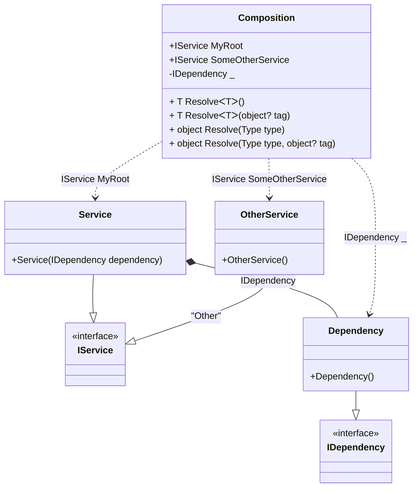

#### Composition roots

[](../tests/Pure.DI.UsageTests/Basics/CompositionRootsScenario.cs)

This example demonstrates several ways to create a composition root. There is no limit to the number of roots, but you should consider limiting the number of roots. Ideally, an application should have a single composition root.

```c#
interface IDependency;

class Dependency : IDependency;

interface IService;

class Service(IDependency dependency) : IService;

class OtherService : IService;

DI.Setup(nameof(Composition))
    .Bind<IService>().To<Service>()
    .Bind<IService>("Other").To<OtherService>()
    .Bind<IDependency>().To<Dependency>()

    // Specifies to create a regular public composition root
    // of type "IService" with the name "MyRoot"
    .Root<IService>("MyRoot")

    // Specifies to create a private composition root
    // that is only accessible from "Resolve()" methods
    .Root<IDependency>()

    // Specifies to create a regular public composition root
    // of type "IService" with the name "SomeOtherService"
    // using the "Other" tag
    .Root<IService>("SomeOtherService", "Other");

var composition = new Composition();
        
// service = new Service(new Dependency());
var service = composition.MyRoot;
        
// someOtherService = new OtherService();
var someOtherService = composition.SomeOtherService;
        
// All and only the roots of the composition
// can be obtained by Resolve method
var dependency = composition.Resolve<IDependency>();
```

The name of the root of a composition is arbitrarily chosen depending on its purpose, but should be restricted by the property naming conventions in C# since it is the same name as a property in the composition class. In reality, the _Root_ property has the form:
```c#
public IService Root
{
  get
  {
    return new Service(new Dependency());
  }
}
```
To avoid generating _Resolve_ methods just add a comment `// Resolve = Off` before a _Setup_ method:
```c#
// Resolve = Off
DI.Setup("Composition")
  .Bind<IDependency>().To<Dependency>()
  ...
```
This can be done if these methods are not needed, in case only certain composition roots are used. It's not significant then, but it will help save resources during compilation.

<details open>
<summary>Class Diagram</summary>



</details>

<details>
<summary>Pure.DI-generated partial class Composition</summary><blockquote>

```c#
partial class Composition
{
  private readonly Composition _root;

  public Composition()
  {
    _root = this;
  }

  internal Composition(Composition parentScope)
  {
    _root = (parentScope ?? throw new ArgumentNullException(nameof(parentScope)))._root;
  }

  public IService MyRoot
  {
    [MethodImpl(MethodImplOptions.AggressiveInlining)]
    get
    {
      return new Service(new Dependency());
    }
  }

  public IService SomeOtherService
  {
    [MethodImpl(MethodImplOptions.AggressiveInlining)]
    get
    {
      return new OtherService();
    }
  }

  private IDependency Root0002
  {
    [MethodImpl(MethodImplOptions.AggressiveInlining)]
    get
    {
      return new Dependency();
    }
  }

  [MethodImpl(MethodImplOptions.AggressiveInlining)]
  public T Resolve<T>()
  {
    return Resolver<T>.Value.Resolve(this);
  }

  [MethodImpl(MethodImplOptions.AggressiveInlining)]
  public T Resolve<T>(object? tag)
  {
    return Resolver<T>.Value.ResolveByTag(this, tag);
  }

  [MethodImpl(MethodImplOptions.AggressiveInlining)]
  public object Resolve(Type type)
  {
    var index = (int)(_bucketSize * ((uint)RuntimeHelpers.GetHashCode(type) % 4));
    ref var pair = ref _buckets[index];
    return pair.Key == type ? pair.Value.Resolve(this) : Resolve(type, index);
  }

  [MethodImpl(MethodImplOptions.NoInlining)]
  private object Resolve(Type type, int index)
  {
    var finish = index + _bucketSize;
    while (++index < finish)
    {
      ref var pair = ref _buckets[index];
      if (pair.Key == type)
      {
        return pair.Value.Resolve(this);
      }
    }

    throw new InvalidOperationException($"{CannotResolveMessage} {OfTypeMessage} {type}.");
  }

  [MethodImpl(MethodImplOptions.AggressiveInlining)]
  public object Resolve(Type type, object? tag)
  {
    var index = (int)(_bucketSize * ((uint)RuntimeHelpers.GetHashCode(type) % 4));
    ref var pair = ref _buckets[index];
    return pair.Key == type ? pair.Value.ResolveByTag(this, tag) : Resolve(type, tag, index);
  }

  [MethodImpl(MethodImplOptions.NoInlining)]
  private object Resolve(Type type, object? tag, int index)
  {
    var finish = index + _bucketSize;
    while (++index < finish)
    {
      ref var pair = ref _buckets[index];
      if (pair.Key == type)
      {
        return pair.Value.ResolveByTag(this, tag);
      }
    }

    throw new InvalidOperationException($"{CannotResolveMessage} \"{tag}\" {OfTypeMessage} {type}.");
  }

  private readonly static int _bucketSize;
  private readonly static Pair<Type, IResolver<Composition, object>>[] _buckets;

  static Composition()
  {
    var valResolver_0000 = new Resolver_0000();
    Resolver<IService>.Value = valResolver_0000;
    var valResolver_0001 = new Resolver_0001();
    Resolver<IDependency>.Value = valResolver_0001;
    _buckets = Buckets<Type, IResolver<Composition, object>>.Create(
      4,
      out _bucketSize,
      new Pair<Type, IResolver<Composition, object>>[2]
      {
         new Pair<Type, IResolver<Composition, object>>(typeof(IService), valResolver_0000)
        ,new Pair<Type, IResolver<Composition, object>>(typeof(IDependency), valResolver_0001)
      });
  }

  private const string CannotResolveMessage = "Cannot resolve composition root ";
  private const string OfTypeMessage = "of type ";

  private class Resolver<T>: IResolver<Composition, T>
  {
    public static IResolver<Composition, T> Value = new Resolver<T>();

    public virtual T Resolve(Composition composite)
    {
      throw new InvalidOperationException($"{CannotResolveMessage}{OfTypeMessage}{typeof(T)}.");
    }

    public virtual T ResolveByTag(Composition composite, object tag)
    {
      throw new InvalidOperationException($"{CannotResolveMessage}\"{tag}\" {OfTypeMessage}{typeof(T)}.");
    }
  }

  private sealed class Resolver_0000: Resolver<IService>
  {
    public override IService Resolve(Composition composition)
    {
      return composition.MyRoot;
    }

    public override IService ResolveByTag(Composition composition, object tag)
    {
      switch (tag)
      {
        case "Other":
          return composition.SomeOtherService;

        case null:
          return composition.MyRoot;

        default:
          return base.ResolveByTag(composition, tag);
      }
    }
  }

  private sealed class Resolver_0001: Resolver<IDependency>
  {
    public override IDependency Resolve(Composition composition)
    {
      return composition.Root0002;
    }

    public override IDependency ResolveByTag(Composition composition, object tag)
    {
      switch (tag)
      {
        case null:
          return composition.Root0002;

        default:
          return base.ResolveByTag(composition, tag);
      }
    }
  }
}
```

</blockquote></details>

