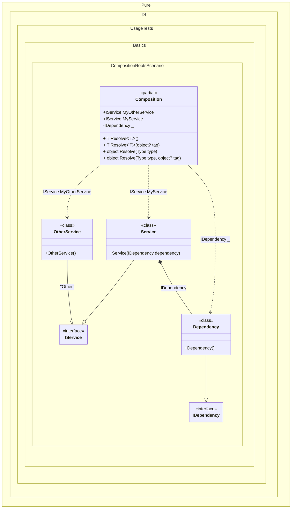

#### Composition roots

This example demonstrates several ways to create a composition root.
> [!TIP]
> There is no limit to the number of roots, but you should consider limiting the number of roots. Ideally, an application should have a single composition root.

If you use classic DI containers, the composition is resolved dynamically every time you call a method similar to `T Resolve<T>()` or `object GetService(Type type)`. The root of the composition there is simply the root type of the composition of objects in memory `T` or `Type` type. There can be as many of these as you like. In the case of Pure.DI, the number of composition roots is limited because for each composition root a separate property or method is created at compile time. Therefore, each root is defined explicitly by calling the `Root(string rootName)` method.


```c#
using Pure.DI;

DI.Setup(nameof(Composition))
    .Bind<IService>().To<Service>()
    .Bind<IService>("Other").To<OtherService>()
    .Bind<IDependency>().To<Dependency>()

    // Specifies to create a regular composition root
    // of type "IService" with the name "MyService"
    .Root<IService>("MyService")

    // Specifies to create an anonymous composition root
    // that is only accessible from "Resolve()" methods
    .Root<IDependency>()

    // Specifies to create a regular composition root
    // of type "IService" with the name "MyOtherService"
    // using the "Other" tag
    .Root<IService>("MyOtherService", "Other");

var composition = new Composition();

// service = new Service(new Dependency());
var service = composition.MyService;

// someOtherService = new OtherService();
var someOtherService = composition.MyOtherService;

// All and only the roots of the composition
// can be obtained by Resolve method
var dependency = composition.Resolve<IDependency>();
        
// including tagged ones
var tagged = composition.Resolve<IService>("Other");

interface IDependency;

class Dependency : IDependency;

interface IService;

class Service(IDependency dependency) : IService;

class OtherService : IService;
```

<details>
<summary>Running this code sample locally</summary>

- Make sure you have the [.NET SDK 9.0](https://dotnet.microsoft.com/en-us/download/dotnet/9.0) or later is installed
```bash
dotnet --list-sdk
```
- Create a net9.0 (or later) console application
```bash
dotnet new console -n Sample
```
- Add reference to NuGet package
  - [Pure.DI](https://www.nuget.org/packages/Pure.DI)
```bash
dotnet add package Pure.DI
```
- Copy the example code into the _Program.cs_ file

You are ready to run the example 🚀
```bash
dotnet run
```

</details>

The name of the composition root is arbitrarily chosen depending on its purpose, but should be restricted by the property naming conventions in C# since it is the same name as a property in the composition class. In reality, the _Root_ property has the form:
```c#
public IService Root
{
  get
  {
    return new Service(new Dependency());
  }
}
```
To avoid generating _Resolve_ methods just add a comment `// Resolve = Off` before a _Setup_ method:
```c#
// Resolve = Off
DI.Setup("Composition")
  .Bind<IDependency>().To<Dependency>()
  ...
```
This can be done if these methods are not needed, in case only certain composition roots are used. It's not significant then, but it will help save resources during compilation.

The following partial class will be generated:

```c#
partial class Composition
{
  [OrdinalAttribute(256)]
  public Composition()
  {
  }

  internal Composition(Composition parentScope)
  {
  }

  public IService MyService
  {
    [MethodImpl(MethodImplOptions.AggressiveInlining)]
    get
    {
      return new Service(new Dependency());
    }
  }

  public IService MyOtherService
  {
    [MethodImpl(MethodImplOptions.AggressiveInlining)]
    get
    {
      return new OtherService();
    }
  }

  private IDependency Root2
  {
    [MethodImpl(MethodImplOptions.AggressiveInlining)]
    get
    {
      return new Dependency();
    }
  }

  [MethodImpl(MethodImplOptions.AggressiveInlining)]
  public T Resolve<T>()
  {
    return Resolver<T>.Value.Resolve(this);
  }

  [MethodImpl(MethodImplOptions.AggressiveInlining)]
  public T Resolve<T>(object? tag)
  {
    return Resolver<T>.Value.ResolveByTag(this, tag);
  }

  [MethodImpl(MethodImplOptions.AggressiveInlining)]
  public object Resolve(Type type)
  {
    var index = (int)(_bucketSize * ((uint)RuntimeHelpers.GetHashCode(type) % 4));
    ref var pair = ref _buckets[index];
    return pair.Key == type ? pair.Value.Resolve(this) : Resolve(type, index);
  }

  [MethodImpl(MethodImplOptions.NoInlining)]
  private object Resolve(Type type, int index)
  {
    var finish = index + _bucketSize;
    while (++index < finish)
    {
      ref var pair = ref _buckets[index];
      if (pair.Key == type)
      {
        return pair.Value.Resolve(this);
      }
    }

    throw new InvalidOperationException($"{CannotResolveMessage} {OfTypeMessage} {type}.");
  }

  [MethodImpl(MethodImplOptions.AggressiveInlining)]
  public object Resolve(Type type, object? tag)
  {
    var index = (int)(_bucketSize * ((uint)RuntimeHelpers.GetHashCode(type) % 4));
    ref var pair = ref _buckets[index];
    return pair.Key == type ? pair.Value.ResolveByTag(this, tag) : Resolve(type, tag, index);
  }

  [MethodImpl(MethodImplOptions.NoInlining)]
  private object Resolve(Type type, object? tag, int index)
  {
    var finish = index + _bucketSize;
    while (++index < finish)
    {
      ref var pair = ref _buckets[index];
      if (pair.Key == type)
      {
        return pair.Value.ResolveByTag(this, tag);
      }
    }

    throw new InvalidOperationException($"{CannotResolveMessage} \"{tag}\" {OfTypeMessage} {type}.");
  }

  private readonly static uint _bucketSize;
  private readonly static Pair<IResolver<Composition, object>>[] _buckets;

  static Composition()
  {
    var valResolver_0000 = new Resolver_0000();
    Resolver<IService>.Value = valResolver_0000;
    var valResolver_0001 = new Resolver_0001();
    Resolver<IDependency>.Value = valResolver_0001;
    _buckets = Buckets<IResolver<Composition, object>>.Create(
      4,
      out _bucketSize,
      new Pair<IResolver<Composition, object>>[2]
      {
         new Pair<IResolver<Composition, object>>(typeof(IService), valResolver_0000)
        ,new Pair<IResolver<Composition, object>>(typeof(IDependency), valResolver_0001)
      });
  }

  private const string CannotResolveMessage = "Cannot resolve composition root ";
  private const string OfTypeMessage = "of type ";

  private class Resolver<T>: IResolver<Composition, T>
  {
    public static IResolver<Composition, T> Value = new Resolver<T>();

    public virtual T Resolve(Composition composite)
    {
      throw new InvalidOperationException($"{CannotResolveMessage}{OfTypeMessage}{typeof(T)}.");
    }

    public virtual T ResolveByTag(Composition composite, object tag)
    {
      throw new InvalidOperationException($"{CannotResolveMessage}\"{tag}\" {OfTypeMessage}{typeof(T)}.");
    }
  }

  private sealed class Resolver_0000: Resolver<IService>
  {
    public override IService Resolve(Composition composition)
    {
      return composition.MyService;
    }

    public override IService ResolveByTag(Composition composition, object tag)
    {
      switch (tag)
      {
        case "Other":
          return composition.MyOtherService;

        case null:
          return composition.MyService;

        default:
          return base.ResolveByTag(composition, tag);
      }
    }
  }

  private sealed class Resolver_0001: Resolver<IDependency>
  {
    public override IDependency Resolve(Composition composition)
    {
      return composition.Root2;
    }

    public override IDependency ResolveByTag(Composition composition, object tag)
    {
      switch (tag)
      {
        case null:
          return composition.Root2;

        default:
          return base.ResolveByTag(composition, tag);
      }
    }
  }
}
```

Class diagram:



