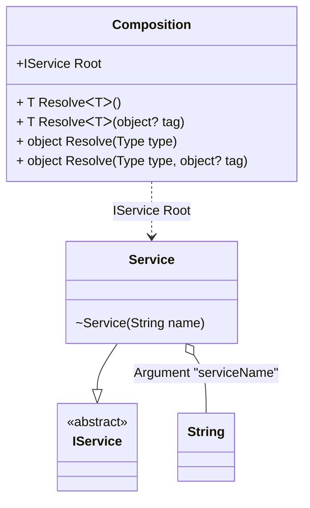

#### Constructor ordinal attribute

[](../tests/Pure.DI.UsageTests/Attributes/ConstructorOrdinalAttributeScenario.cs)

When applied to any constructor in a type, automatic injection constructor selection is disabled. The selection will only focus on constructors marked with this attribute, in the appropriate order from smallest value to largest.

```c#
interface IDependency;

class Dependency : IDependency;

interface IService;

class Service : IService
{
    private readonly string _name;

    [Ordinal(1)]
    public Service(IDependency dependency) =>
        _name = "with dependency";

    [Ordinal(0)]
    internal Service(string name) => _name = name;

    public Service() => _name = "default";

    public override string ToString() => _name;
}

DI.Setup(nameof(Composition))
    .Arg<string>("serviceName")
    .Bind<IDependency>().To<Dependency>()
    .Bind<IService>().To<Service>()

    // Composition root
    .Root<IService>("Root");

var composition = new Composition(serviceName: "Xyz");
var service = composition.Root;
service.ToString().ShouldBe("Xyz");
```

The attribute `Ordinal` is part of the API, but you can use your own attribute at any time, and this allows you to define them in the assembly and namespace you want.

<details open>
<summary>Class Diagram</summary>



</details>

<details>
<summary>Pure.DI-generated partial class Composition</summary><blockquote>

```c#
partial class Composition
{
  private readonly Composition _rootM04D12di;
  private readonly string _argM04D12di_serviceName;
  
  public Composition(string serviceName)
  {
    _rootM04D12di = this;
    if (ReferenceEquals(serviceName, null))
    {
      throw new global::System.ArgumentNullException("serviceName");
    }
    
    _argM04D12di_serviceName = serviceName;
  }
  
  internal Composition(Composition baseComposition)
  {
    _rootM04D12di = baseComposition._rootM04D12di;
    _argM04D12di_serviceName = baseComposition._argM04D12di_serviceName;
  }
  
  public Pure.DI.UsageTests.Attributes.ConstructorOrdinalAttributeScenario.IService Root
  {
    [global::System.Runtime.CompilerServices.MethodImpl((global::System.Runtime.CompilerServices.MethodImplOptions)0x100)]
    get
    {
      return new Pure.DI.UsageTests.Attributes.ConstructorOrdinalAttributeScenario.Service(_argM04D12di_serviceName);
    }
  }
  
  public T Resolve<T>()
  {
    return ResolverM04D12di<T>.Value.Resolve(this);
  }
  
  public T Resolve<T>(object? tag)
  {
    return ResolverM04D12di<T>.Value.ResolveByTag(this, tag);
  }
  
  [global::System.Runtime.CompilerServices.MethodImpl((global::System.Runtime.CompilerServices.MethodImplOptions)0x100)]
  public object Resolve(global::System.Type type)
  {
    var index = (int)(_bucketSizeM04D12di * ((uint)global::System.Runtime.CompilerServices.RuntimeHelpers.GetHashCode(type) % 1));
    ref var pair = ref _bucketsM04D12di[index];
    return pair.Key == type ? pair.Value.Resolve(this) : ResolveM04D12di(type, index);
  }
  
  [global::System.Runtime.CompilerServices.MethodImpl((global::System.Runtime.CompilerServices.MethodImplOptions)0x8)]
  private object ResolveM04D12di(global::System.Type type, int index)
  {
    var finish = index + _bucketSizeM04D12di;
    while (++index < finish)
    {
      ref var pair = ref _bucketsM04D12di[index];
      if (pair.Key == type)
      {
        return pair.Value.Resolve(this);
      }
    }
    
    throw new global::System.InvalidOperationException($"Cannot resolve composition root of type {type}.");
  }
  
  [global::System.Runtime.CompilerServices.MethodImpl((global::System.Runtime.CompilerServices.MethodImplOptions)0x100)]
  public object Resolve(global::System.Type type, object? tag)
  {
    var index = (int)(_bucketSizeM04D12di * ((uint)global::System.Runtime.CompilerServices.RuntimeHelpers.GetHashCode(type) % 1));
    ref var pair = ref _bucketsM04D12di[index];
    return pair.Key == type ? pair.Value.ResolveByTag(this, tag) : ResolveM04D12di(type, index);
  }
  
  [global::System.Runtime.CompilerServices.MethodImpl((global::System.Runtime.CompilerServices.MethodImplOptions)0x8)]
  private object ResolveM04D12di(global::System.Type type, object? tag, int index)
  {
    var finish = index + _bucketSizeM04D12di;
    while (++index < finish)
    {
      ref var pair = ref _bucketsM04D12di[index];
      if (pair.Key == type)
      {
        return pair.Value.ResolveByTag(this, tag);
      }
    }
    
    throw new global::System.InvalidOperationException($"Cannot resolve composition root \"{tag}\" of type {type}.");
  }
  
  public override string ToString()
  {
    return
      "classDiagram\n" +
        "  class Composition {\n" +
          "    +IService Root\n" +
          "    + T ResolveᐸTᐳ()\n" +
          "    + T ResolveᐸTᐳ(object? tag)\n" +
          "    + object Resolve(Type type)\n" +
          "    + object Resolve(Type type, object? tag)\n" +
        "  }\n" +
        "  class String\n" +
        "  Service --|> IService : \n" +
        "  class Service {\n" +
          "    ~Service(String name)\n" +
        "  }\n" +
        "  class IService {\n" +
          "    <<abstract>>\n" +
        "  }\n" +
        "  Service o-- String : Argument \"serviceName\"\n" +
        "  Composition ..> Service : IService Root";
  }
  
  private readonly static int _bucketSizeM04D12di;
  private readonly static global::Pure.DI.Pair<global::System.Type, global::Pure.DI.IResolver<Composition, object>>[] _bucketsM04D12di;
  
  static Composition()
  {
    var valResolverM04D12di_0000 = new ResolverM04D12di_0000();
    ResolverM04D12di<Pure.DI.UsageTests.Attributes.ConstructorOrdinalAttributeScenario.IService>.Value = valResolverM04D12di_0000;
    _bucketsM04D12di = global::Pure.DI.Buckets<global::System.Type, global::Pure.DI.IResolver<Composition, object>>.Create(
      1,
      out _bucketSizeM04D12di,
      new global::Pure.DI.Pair<global::System.Type, global::Pure.DI.IResolver<Composition, object>>[1]
      {
         new global::Pure.DI.Pair<global::System.Type, global::Pure.DI.IResolver<Composition, object>>(typeof(Pure.DI.UsageTests.Attributes.ConstructorOrdinalAttributeScenario.IService), valResolverM04D12di_0000)
      });
  }
  
  private sealed class ResolverM04D12di<T>: global::Pure.DI.IResolver<Composition, T>
  {
    public static global::Pure.DI.IResolver<Composition, T> Value = new ResolverM04D12di<T>();
    
    public T Resolve(Composition composite)
    {
      throw new global::System.InvalidOperationException($"Cannot resolve composition root of type {typeof(T)}.");
    }
    
    public T ResolveByTag(Composition composite, object tag)
    {
      throw new global::System.InvalidOperationException($"Cannot resolve composition root \"{tag}\" of type {typeof(T)}.");
    }
  }
  
  private sealed class ResolverM04D12di_0000: global::Pure.DI.IResolver<Composition, Pure.DI.UsageTests.Attributes.ConstructorOrdinalAttributeScenario.IService>
  {
    public Pure.DI.UsageTests.Attributes.ConstructorOrdinalAttributeScenario.IService Resolve(Composition composition)
    {
      return composition.Root;
    }
    
    public Pure.DI.UsageTests.Attributes.ConstructorOrdinalAttributeScenario.IService ResolveByTag(Composition composition, object tag)
    {
      switch (tag)
      {
        case null:
          return composition.Root;
      }
      throw new global::System.InvalidOperationException($"Cannot resolve composition root \"{tag}\" of type Pure.DI.UsageTests.Attributes.ConstructorOrdinalAttributeScenario.IService.");
    }
  }
}
```

</blockquote></details>

