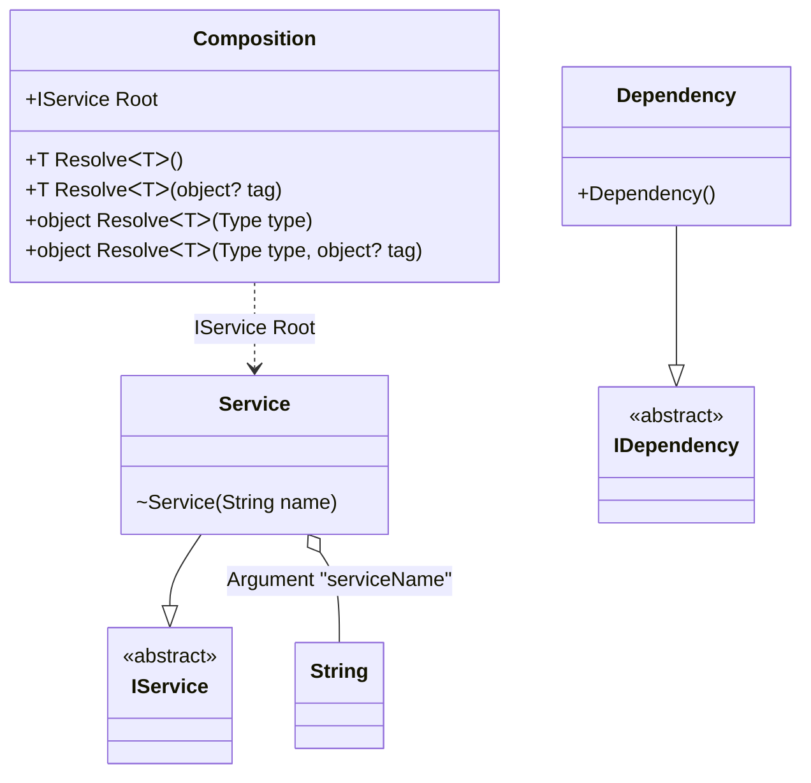

#### Constructor Ordinal Attribute

[](../tests/Pure.DI.UsageTests/Attributes/ConstructorOrdinalAttributeScenario.cs)

When applied to any constructor in a type, automatic injection constructor selection is disabled. The selection will only focus on constructors marked with this attribute, in the appropriate order from smallest value to largest.

```c#
internal interface IDependency { }

internal class Dependency : IDependency { }

internal interface IService { }

internal class Service : IService
{
    private readonly string _name;

    [Ordinal(1)]
    public Service(IDependency dependency) => _name = "with dependency";

    [Ordinal(0)]
    internal Service(string name) => _name = name;

    public Service() => _name = "default";

    public override string ToString() => _name;
}

DI.Setup("Composition")
    .Arg<string>("serviceName")
    .Bind<IDependency>().To<Dependency>()
    .Bind<IService>().To<Service>().Root<IService>("Root");

var composition = new Composition("Xyz");
var service = composition.Root;
service.ToString().ShouldBe("Xyz");
```

<details open>
<summary>Class Diagram</summary>



</details>

<details>
<summary>Generated Code</summary>

```c#
partial class Composition
{
  private readonly string _serviceNameArgA1F7;
  
  public Composition(string serviceName)
  {
    if (global::System.Object.ReferenceEquals(serviceName, null))
    {
      throw new global::System.ArgumentNullException("serviceName");
    }
    
    _serviceNameArgA1F7 = serviceName;
  }
  
  internal Composition(Composition parent)
  {
    _serviceNameArgA1F7 = parent._serviceNameArgA1F7;
  }
  
  #region Composition Roots
  public Pure.DI.UsageTests.Attributes.ConstructorOrdinalAttributeScenario.IService Root
  {
    [global::System.Runtime.CompilerServices.MethodImpl((global::System.Runtime.CompilerServices.MethodImplOptions)0x300)]
    get
    {
      Pure.DI.UsageTests.Attributes.ConstructorOrdinalAttributeScenario.Service v0LocalA1F7 = new Pure.DI.UsageTests.Attributes.ConstructorOrdinalAttributeScenario.Service(_serviceNameArgA1F7);
      return v0LocalA1F7;
    }
  }
  #endregion
  
  #region API
  #if NETSTANDARD2_0_OR_GREATER || NETCOREAPP || NET40_OR_GREATER
  [global::System.Diagnostics.Contracts.Pure]
  #endif
  [global::System.Runtime.CompilerServices.MethodImpl((global::System.Runtime.CompilerServices.MethodImplOptions)0x300)]
  public T Resolve<T>()
  {
    return ResolverA1F7<T>.Value.Resolve(this);
  }
  
  #if NETSTANDARD2_0_OR_GREATER || NETCOREAPP || NET40_OR_GREATER
  [global::System.Diagnostics.Contracts.Pure]
  #endif
  [global::System.Runtime.CompilerServices.MethodImpl((global::System.Runtime.CompilerServices.MethodImplOptions)0x300)]
  public T Resolve<T>(object? tag)
  {
    return ResolverA1F7<T>.Value.ResolveByTag(this, tag);
  }
  
  #if NETSTANDARD2_0_OR_GREATER || NETCOREAPP || NET40_OR_GREATER
  [global::System.Diagnostics.Contracts.Pure]
  #endif
  [global::System.Runtime.CompilerServices.MethodImpl((global::System.Runtime.CompilerServices.MethodImplOptions)0x300)]
  public object Resolve(global::System.Type type)
  {
    int index = (int)(_bucketSizeA1F7 * ((uint)global::System.Runtime.CompilerServices.RuntimeHelpers.GetHashCode(type) % 1));
    ref var pair = ref _bucketsA1F7[index];
    if (ReferenceEquals(pair.Key, type))
    {
      return pair.Value.Resolve(this);
    }
    
    int maxIndex = index + _bucketSizeA1F7;
    for (int i = index + 1; i < maxIndex; i++)
    {
      pair = ref _bucketsA1F7[i];
      if (ReferenceEquals(pair.Key, type))
      {
        return pair.Value.Resolve(this);
      }
    }
    
    throw new global::System.InvalidOperationException($"Cannot resolve composition root of type {type}.");
  }
  
  #if NETSTANDARD2_0_OR_GREATER || NETCOREAPP || NET40_OR_GREATER
  [global::System.Diagnostics.Contracts.Pure]
  #endif
  [global::System.Runtime.CompilerServices.MethodImpl((global::System.Runtime.CompilerServices.MethodImplOptions)0x300)]
  public object Resolve(global::System.Type type, object? tag)
  {
    int index = (int)(_bucketSizeA1F7 * ((uint)global::System.Runtime.CompilerServices.RuntimeHelpers.GetHashCode(type) % 1));
    ref var pair = ref _bucketsA1F7[index];
    if (ReferenceEquals(pair.Key, type))
    {
      return pair.Value.ResolveByTag(this, tag);
    }
    
    int maxIndex = index + _bucketSizeA1F7;
    for (int i = index + 1; i < maxIndex; i++)
    {
      pair = ref _bucketsA1F7[i];
      if (ReferenceEquals(pair.Key, type))
      {
        return pair.Value.ResolveByTag(this, tag);
      }
    }
    
    throw new global::System.InvalidOperationException($"Cannot resolve composition root \"{tag}\" of type {type}.");
  }
  #endregion
  
  public override string ToString()
  {
    return
      "classDiagram\n" +
        "  class Composition {\n" +
          "    +IService Root\n" +
          "    +T ResolveᐸTᐳ()\n" +
          "    +T ResolveᐸTᐳ(object? tag)\n" +
          "    +object ResolveᐸTᐳ(Type type)\n" +
          "    +object ResolveᐸTᐳ(Type type, object? tag)\n" +
        "  }\n" +
        "  Service --|> IService : \n" +
        "  class Service {\n" +
          "    ~Service(String name)\n" +
        "  }\n" +
        "  Dependency --|> IDependency : \n" +
        "  class Dependency {\n" +
          "    +Dependency()\n" +
        "  }\n" +
        "  class String\n" +
        "  class IService {\n" +
          "    <<abstract>>\n" +
        "  }\n" +
        "  class IDependency {\n" +
          "    <<abstract>>\n" +
        "  }\n" +
        "  Service o-- String : Argument \"serviceName\"\n" +
        "  Composition ..> Service : IService Root";
  }
  
  private readonly static int _bucketSizeA1F7;
  private readonly static global::Pure.DI.Pair<global::System.Type, global::Pure.DI.IResolver<Composition, object>>[] _bucketsA1F7;
  
  static Composition()
  {
    ResolverA1F70 valResolverA1F70 = new ResolverA1F70();
    ResolverA1F7<Pure.DI.UsageTests.Attributes.ConstructorOrdinalAttributeScenario.IService>.Value = valResolverA1F70;
    _bucketsA1F7 = global::Pure.DI.Buckets<global::System.Type, global::Pure.DI.IResolver<Composition, object>>.Create(
      1,
      out _bucketSizeA1F7,
      new global::Pure.DI.Pair<global::System.Type, global::Pure.DI.IResolver<Composition, object>>[1]
      {
         new global::Pure.DI.Pair<global::System.Type, global::Pure.DI.IResolver<Composition, object>>(typeof(Pure.DI.UsageTests.Attributes.ConstructorOrdinalAttributeScenario.IService), valResolverA1F70)
      });
  }
  
  #region Resolvers
  private sealed class ResolverA1F7<T>: global::Pure.DI.IResolver<Composition, T>
  {
    public static global::Pure.DI.IResolver<Composition, T> Value = new ResolverA1F7<T>();
    
    public T Resolve(Composition composite)
    {
      throw new global::System.InvalidOperationException($"Cannot resolve composition root of type {typeof(T)}.");
    }
    
    public T ResolveByTag(Composition composite, object tag)
    {
      throw new global::System.InvalidOperationException($"Cannot resolve composition root \"{tag}\" of type {typeof(T)}.");
    }
  }
  
  private sealed class ResolverA1F70: global::Pure.DI.IResolver<Composition, Pure.DI.UsageTests.Attributes.ConstructorOrdinalAttributeScenario.IService>
  {
    [global::System.Runtime.CompilerServices.MethodImpl((global::System.Runtime.CompilerServices.MethodImplOptions)0x300)]
    public Pure.DI.UsageTests.Attributes.ConstructorOrdinalAttributeScenario.IService Resolve(Composition composition)
    {
      return composition.Root;
    }
    
    [global::System.Runtime.CompilerServices.MethodImpl((global::System.Runtime.CompilerServices.MethodImplOptions)0x300)]
    public Pure.DI.UsageTests.Attributes.ConstructorOrdinalAttributeScenario.IService ResolveByTag(Composition composition, object tag)
    {
      if (Equals(tag, null)) return composition.Root;
      throw new global::System.InvalidOperationException($"Cannot resolve composition root \"{tag}\" of type Pure.DI.UsageTests.Attributes.ConstructorOrdinalAttributeScenario.IService.");
    }
  }
  #endregion
}
```

</details>


The attribute `Ordinal` is part of the API, but you can use your own attribute at any time, and this allows you to define them in the assembly and namespace you want.
