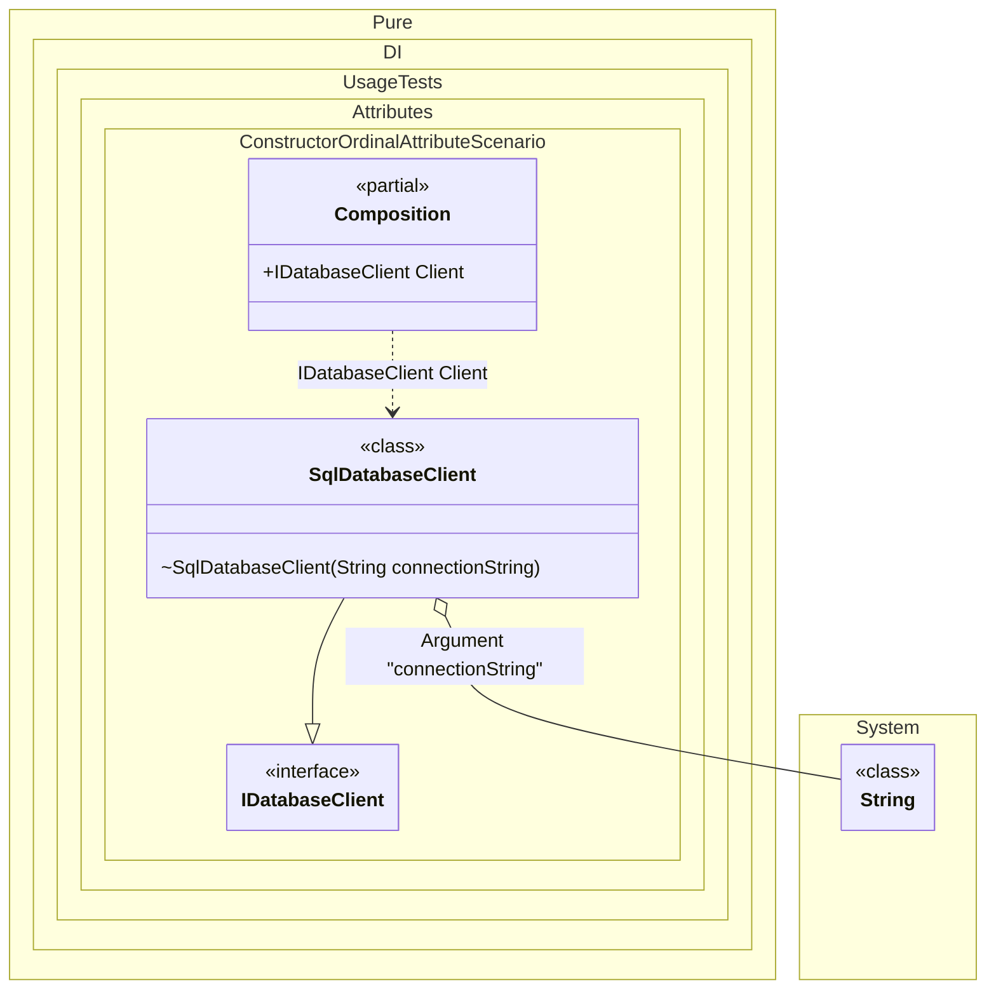

#### Constructor ordinal attribute

When applied to any constructor in a type, automatic injection constructor selection is disabled. The selection will only focus on constructors marked with this attribute, in the appropriate order from smallest value to largest.


```c#
using Shouldly;
using Pure.DI;

DI.Setup(nameof(Composition))
    .Arg<string>("connectionString")
    .Bind().To<Configuration>()
    .Bind().To<SqlDatabaseClient>()

    // Composition root
    .Root<IDatabaseClient>("Client");

var composition = new Composition(connectionString: "Server=.;Database=MyDb;");
var client = composition.Client;

// The client was created using the connection string constructor (Ordinal 0)
// even though the configuration constructor (Ordinal 1) was also possible.
client.ConnectionString.ShouldBe("Server=.;Database=MyDb;");

interface IConfiguration;

class Configuration : IConfiguration;

interface IDatabaseClient
{
    string ConnectionString { get; }
}

class SqlDatabaseClient : IDatabaseClient
{
    // The integer value in the argument specifies
    // the ordinal of injection.
    // The DI container will try to use this constructor first (Ordinal 0).
    [Ordinal(0)]
    internal SqlDatabaseClient(string connectionString) =>
        ConnectionString = connectionString;

    // If the first constructor cannot be used (e.g. connectionString is missing),
    // the DI container will try to use this one (Ordinal 1).
    [Ordinal(1)]
    public SqlDatabaseClient(IConfiguration configuration) =>
        ConnectionString = "Server=.;Database=DefaultDb;";

    public SqlDatabaseClient() =>
        ConnectionString = "InMemory";

    public string ConnectionString { get; }
}
```

<details>
<summary>Running this code sample locally</summary>

- Make sure you have the [.NET SDK 10.0](https://dotnet.microsoft.com/en-us/download/dotnet/10.0) or later is installed
```bash
dotnet --list-sdk
```
- Create a net10.0 (or later) console application
```bash
dotnet new console -n Sample
```
- Add references to NuGet packages
  - [Pure.DI](https://www.nuget.org/packages/Pure.DI)
  - [Shouldly](https://www.nuget.org/packages/Shouldly)
```bash
dotnet add package Pure.DI
dotnet add package Shouldly
```
- Copy the example code into the _Program.cs_ file

You are ready to run the example 🚀
```bash
dotnet run
```

</details>

The attribute `Ordinal` is part of the API, but you can use your own attribute at any time, and this allows you to define them in the assembly and namespace you want.

The following partial class will be generated:

```c#
partial class Composition
{
#if NET9_0_OR_GREATER
  private readonly Lock _lock;
#else
  private readonly Object _lock;
#endif

  private readonly string _argConnectionString;

  [OrdinalAttribute(128)]
  public Composition(string connectionString)
  {
    _argConnectionString = connectionString ?? throw new ArgumentNullException(nameof(connectionString));
#if NET9_0_OR_GREATER
    _lock = new Lock();
#else
    _lock = new Object();
#endif
  }

  public IDatabaseClient Client
  {
    [MethodImpl(MethodImplOptions.AggressiveInlining)]
    get
    {
      return new SqlDatabaseClient(_argConnectionString);
    }
  }
}
```

Class diagram:



