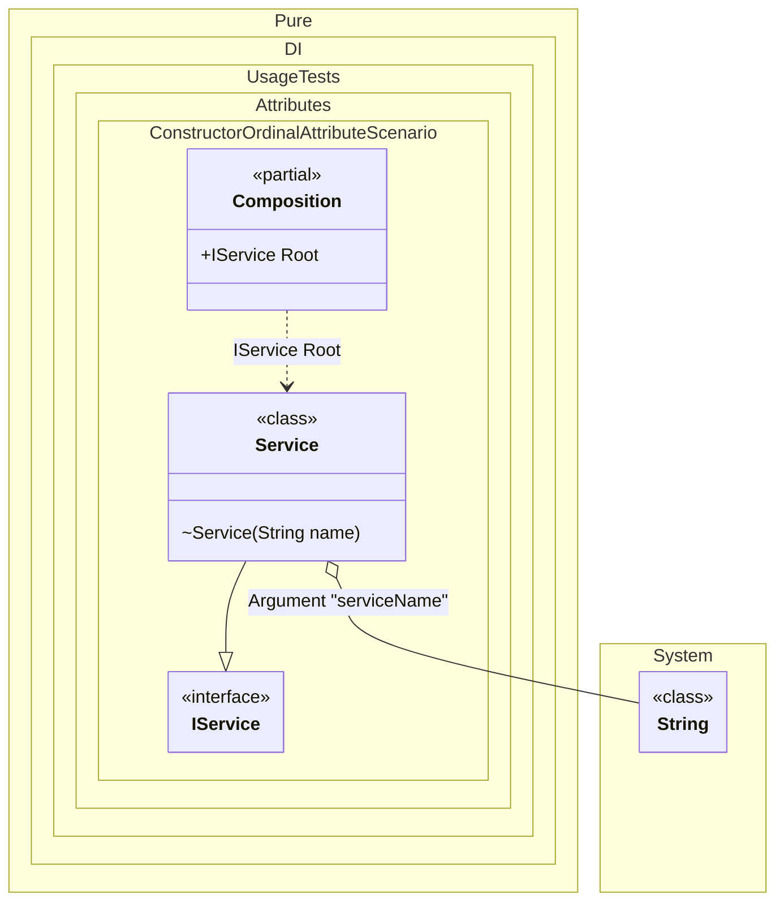

#### Constructor ordinal attribute

When applied to any constructor in a type, automatic injection constructor selection is disabled. The selection will only focus on constructors marked with this attribute, in the appropriate order from smallest value to largest.


```c#
using Shouldly;
using Pure.DI;

DI.Setup(nameof(Composition))
    .Arg<string>("serviceName")
    .Bind().To<Dependency>()
    .Bind().To<Service>()

    // Composition root
    .Root<IService>("Root");

var composition = new Composition(serviceName: "Xyz");
var service = composition.Root;
service.ToString().ShouldBe("Xyz");

interface IDependency;

class Dependency : IDependency;

interface IService;

class Service : IService
{
    private readonly string _name;

    // The integer value in the argument specifies
    // the ordinal of injection
    [Ordinal(1)]
    public Service(IDependency dependency) =>
        _name = "with dependency";

    [Ordinal(0)]
    internal Service(string name) => _name = name;

    public Service() => _name = "default";

    public override string ToString() => _name;
}
```

<details>
<summary>Running this code sample locally</summary>

- Make sure you have the [.NET SDK 9.0](https://dotnet.microsoft.com/en-us/download/dotnet/9.0) or later is installed
```bash
dotnet --list-sdk
```
- Create a net9.0 (or later) console application
```bash
dotnet new console -n Sample
```
- Add references to NuGet packages
  - [Pure.DI](https://www.nuget.org/packages/Pure.DI)
  - [Shouldly](https://www.nuget.org/packages/Shouldly)
```bash
dotnet add package Pure.DI
dotnet add package Shouldly
```
- Copy the example code into the _Program.cs_ file

You are ready to run the example 🚀
```bash
dotnet run
```

</details>

The attribute `Ordinal` is part of the API, but you can use your own attribute at any time, and this allows you to define them in the assembly and namespace you want.

The following partial class will be generated:

```c#
partial class Composition
{
  private readonly Composition _root;
#if NET9_0_OR_GREATER
  private readonly Lock _lock;
#else
  private readonly Object _lock;
#endif

  private readonly string _argServiceName;

  [OrdinalAttribute(128)]
  public Composition(string serviceName)
  {
    _argServiceName = serviceName ?? throw new ArgumentNullException(nameof(serviceName));
    _root = this;
#if NET9_0_OR_GREATER
    _lock = new Lock();
#else
    _lock = new Object();
#endif
  }

  internal Composition(Composition parentScope)
  {
    _root = (parentScope ?? throw new ArgumentNullException(nameof(parentScope)))._root;
    _argServiceName = _root._argServiceName;
    _lock = _root._lock;
  }

  public IService Root
  {
    [MethodImpl(MethodImplOptions.AggressiveInlining)]
    get
    {
      return new Service(_argServiceName);
    }
  }
}
```

Class diagram:



