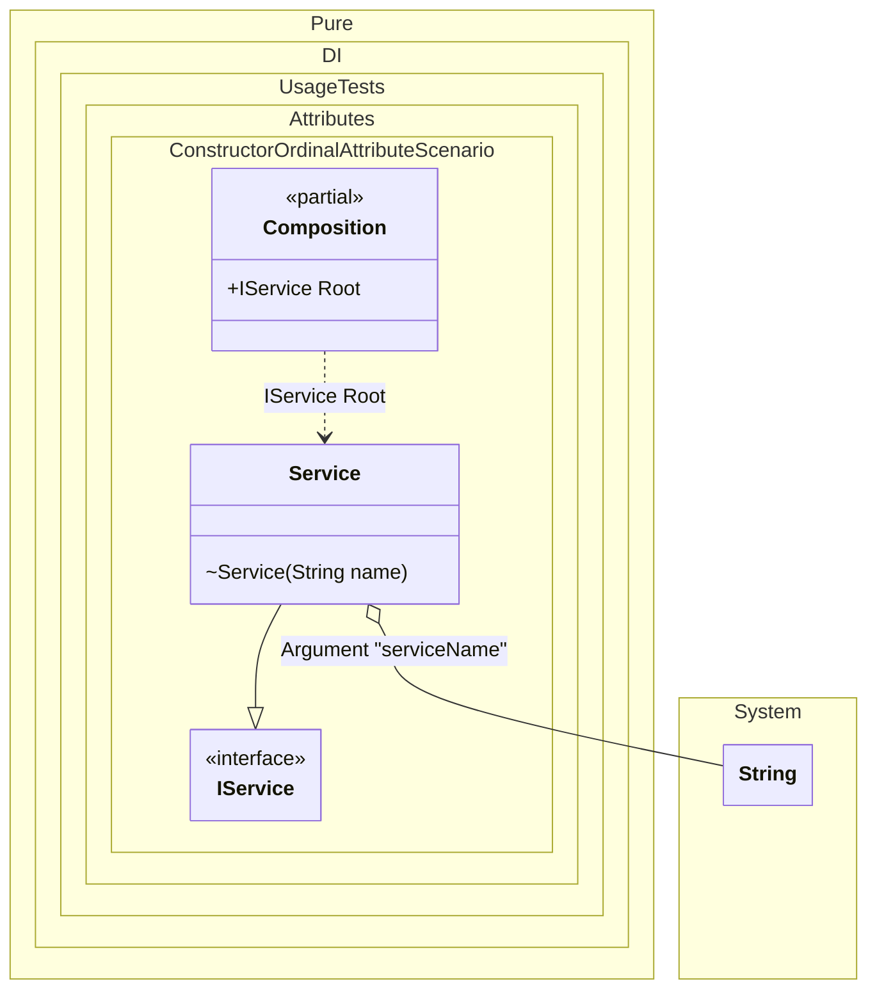

#### Constructor ordinal attribute

[](../tests/Pure.DI.UsageTests/Attributes/ConstructorOrdinalAttributeScenario.cs)

When applied to any constructor in a type, automatic injection constructor selection is disabled. The selection will only focus on constructors marked with this attribute, in the appropriate order from smallest value to largest.


```c#
interface IDependency;

class Dependency : IDependency;

interface IService;

class Service : IService
{
    private readonly string _name;

    // The integer value in the argument specifies
    // the ordinal of injection
    [Ordinal(1)]
    public Service(IDependency dependency) =>
        _name = "with dependency";

    [Ordinal(0)]
    internal Service(string name) => _name = name;

    public Service() => _name = "default";

    public override string ToString() => _name;
}

DI.Setup(nameof(Composition))
    .Arg<string>("serviceName")
    .Bind().To<Dependency>()
    .Bind().To<Service>()

    // Composition root
    .Root<IService>("Root");

var composition = new Composition(serviceName: "Xyz");
var service = composition.Root;
service.ToString().ShouldBe("Xyz");
```

The attribute `Ordinal` is part of the API, but you can use your own attribute at any time, and this allows you to define them in the assembly and namespace you want.

The following partial class will be generated:

```c#
partial class Composition
{
  private readonly Composition _root;

  private readonly string _argServiceName;

  [OrdinalAttribute(10)]
  public Composition(string serviceName)
  {
    _argServiceName = serviceName ?? throw new ArgumentNullException(nameof(serviceName));
    _root = this;
  }

  internal Composition(Composition parentScope)
  {
    _root = (parentScope ?? throw new ArgumentNullException(nameof(parentScope)))._root;
    _argServiceName = _root._argServiceName;
  }

  public IService Root
  {
    [MethodImpl(MethodImplOptions.AggressiveInlining)]
    get
    {
      return new Service(_argServiceName);
    }
  }
}
```

Class diagram:



