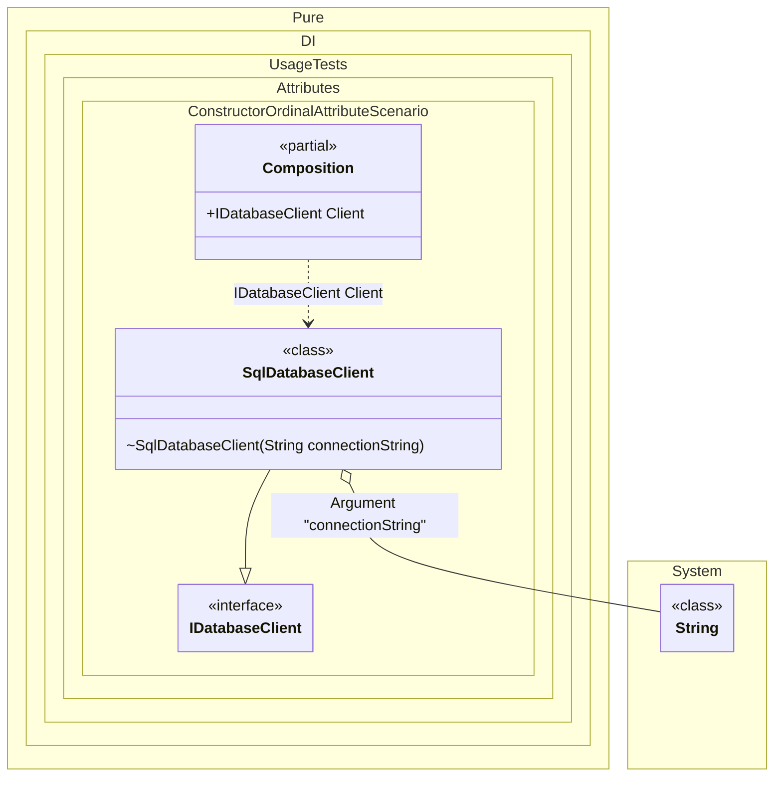

#### Constructor ordinal attribute

Applying this attribute disables automatic constructor selection. Only constructors marked with this attribute are considered, ordered by ordinal (ascending).


```c#
using Shouldly;
using Pure.DI;

DI.Setup(nameof(Composition))
    .Arg<string>("connectionString")
    .Bind().To<Configuration>()
    .Bind().To<SqlDatabaseClient>()

    // Composition root
    .Root<IDatabaseClient>("Client");

var composition = new Composition(connectionString: "Server=.;Database=MyDb;");
var client = composition.Client;

// The client was created using the connection string constructor (Ordinal 0)
// even though the configuration constructor (Ordinal 1) was also possible.
client.ConnectionString.ShouldBe("Server=.;Database=MyDb;");

interface IConfiguration;

class Configuration : IConfiguration;

interface IDatabaseClient
{
    string ConnectionString { get; }
}

class SqlDatabaseClient : IDatabaseClient
{
    // The integer value in the argument specifies
    // the ordinal of injection.
    // The DI will try to use this constructor first (Ordinal 0).
    [Ordinal(0)]
    internal SqlDatabaseClient(string connectionString) =>
        ConnectionString = connectionString;

    // If the first constructor cannot be used (e.g. connectionString is missing),
    // the DI will try to use this one (Ordinal 1).
    [Ordinal(1)]
    public SqlDatabaseClient(IConfiguration configuration) =>
        ConnectionString = "Server=.;Database=DefaultDb;";

    public SqlDatabaseClient() =>
        ConnectionString = "InMemory";

    public string ConnectionString { get; }
}
```

<details>
<summary>Running this code sample locally</summary>

- Make sure you have the [.NET SDK 10.0](https://dotnet.microsoft.com/en-us/download/dotnet/10.0) or later installed
```bash
dotnet --list-sdk
```
- Create a net10.0 (or later) console application
```bash
dotnet new console -n Sample
```
- Add references to the NuGet packages
  - [Pure.DI](https://www.nuget.org/packages/Pure.DI)
  - [Shouldly](https://www.nuget.org/packages/Shouldly)
```bash
dotnet add package Pure.DI
dotnet add package Shouldly
```
- Copy the example code into the _Program.cs_ file

You are ready to run the example 🚀
```bash
dotnet run
```

</details>

The `Ordinal` attribute is part of the API, but you can define your own in any assembly or namespace.

<details>
<summary>The following partial class will be generated</summary>

```c#
partial class Composition
{
  private readonly string _argConnectionString;

  [OrdinalAttribute(128)]
  public Composition(string connectionString)
  {
    _argConnectionString = connectionString ?? throw new ArgumentNullException(nameof(connectionString));
  }

  public IDatabaseClient Client
  {
    [MethodImpl(MethodImplOptions.AggressiveInlining)]
    get
    {
      return new SqlDatabaseClient(_argConnectionString);
    }
  }
}
```

</details>

Class diagram:


```mermaid
---
 config:
  class:
   hideEmptyMembersBox: true
---
classDiagram
	SqlDatabaseClient --|> IDatabaseClient
	Composition ..> SqlDatabaseClient : IDatabaseClient Client
	SqlDatabaseClient o-- String : Argument "connectionString"
	namespace Pure.DI.UsageTests.Attributes.ConstructorOrdinalAttributeScenario {
		class Composition {
		<<partial>>
		+IDatabaseClient Client
		}
		class IDatabaseClient {
			<<interface>>
		}
		class SqlDatabaseClient {
				<<class>>
			~SqlDatabaseClient(String connectionString)
		}
	}
	namespace System {
		class String {
				<<class>>
		}
	}
```

See also:

- [Member ordinal attribute](member-ordinal-attribute.md)
- [Dependency attribute](dependency-attribute.md)

