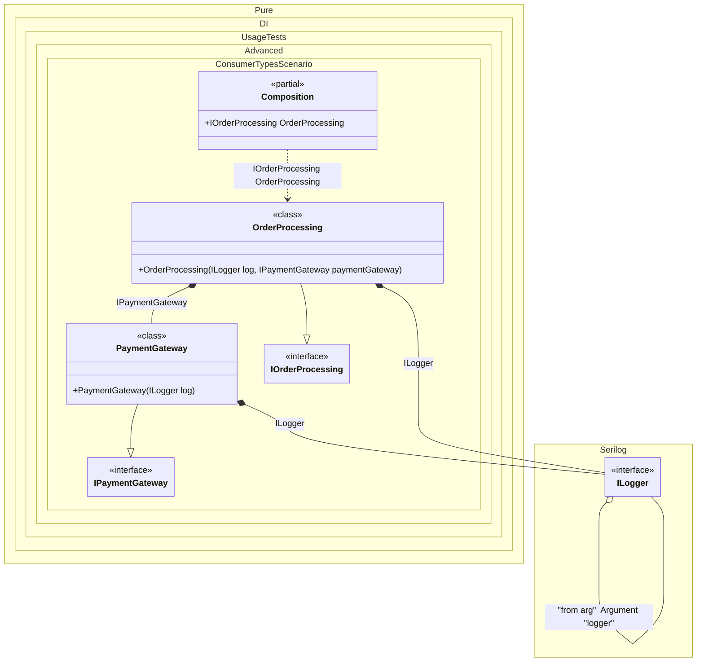

#### Consumer types

`ConsumerTypes` is used to get the list of consumer types of a given dependency. It contains an array of types and guarantees that it will contain at least one element. The use of `ConsumerTypes` is demonstrated on the example of [Serilog library](https://serilog.net/):


```c#
using Shouldly;
using Serilog.Core;
using Serilog.Events;
using Pure.DI;
using Serilog.Core;

Serilog.ILogger serilogLogger = new Serilog.LoggerConfiguration().CreateLogger();
var composition = new Composition(logger: serilogLogger);
var orderProcessing = composition.OrderProcessing;

interface IPaymentGateway;

class PaymentGateway : IPaymentGateway
{
    public PaymentGateway(Serilog.ILogger log)
    {
        log.Information("Payment gateway initialized");
    }
}

interface IOrderProcessing
{
    IPaymentGateway PaymentGateway { get; }
}

class OrderProcessing : IOrderProcessing
{
    public OrderProcessing(
        Serilog.ILogger log,
        IPaymentGateway paymentGateway)
    {
        PaymentGateway = paymentGateway;
        log.Information("Order processing initialized");
    }

    public IPaymentGateway PaymentGateway { get; }
}

partial class Composition
{
    private void Setup() =>

        DI.Setup(nameof(Composition))
            .Arg<Serilog.ILogger>("logger", "from arg")
            .Bind().To(ctx => {
                ctx.Inject<Serilog.ILogger>("from arg", out var logger);

                // Using ConsumerTypes to get the type of the consumer.
                // This allows us to create a logger with a context specific to the consuming class.
                return logger.ForContext(ctx.ConsumerTypes[0]);
            })
            .Bind().To<PaymentGateway>()
            .Bind().To<OrderProcessing>()
            .Root<IOrderProcessing>(nameof(OrderProcessing));
}
```

<details>
<summary>Running this code sample locally</summary>

- Make sure you have the [.NET SDK 10.0](https://dotnet.microsoft.com/en-us/download/dotnet/10.0) or later is installed
```bash
dotnet --list-sdk
```
- Create a net10.0 (or later) console application
```bash
dotnet new console -n Sample
```
- Add references to NuGet packages
  - [Pure.DI](https://www.nuget.org/packages/Pure.DI)
  - [Shouldly](https://www.nuget.org/packages/Shouldly)
  - [Serilog.Core](https://www.nuget.org/packages/Serilog.Core)
  - [Serilog.Events](https://www.nuget.org/packages/Serilog.Events)
```bash
dotnet add package Pure.DI
dotnet add package Shouldly
dotnet add package Serilog.Core
dotnet add package Serilog.Events
```
- Copy the example code into the _Program.cs_ file

You are ready to run the example 🚀
```bash
dotnet run
```

</details>

The following partial class will be generated:

```c#
partial class Composition
{
#if NET9_0_OR_GREATER
  private readonly Lock _lock;
#else
  private readonly Object _lock;
#endif

  private readonly Serilog.ILogger _argLogger;

  [OrdinalAttribute(128)]
  public Composition(Serilog.ILogger logger)
  {
    _argLogger = logger ?? throw new ArgumentNullException(nameof(logger));
#if NET9_0_OR_GREATER
    _lock = new Lock();
#else
    _lock = new Object();
#endif
  }

  internal Composition(Composition parentScope)
  {
    _argLogger = parentScope._argLogger;
    _lock = parentScope._lock;
  }

  public IOrderProcessing OrderProcessing
  {
    [MethodImpl(MethodImplOptions.AggressiveInlining)]
    get
    {
      Serilog.ILogger transientILogger3;
      Serilog.ILogger localLogger = _argLogger;
      // Using ConsumerTypes to get the type of the consumer.
      // This allows us to create a logger with a context specific to the consuming class.
      transientILogger3 = localLogger.ForContext(new Type[3] { typeof(PaymentGateway), typeof(OrderProcessing), typeof(Composition) }[0]);
      Serilog.ILogger transientILogger1;
      Serilog.ILogger localLogger1 = _argLogger;
      // Using ConsumerTypes to get the type of the consumer.
      // This allows us to create a logger with a context specific to the consuming class.
      transientILogger1 = localLogger1.ForContext(new Type[2] { typeof(OrderProcessing), typeof(Composition) }[0]);
      return new OrderProcessing(transientILogger1, new PaymentGateway(transientILogger3));
    }
  }
}
```

Class diagram:



