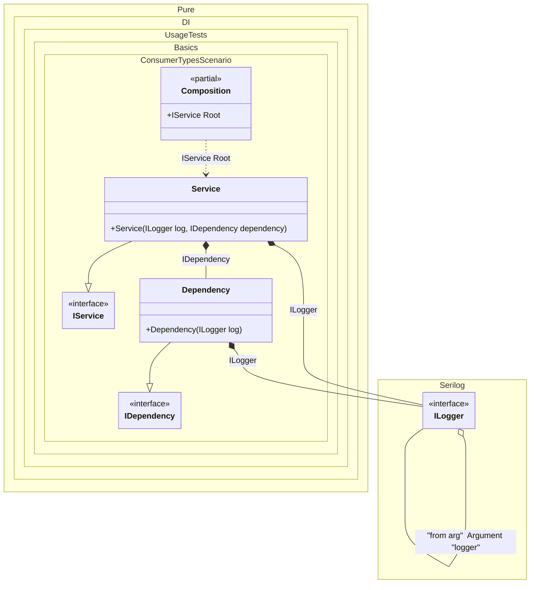

#### Consumer types

[](../tests/Pure.DI.UsageTests/Basics/ConsumerTypesScenario.cs)

`ConsumerTypes` is used to get the list of consumer types of a given dependency. It contains an array of types and guarantees that it will contain at least one element. The use of `ConsumerTypes` is demonstrated on the example of [Serilog library](https://serilog.net/):


```c#
using Pure.DI;
using Shouldly;
using Serilog.Core;
using Serilog.Events;

Serilog.ILogger serilogLogger = new Serilog.LoggerConfiguration().CreateLogger();
var composition = new Composition(logger: serilogLogger);
var service = composition.Root;

interface IDependency;

class Dependency : IDependency
{
    public Dependency(Serilog.ILogger log)
    {
        log.Information("created");
    }
}

interface IService
{
    IDependency Dependency { get; }
}

class Service : IService
{
    public Service(
        Serilog.ILogger log,
        IDependency dependency)
    {
        Dependency = dependency;
        log.Information("created");
    }

    public IDependency Dependency { get; }
}

partial class Composition
{
    private void Setup() =>
        DI.Setup(nameof(Composition))

            .Arg<Serilog.ILogger>("logger", "from arg")
            .Bind().To(ctx =>
            {
                ctx.Inject<Serilog.ILogger>("from arg", out var logger);
                return logger.ForContext(ctx.ConsumerTypes[0]);
            })

            .Bind().To<Dependency>()
            .Bind().To<Service>()
            .Root<IService>(nameof(Root));
}
```


Class diagram:



