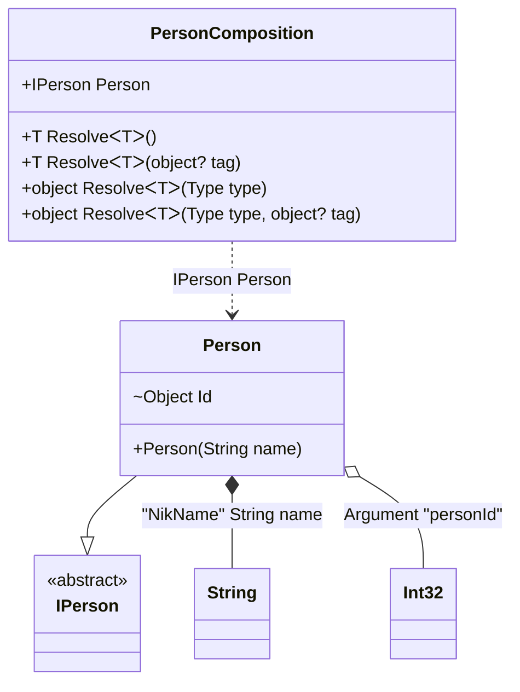

#### Custom Attributes

[](../tests/Pure.DI.UsageTests/Attributes/CustomAttributesScenario.cs)

It's very easy to use your attributes. To do this, you need to create a descendant of the `System.Attribute` class and register it using one of the appropriate methods:
- `TagAttribute`
- `OrdinalAttribute`
- `TagAttribute`
You can also use combined attributes, and each method in the list above has an optional parameter that defines the argument number (the default is 0) from where to get the appropriate metadata for _tag_, _ordinal_, or _type_.

```c#

[AttributeUsage(AttributeTargets.Constructor | AttributeTargets.Method | AttributeTargets.Property | AttributeTargets.Field)]
internal class MyOrdinalAttribute : Attribute
{
    public MyOrdinalAttribute(int ordinal) { }
}

[AttributeUsage(AttributeTargets.Parameter | AttributeTargets.Property | AttributeTargets.Field)]
internal class MyTagAttribute : Attribute
{
    public MyTagAttribute(object tag) { }
}

[AttributeUsage(AttributeTargets.Parameter | AttributeTargets.Property | AttributeTargets.Field)]
internal class MyTypeAttribute : Attribute
{
    public MyTypeAttribute(Type type) { }
}

internal interface IPerson
{
}

internal class Person : IPerson
{
    private readonly string _name;

    public Person([MyTag("NikName")] string name) => _name = name;

    [MyOrdinal(1)]
    [MyType(typeof(int))]
    internal object Id = "";

    public override string ToString() => $"{Id} {_name}";
}

DI.Setup("PersonComposition")
    .TagAttribute<MyTagAttribute>()
    .OrdinalAttribute<MyOrdinalAttribute>()
    .TypeAttribute<MyTypeAttribute>()
    .Arg<int>("personId")
    .Bind<string>("NikName").To(_ => "Nik")
    .Bind<IPerson>().To<Person>().Root<IPerson>("Person");

var composition = new PersonComposition(123);
var person = composition.Person;
person.ToString().ShouldBe("123 Nik");
```

<details open>
<summary>Class Diagram</summary>



</details>

<details>
<summary>Generated Code</summary>

```c#
partial class PersonComposition
{
  private readonly int _personIdArgA1F7;
  
  public PersonComposition(int personId)
  {
    _personIdArgA1F7 = personId;
  }
  
  internal PersonComposition(PersonComposition parent)
  {
    _personIdArgA1F7 = parent._personIdArgA1F7;
  }
  
  #region Composition Roots
  public Pure.DI.UsageTests.Attributes.CustomAttributesScenario.IPerson Person
  {
    [global::System.Runtime.CompilerServices.MethodImpl((global::System.Runtime.CompilerServices.MethodImplOptions)0x300)]
    get
    {
      string v2LocalA1F7;
      v2LocalA1F7 = "Nik";
      Pure.DI.UsageTests.Attributes.CustomAttributesScenario.Person v1LocalA1F7 = new Pure.DI.UsageTests.Attributes.CustomAttributesScenario.Person(v2LocalA1F7);
      v1LocalA1F7.Id = _personIdArgA1F7;
      return v1LocalA1F7;
    }
  }
  #endregion
  
  #region API
  #if NETSTANDARD2_0_OR_GREATER || NETCOREAPP || NET40_OR_GREATER
  [global::System.Diagnostics.Contracts.Pure]
  #endif
  [global::System.Runtime.CompilerServices.MethodImpl((global::System.Runtime.CompilerServices.MethodImplOptions)0x300)]
  public T Resolve<T>()
  {
    return ResolverA1F7<T>.Value.Resolve(this);
  }
  
  #if NETSTANDARD2_0_OR_GREATER || NETCOREAPP || NET40_OR_GREATER
  [global::System.Diagnostics.Contracts.Pure]
  #endif
  [global::System.Runtime.CompilerServices.MethodImpl((global::System.Runtime.CompilerServices.MethodImplOptions)0x300)]
  public T Resolve<T>(object? tag)
  {
    return ResolverA1F7<T>.Value.ResolveByTag(this, tag);
  }
  
  #if NETSTANDARD2_0_OR_GREATER || NETCOREAPP || NET40_OR_GREATER
  [global::System.Diagnostics.Contracts.Pure]
  #endif
  [global::System.Runtime.CompilerServices.MethodImpl((global::System.Runtime.CompilerServices.MethodImplOptions)0x300)]
  public object Resolve(global::System.Type type)
  {
    int index = (int)(_bucketSizeA1F7 * ((uint)global::System.Runtime.CompilerServices.RuntimeHelpers.GetHashCode(type) % 1));
    ref var pair = ref _bucketsA1F7[index];
    if (ReferenceEquals(pair.Key, type))
    {
      return pair.Value.Resolve(this);
    }
    
    int maxIndex = index + _bucketSizeA1F7;
    for (int i = index + 1; i < maxIndex; i++)
    {
      pair = ref _bucketsA1F7[i];
      if (ReferenceEquals(pair.Key, type))
      {
        return pair.Value.Resolve(this);
      }
    }
    
    throw new global::System.InvalidOperationException($"Cannot resolve composition root of type {type}.");
  }
  
  #if NETSTANDARD2_0_OR_GREATER || NETCOREAPP || NET40_OR_GREATER
  [global::System.Diagnostics.Contracts.Pure]
  #endif
  [global::System.Runtime.CompilerServices.MethodImpl((global::System.Runtime.CompilerServices.MethodImplOptions)0x300)]
  public object Resolve(global::System.Type type, object? tag)
  {
    int index = (int)(_bucketSizeA1F7 * ((uint)global::System.Runtime.CompilerServices.RuntimeHelpers.GetHashCode(type) % 1));
    ref var pair = ref _bucketsA1F7[index];
    if (ReferenceEquals(pair.Key, type))
    {
      return pair.Value.ResolveByTag(this, tag);
    }
    
    int maxIndex = index + _bucketSizeA1F7;
    for (int i = index + 1; i < maxIndex; i++)
    {
      pair = ref _bucketsA1F7[i];
      if (ReferenceEquals(pair.Key, type))
      {
        return pair.Value.ResolveByTag(this, tag);
      }
    }
    
    throw new global::System.InvalidOperationException($"Cannot resolve composition root \"{tag}\" of type {type}.");
  }
  #endregion
  
  public override string ToString()
  {
    return
      "classDiagram\n" +
        "  class PersonComposition {\n" +
          "    +IPerson Person\n" +
          "    +T ResolveᐸTᐳ()\n" +
          "    +T ResolveᐸTᐳ(object? tag)\n" +
          "    +object ResolveᐸTᐳ(Type type)\n" +
          "    +object ResolveᐸTᐳ(Type type, object? tag)\n" +
        "  }\n" +
        "  Person --|> IPerson : \n" +
        "  class Person {\n" +
          "    +Person(String name)\n" +
          "    ~Object Id\n" +
        "  }\n" +
        "  class String\n" +
        "  class Int32\n" +
        "  class IPerson {\n" +
          "    <<abstract>>\n" +
        "  }\n" +
        "  Person *--  String : \"NikName\"  String name\n" +
        "  Person o-- Int32 : Argument \"personId\"\n" +
        "  PersonComposition ..> Person : IPerson Person";
  }
  
  private readonly static int _bucketSizeA1F7;
  private readonly static global::Pure.DI.Pair<global::System.Type, global::Pure.DI.IResolver<PersonComposition, object>>[] _bucketsA1F7;
  
  static PersonComposition()
  {
    ResolverA1F70 valResolverA1F70 = new ResolverA1F70();
    ResolverA1F7<Pure.DI.UsageTests.Attributes.CustomAttributesScenario.IPerson>.Value = valResolverA1F70;
    _bucketsA1F7 = global::Pure.DI.Buckets<global::System.Type, global::Pure.DI.IResolver<PersonComposition, object>>.Create(
      1,
      out _bucketSizeA1F7,
      new global::Pure.DI.Pair<global::System.Type, global::Pure.DI.IResolver<PersonComposition, object>>[1]
      {
         new global::Pure.DI.Pair<global::System.Type, global::Pure.DI.IResolver<PersonComposition, object>>(typeof(Pure.DI.UsageTests.Attributes.CustomAttributesScenario.IPerson), valResolverA1F70)
      });
  }
  
  #region Resolvers
  private sealed class ResolverA1F7<T>: global::Pure.DI.IResolver<PersonComposition, T>
  {
    public static global::Pure.DI.IResolver<PersonComposition, T> Value = new ResolverA1F7<T>();
    
    public T Resolve(PersonComposition composite)
    {
      throw new global::System.InvalidOperationException($"Cannot resolve composition root of type {typeof(T)}.");
    }
    
    public T ResolveByTag(PersonComposition composite, object tag)
    {
      throw new global::System.InvalidOperationException($"Cannot resolve composition root \"{tag}\" of type {typeof(T)}.");
    }
  }
  
  private sealed class ResolverA1F70: global::Pure.DI.IResolver<PersonComposition, Pure.DI.UsageTests.Attributes.CustomAttributesScenario.IPerson>
  {
    [global::System.Runtime.CompilerServices.MethodImpl((global::System.Runtime.CompilerServices.MethodImplOptions)0x300)]
    public Pure.DI.UsageTests.Attributes.CustomAttributesScenario.IPerson Resolve(PersonComposition composition)
    {
      return composition.Person;
    }
    
    [global::System.Runtime.CompilerServices.MethodImpl((global::System.Runtime.CompilerServices.MethodImplOptions)0x300)]
    public Pure.DI.UsageTests.Attributes.CustomAttributesScenario.IPerson ResolveByTag(PersonComposition composition, object tag)
    {
      if (Equals(tag, null)) return composition.Person;
      throw new global::System.InvalidOperationException($"Cannot resolve composition root \"{tag}\" of type Pure.DI.UsageTests.Attributes.CustomAttributesScenario.IPerson.");
    }
  }
  #endregion
}
```

</details>

