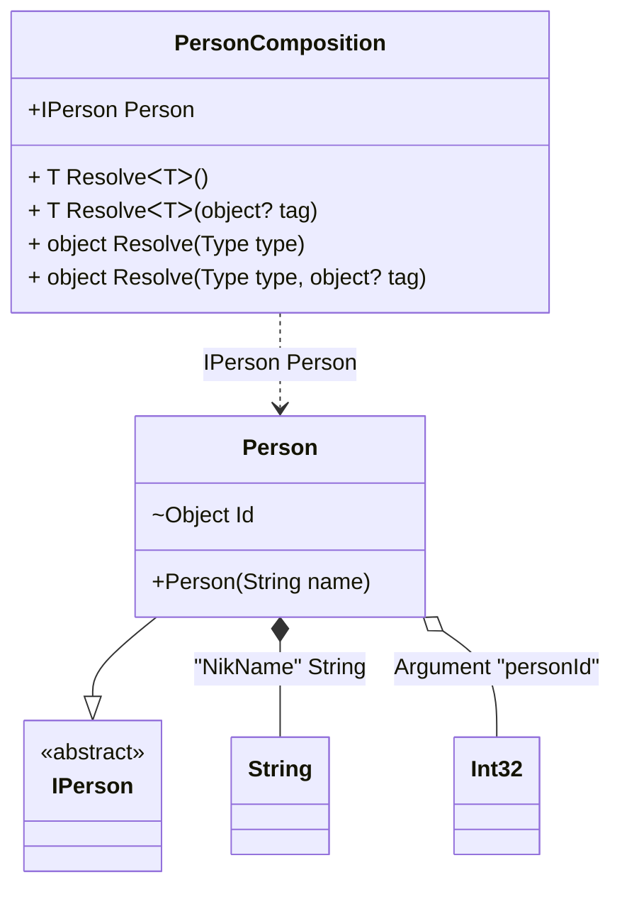

#### Custom attributes

[](../tests/Pure.DI.UsageTests/Attributes/CustomAttributesScenario.cs)

It's very easy to use your attributes. To do this, you need to create a descendant of the `System.Attribute` class and register it using one of the appropriate methods:
- `TagAttribute`
- `OrdinalAttribute`
- `TagAttribute`
You can also use combined attributes, and each method in the list above has an optional parameter that defines the argument number (the default is 0) from where to get the appropriate metadata for _tag_, _ordinal_, or _type_.

```c#
[AttributeUsage(
    AttributeTargets.Constructor
    | AttributeTargets.Method |
    AttributeTargets.Property |
    AttributeTargets.Field)]
class MyOrdinalAttribute : Attribute
{
    public MyOrdinalAttribute(int ordinal) { }
}

[AttributeUsage(
    AttributeTargets.Parameter
    | AttributeTargets.Property
    | AttributeTargets.Field)]
class MyTagAttribute : Attribute
{
    public MyTagAttribute(object tag) { }
}

[AttributeUsage(
    AttributeTargets.Parameter
    | AttributeTargets.Property
    | AttributeTargets.Field)]
class MyTypeAttribute : Attribute
{
    public MyTypeAttribute(Type type) { }
}

interface IPerson;

class Person([MyTag("NikName")] string name) : IPerson
{
    [MyOrdinal(1)]
    [MyType(typeof(int))]
    internal object Id = "";

    public override string ToString() => $"{Id} {name}";
}

DI.Setup("PersonComposition")
    .TagAttribute<MyTagAttribute>()
    .OrdinalAttribute<MyOrdinalAttribute>()
    .TypeAttribute<MyTypeAttribute>()
    .Arg<int>("personId")
    .Bind<string>("NikName").To(_ => "Nik")
    .Bind<IPerson>().To<Person>().Root<IPerson>("Person");

var composition = new PersonComposition(personId: 123);
var person = composition.Person;
person.ToString().ShouldBe("123 Nik");
```

<details open>
<summary>Class Diagram</summary>



</details>

<details>
<summary>Pure.DI-generated partial class PersonComposition</summary><blockquote>

```c#
partial class PersonComposition
{
  private readonly global::System.IDisposable[] _disposableSingletonsM01D20di;
  private readonly int _argM01D20di_personId;
  
  public PersonComposition(int personId)
  {
    _argM01D20di_personId = personId;
    _disposableSingletonsM01D20di = new global::System.IDisposable[0];
  }
  
  internal PersonComposition(PersonComposition parent)
  {
    _disposableSingletonsM01D20di = new global::System.IDisposable[0];
    _argM01D20di_personId = parent._argM01D20di_personId;
  }
  
  #region Composition Roots
  public Pure.DI.UsageTests.Attributes.CustomAttributesScenario.IPerson Person
  {
    #if NETSTANDARD2_0_OR_GREATER || NETCOREAPP || NET40_OR_GREATER || NET
    [global::System.Diagnostics.Contracts.Pure]
    #endif
    get
    {
      string transientM01D20di1_String = "Nik";
      var transientM01D20di0_Person = new Pure.DI.UsageTests.Attributes.CustomAttributesScenario.Person(transientM01D20di1_String);
      transientM01D20di0_Person.Id = _argM01D20di_personId;
      return transientM01D20di0_Person;
    }
  }
  #endregion
  
  #region API
  #if NETSTANDARD2_0_OR_GREATER || NETCOREAPP || NET40_OR_GREATER || NET
  [global::System.Diagnostics.Contracts.Pure]
  #endif
  public T Resolve<T>()
  {
    return ResolverM01D20di<T>.Value.Resolve(this);
  }
  
  #if NETSTANDARD2_0_OR_GREATER || NETCOREAPP || NET40_OR_GREATER || NET
  [global::System.Diagnostics.Contracts.Pure]
  #endif
  public T Resolve<T>(object? tag)
  {
    return ResolverM01D20di<T>.Value.ResolveByTag(this, tag);
  }
  
  #if NETSTANDARD2_0_OR_GREATER || NETCOREAPP || NET40_OR_GREATER || NET
  [global::System.Diagnostics.Contracts.Pure]
  #endif
  public object Resolve(global::System.Type type)
  {
    var index = (int)(_bucketSizeM01D20di * ((uint)global::System.Runtime.CompilerServices.RuntimeHelpers.GetHashCode(type) % 1));
    var finish = index + _bucketSizeM01D20di;
    do {
      ref var pair = ref _bucketsM01D20di[index];
      if (ReferenceEquals(pair.Key, type))
      {
        return pair.Value.Resolve(this);
      }
    } while (++index < finish);
    
    throw new global::System.InvalidOperationException($"Cannot resolve composition root of type {type}.");
  }
  
  #if NETSTANDARD2_0_OR_GREATER || NETCOREAPP || NET40_OR_GREATER || NET
  [global::System.Diagnostics.Contracts.Pure]
  #endif
  public object Resolve(global::System.Type type, object? tag)
  {
    var index = (int)(_bucketSizeM01D20di * ((uint)global::System.Runtime.CompilerServices.RuntimeHelpers.GetHashCode(type) % 1));
    var finish = index + _bucketSizeM01D20di;
    do {
      ref var pair = ref _bucketsM01D20di[index];
      if (ReferenceEquals(pair.Key, type))
      {
        return pair.Value.ResolveByTag(this, tag);
      }
    } while (++index < finish);
    
    throw new global::System.InvalidOperationException($"Cannot resolve composition root \"{tag}\" of type {type}.");
  }
  #endregion
  
  public override string ToString()
  {
    return
      "classDiagram\n" +
        "  class PersonComposition {\n" +
          "    +IPerson Person\n" +
          "    + T ResolveᐸTᐳ()\n" +
          "    + T ResolveᐸTᐳ(object? tag)\n" +
          "    + object Resolve(Type type)\n" +
          "    + object Resolve(Type type, object? tag)\n" +
        "  }\n" +
        "  class String\n" +
        "  class Int32\n" +
        "  Person --|> IPerson : \n" +
        "  class Person {\n" +
          "    +Person(String name)\n" +
          "    ~Object Id\n" +
        "  }\n" +
        "  class IPerson {\n" +
          "    <<abstract>>\n" +
        "  }\n" +
        "  Person *--  String : \"NikName\"  String\n" +
        "  Person o-- Int32 : Argument \"personId\"\n" +
        "  PersonComposition ..> Person : IPerson Person";
  }
  
  private readonly static int _bucketSizeM01D20di;
  private readonly static global::Pure.DI.Pair<global::System.Type, global::Pure.DI.IResolver<PersonComposition, object>>[] _bucketsM01D20di;
  
  static PersonComposition()
  {
    var valResolverM01D20di_0000 = new ResolverM01D20di_0000();
    ResolverM01D20di<Pure.DI.UsageTests.Attributes.CustomAttributesScenario.IPerson>.Value = valResolverM01D20di_0000;
    _bucketsM01D20di = global::Pure.DI.Buckets<global::System.Type, global::Pure.DI.IResolver<PersonComposition, object>>.Create(
      1,
      out _bucketSizeM01D20di,
      new global::Pure.DI.Pair<global::System.Type, global::Pure.DI.IResolver<PersonComposition, object>>[1]
      {
         new global::Pure.DI.Pair<global::System.Type, global::Pure.DI.IResolver<PersonComposition, object>>(typeof(Pure.DI.UsageTests.Attributes.CustomAttributesScenario.IPerson), valResolverM01D20di_0000)
      });
  }
  
  #region Resolvers
  private sealed class ResolverM01D20di<T>: global::Pure.DI.IResolver<PersonComposition, T>
  {
    public static global::Pure.DI.IResolver<PersonComposition, T> Value = new ResolverM01D20di<T>();
    
    public T Resolve(PersonComposition composite)
    {
      throw new global::System.InvalidOperationException($"Cannot resolve composition root of type {typeof(T)}.");
    }
    
    public T ResolveByTag(PersonComposition composite, object tag)
    {
      throw new global::System.InvalidOperationException($"Cannot resolve composition root \"{tag}\" of type {typeof(T)}.");
    }
  }
  
  private sealed class ResolverM01D20di_0000: global::Pure.DI.IResolver<PersonComposition, Pure.DI.UsageTests.Attributes.CustomAttributesScenario.IPerson>
  {
    public Pure.DI.UsageTests.Attributes.CustomAttributesScenario.IPerson Resolve(PersonComposition composition)
    {
      return composition.Person;
    }
    
    public Pure.DI.UsageTests.Attributes.CustomAttributesScenario.IPerson ResolveByTag(PersonComposition composition, object tag)
    {
      switch (tag)
      {
        case null:
          return composition.Person;
      }
      throw new global::System.InvalidOperationException($"Cannot resolve composition root \"{tag}\" of type Pure.DI.UsageTests.Attributes.CustomAttributesScenario.IPerson.");
    }
  }
  #endregion
}
```

</blockquote></details>

