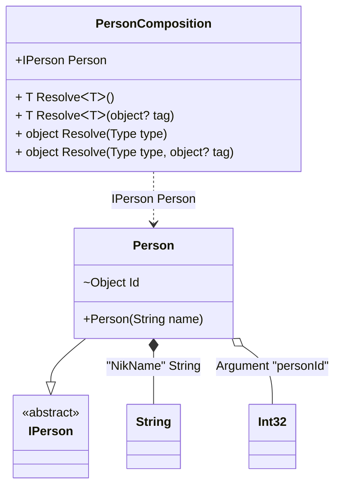

#### Custom attributes

[](../tests/Pure.DI.UsageTests/Attributes/CustomAttributesScenario.cs)

It's very easy to use your attributes. To do this, you need to create a descendant of the `System.Attribute` class and register it using one of the appropriate methods:
- `TagAttribute`
- `OrdinalAttribute`
- `TagAttribute`
You can also use combined attributes, and each method in the list above has an optional parameter that defines the argument number (the default is 0) from where to get the appropriate metadata for _tag_, _ordinal_, or _type_.

```c#
[AttributeUsage(
    AttributeTargets.Constructor
    | AttributeTargets.Method |
    AttributeTargets.Property |
    AttributeTargets.Field)]
class MyOrdinalAttribute(int ordinal) : Attribute;

[AttributeUsage(
    AttributeTargets.Parameter
    | AttributeTargets.Property
    | AttributeTargets.Field)]
class MyTagAttribute(object tag) : Attribute;

[AttributeUsage(
    AttributeTargets.Parameter
    | AttributeTargets.Property
    | AttributeTargets.Field)]
class MyTypeAttribute(Type type) : Attribute;

interface IPerson;

class Person([MyTag("NikName")] string name) : IPerson
{
    [MyOrdinal(1)]
    [MyType(typeof(int))]
    internal object Id = "";

    public override string ToString() => $"{Id} {name}";
}

DI.Setup(nameof(PersonComposition))
    .TagAttribute<MyTagAttribute>()
    .OrdinalAttribute<MyOrdinalAttribute>()
    .TypeAttribute<MyTypeAttribute>()
    .Arg<int>("personId")
    .Bind<string>("NikName").To(_ => "Nik")
    .Bind<IPerson>().To<Person>()

    // Composition root
    .Root<IPerson>("Person");

var composition = new PersonComposition(personId: 123);
var person = composition.Person;
person.ToString().ShouldBe("123 Nik");
```

<details open>
<summary>Class Diagram</summary>



</details>

<details>
<summary>Pure.DI-generated partial class PersonComposition</summary><blockquote>

```c#
partial class PersonComposition
{
  private readonly PersonComposition _rootM04D26di;
  private readonly int _argM04D26di_personId;
  
  public PersonComposition(int personId)
  {
    _rootM04D26di = this;
    _argM04D26di_personId = personId;
  }
  
  internal PersonComposition(PersonComposition baseComposition)
  {
    _rootM04D26di = baseComposition._rootM04D26di;
    _argM04D26di_personId = baseComposition._argM04D26di_personId;
  }
  
  public Pure.DI.UsageTests.Attributes.CustomAttributesScenario.IPerson Person
  {
    [global::System.Runtime.CompilerServices.MethodImpl((global::System.Runtime.CompilerServices.MethodImplOptions)0x100)]
    get
    {
      string transientM04D26di1_String = "Nik";
      Pure.DI.UsageTests.Attributes.CustomAttributesScenario.Person transientM04D26di0_Person = new Pure.DI.UsageTests.Attributes.CustomAttributesScenario.Person(transientM04D26di1_String);
      transientM04D26di0_Person.Id = _argM04D26di_personId;
      return transientM04D26di0_Person;
    }
  }
  
  [global::System.Runtime.CompilerServices.MethodImpl((global::System.Runtime.CompilerServices.MethodImplOptions)0x100)]
  public T Resolve<T>()
  {
    return ResolverM04D26di<T>.Value.Resolve(this);
  }
  
  [global::System.Runtime.CompilerServices.MethodImpl((global::System.Runtime.CompilerServices.MethodImplOptions)0x100)]
  public T Resolve<T>(object? tag)
  {
    return ResolverM04D26di<T>.Value.ResolveByTag(this, tag);
  }
  
  [global::System.Runtime.CompilerServices.MethodImpl((global::System.Runtime.CompilerServices.MethodImplOptions)0x100)]
  public object Resolve(global::System.Type type)
  {
    var index = (int)(_bucketSizeM04D26di * ((uint)global::System.Runtime.CompilerServices.RuntimeHelpers.GetHashCode(type) % 1));
    ref var pair = ref _bucketsM04D26di[index];
    return pair.Key == type ? pair.Value.Resolve(this) : ResolveM04D26di(type, index);
  }
  
  [global::System.Runtime.CompilerServices.MethodImpl((global::System.Runtime.CompilerServices.MethodImplOptions)0x8)]
  private object ResolveM04D26di(global::System.Type type, int index)
  {
    var finish = index + _bucketSizeM04D26di;
    while (++index < finish)
    {
      ref var pair = ref _bucketsM04D26di[index];
      if (pair.Key == type)
      {
        return pair.Value.Resolve(this);
      }
    }
    
    throw new global::System.InvalidOperationException($"Cannot resolve composition root of type {type}.");
  }
  
  [global::System.Runtime.CompilerServices.MethodImpl((global::System.Runtime.CompilerServices.MethodImplOptions)0x100)]
  public object Resolve(global::System.Type type, object? tag)
  {
    var index = (int)(_bucketSizeM04D26di * ((uint)global::System.Runtime.CompilerServices.RuntimeHelpers.GetHashCode(type) % 1));
    ref var pair = ref _bucketsM04D26di[index];
    return pair.Key == type ? pair.Value.ResolveByTag(this, tag) : ResolveM04D26di(type, tag, index);
  }
  
  [global::System.Runtime.CompilerServices.MethodImpl((global::System.Runtime.CompilerServices.MethodImplOptions)0x8)]
  private object ResolveM04D26di(global::System.Type type, object? tag, int index)
  {
    var finish = index + _bucketSizeM04D26di;
    while (++index < finish)
    {
      ref var pair = ref _bucketsM04D26di[index];
      if (pair.Key == type)
      {
        return pair.Value.ResolveByTag(this, tag);
      }
    }
    
    throw new global::System.InvalidOperationException($"Cannot resolve composition root \"{tag}\" of type {type}.");
  }
  public override string ToString()
  {
    return
      "classDiagram\n" +
        "  class PersonComposition {\n" +
          "    +IPerson Person\n" +
          "    + T ResolveᐸTᐳ()\n" +
          "    + T ResolveᐸTᐳ(object? tag)\n" +
          "    + object Resolve(Type type)\n" +
          "    + object Resolve(Type type, object? tag)\n" +
        "  }\n" +
        "  class String\n" +
        "  class Int32\n" +
        "  Person --|> IPerson : \n" +
        "  class Person {\n" +
          "    +Person(String name)\n" +
          "    ~Object Id\n" +
        "  }\n" +
        "  class IPerson {\n" +
          "    <<abstract>>\n" +
        "  }\n" +
        "  Person *--  String : \"NikName\"  String\n" +
        "  Person o-- Int32 : Argument \"personId\"\n" +
        "  PersonComposition ..> Person : IPerson Person";
  }
  
  private readonly static int _bucketSizeM04D26di;
  private readonly static global::Pure.DI.Pair<global::System.Type, global::Pure.DI.IResolver<PersonComposition, object>>[] _bucketsM04D26di;
  
  static PersonComposition()
  {
    var valResolverM04D26di_0000 = new ResolverM04D26di_0000();
    ResolverM04D26di<Pure.DI.UsageTests.Attributes.CustomAttributesScenario.IPerson>.Value = valResolverM04D26di_0000;
    _bucketsM04D26di = global::Pure.DI.Buckets<global::System.Type, global::Pure.DI.IResolver<PersonComposition, object>>.Create(
      1,
      out _bucketSizeM04D26di,
      new global::Pure.DI.Pair<global::System.Type, global::Pure.DI.IResolver<PersonComposition, object>>[1]
      {
         new global::Pure.DI.Pair<global::System.Type, global::Pure.DI.IResolver<PersonComposition, object>>(typeof(Pure.DI.UsageTests.Attributes.CustomAttributesScenario.IPerson), valResolverM04D26di_0000)
      });
  }
  
  private sealed class ResolverM04D26di<T>: global::Pure.DI.IResolver<PersonComposition, T>
  {
    public static global::Pure.DI.IResolver<PersonComposition, T> Value = new ResolverM04D26di<T>();
    
    public T Resolve(PersonComposition composite)
    {
      throw new global::System.InvalidOperationException($"Cannot resolve composition root of type {typeof(T)}.");
    }
    
    public T ResolveByTag(PersonComposition composite, object tag)
    {
      throw new global::System.InvalidOperationException($"Cannot resolve composition root \"{tag}\" of type {typeof(T)}.");
    }
  }
  
  private sealed class ResolverM04D26di_0000: global::Pure.DI.IResolver<PersonComposition, Pure.DI.UsageTests.Attributes.CustomAttributesScenario.IPerson>
  {
    public Pure.DI.UsageTests.Attributes.CustomAttributesScenario.IPerson Resolve(PersonComposition composition)
    {
      return composition.Person;
    }
    
    public Pure.DI.UsageTests.Attributes.CustomAttributesScenario.IPerson ResolveByTag(PersonComposition composition, object tag)
    {
      switch (tag)
      {
        case null:
          return composition.Person;
        default:
          throw new global::System.InvalidOperationException($"Cannot resolve composition root \"{tag}\" of type Pure.DI.UsageTests.Attributes.CustomAttributesScenario.IPerson.");
      }
    }
  }
}
```

</blockquote></details>

