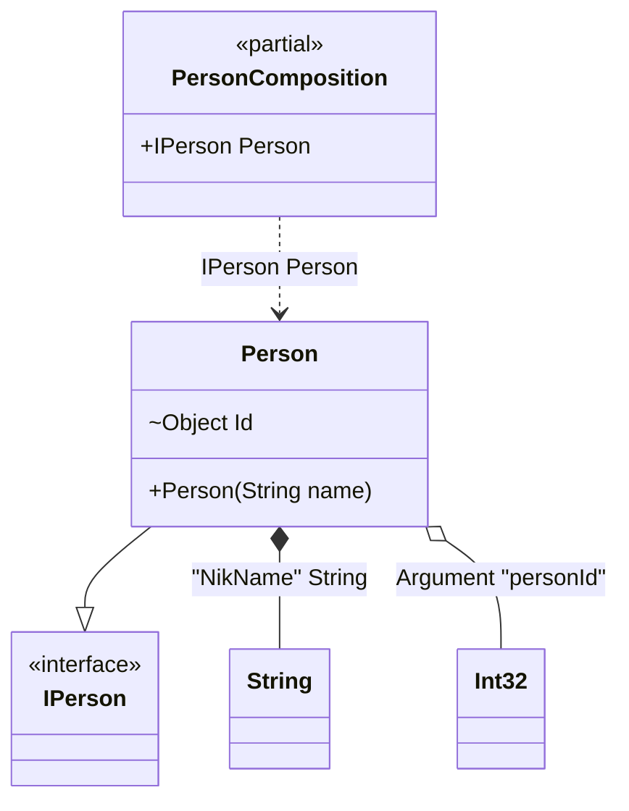

#### Custom attributes

[](../tests/Pure.DI.UsageTests/Attributes/CustomAttributesScenario.cs)

It's very easy to use your attributes. To do this, you need to create a descendant of the `System.Attribute` class and register it using one of the appropriate methods:
- `TagAttribute`
- `OrdinalAttribute`
- `TagAttribute`
You can also use combined attributes, and each method in the list above has an optional parameter that defines the argument number (the default is 0) from where to get the appropriate metadata for _tag_, _ordinal_, or _type_.


```c#
[AttributeUsage(
    AttributeTargets.Constructor
    | AttributeTargets.Method |
    AttributeTargets.Property |
    AttributeTargets.Field)]
class MyOrdinalAttribute(int ordinal) : Attribute;

[AttributeUsage(
    AttributeTargets.Parameter
    | AttributeTargets.Property
    | AttributeTargets.Field)]
class MyTagAttribute(object tag) : Attribute;

[AttributeUsage(
    AttributeTargets.Parameter
    | AttributeTargets.Property
    | AttributeTargets.Field)]
class MyTypeAttribute(Type type) : Attribute;

interface IPerson;

class Person([MyTag("NikName")] string name) : IPerson
{
    [MyOrdinal(1)]
    [MyType(typeof(int))]
    internal object Id = "";

    public override string ToString() => $"{Id} {name}";
}

DI.Setup(nameof(PersonComposition))
    .TagAttribute<MyTagAttribute>()
    .OrdinalAttribute<MyOrdinalAttribute>()
    .TypeAttribute<MyTypeAttribute>()
    .Arg<int>("personId")
    .Bind<string>("NikName").To(_ => "Nik")
    .Bind<IPerson>().To<Person>()

    // Composition root
    .Root<IPerson>("Person");

var composition = new PersonComposition(personId: 123);
var person = composition.Person;
person.ToString().ShouldBe("123 Nik");
```

The following partial class will be generated:

```c#
partial class PersonComposition
{
  private readonly PersonComposition _root;

  private readonly int _argPersonId;

  public PersonComposition(int personId)
  {
    _argPersonId = personId;
    _root = this;
  }

  internal PersonComposition(PersonComposition parentScope)
  {
    _root = (parentScope ?? throw new ArgumentNullException(nameof(parentScope)))._root;
    _argPersonId = _root._argPersonId;
  }

  public IPerson Person
  {
    [MethodImpl(MethodImplOptions.AggressiveInlining)]
    get
    {
      string transientString1 = "Nik";
      Person transientPerson0 = new Person(transientString1);
      transientPerson0.Id = _argPersonId;
      return transientPerson0;
    }
  }
}
```

Class diagram:



