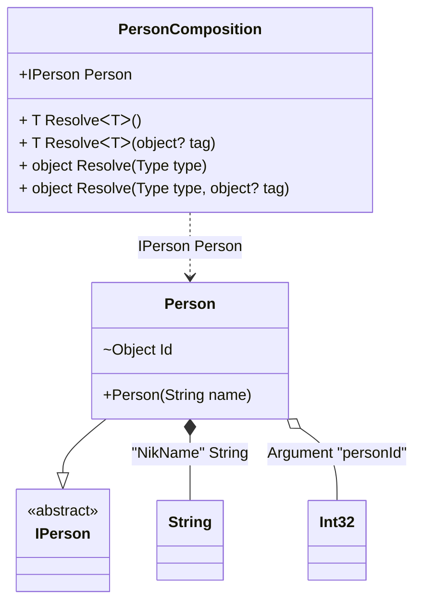

#### Custom attributes

[](../tests/Pure.DI.UsageTests/Attributes/CustomAttributesScenario.cs)

It's very easy to use your attributes. To do this, you need to create a descendant of the `System.Attribute` class and register it using one of the appropriate methods:
- `TagAttribute`
- `OrdinalAttribute`
- `TagAttribute`
You can also use combined attributes, and each method in the list above has an optional parameter that defines the argument number (the default is 0) from where to get the appropriate metadata for _tag_, _ordinal_, or _type_.

```c#
[AttributeUsage(
    AttributeTargets.Constructor
    | AttributeTargets.Method |
    AttributeTargets.Property |
    AttributeTargets.Field)]
class MyOrdinalAttribute(int ordinal) : Attribute;

[AttributeUsage(
    AttributeTargets.Parameter
    | AttributeTargets.Property
    | AttributeTargets.Field)]
class MyTagAttribute(object tag) : Attribute;

[AttributeUsage(
    AttributeTargets.Parameter
    | AttributeTargets.Property
    | AttributeTargets.Field)]
class MyTypeAttribute(Type type) : Attribute;

interface IPerson;

class Person([MyTag("NikName")] string name) : IPerson
{
    [MyOrdinal(1)]
    [MyType(typeof(int))]
    internal object Id = "";

    public override string ToString() => $"{Id} {name}";
}

DI.Setup(nameof(PersonComposition))
    .TagAttribute<MyTagAttribute>()
    .OrdinalAttribute<MyOrdinalAttribute>()
    .TypeAttribute<MyTypeAttribute>()
    .Arg<int>("personId")
    .Bind<string>("NikName").To(_ => "Nik")
    .Bind<IPerson>().To<Person>()

    // Composition root
    .Root<IPerson>("Person");

var composition = new PersonComposition(personId: 123);
var person = composition.Person;
person.ToString().ShouldBe("123 Nik");
```

<details open>
<summary>Class Diagram</summary>



</details>

<details>
<summary>Pure.DI-generated partial class PersonComposition</summary><blockquote>

```c#
partial class PersonComposition
{
  private readonly PersonComposition _root;

  private readonly int _arg_personId;

  public PersonComposition(int personId)
  {
    _root = this;
    _arg_personId = personId;
  }

  internal PersonComposition(PersonComposition baseComposition)
  {
    _root = baseComposition._root;
    _arg_personId = baseComposition._arg_personId;
  }

  public IPerson Person
  {
    [MethodImpl((MethodImplOptions)0x100)]
    get
    {
      string transient1_String = "Nik";
      Person transient0_Person = new Person(transient1_String);
      transient0_Person.Id = _arg_personId;
      return transient0_Person;
    }
  }

  [MethodImpl((MethodImplOptions)0x100)]
  public T Resolve<T>()
  {
    return Resolver<T>.Value.Resolve(this);
  }

  [MethodImpl((MethodImplOptions)0x100)]
  public T Resolve<T>(object? tag)
  {
    return Resolver<T>.Value.ResolveByTag(this, tag);
  }

  [MethodImpl((MethodImplOptions)0x100)]
  public object Resolve(Type type)
  {
    var index = (int)(_bucketSize * ((uint)RuntimeHelpers.GetHashCode(type) % 1));
    ref var pair = ref _buckets[index];
    return pair.Key == type ? pair.Value.Resolve(this) : Resolve(type, index);
  }

  [MethodImpl((MethodImplOptions)0x8)]
  private object Resolve(Type type, int index)
  {
    var finish = index + _bucketSize;
    while (++index < finish)
    {
      ref var pair = ref _buckets[index];
      if (pair.Key == type)
      {
        return pair.Value.Resolve(this);
      }
    }

    throw new InvalidOperationException($"Cannot resolve composition root of type {type}.");
  }

  [MethodImpl((MethodImplOptions)0x100)]
  public object Resolve(Type type, object? tag)
  {
    var index = (int)(_bucketSize * ((uint)RuntimeHelpers.GetHashCode(type) % 1));
    ref var pair = ref _buckets[index];
    return pair.Key == type ? pair.Value.ResolveByTag(this, tag) : Resolve(type, tag, index);
  }

  [MethodImpl((MethodImplOptions)0x8)]
  private object Resolve(Type type, object? tag, int index)
  {
    var finish = index + _bucketSize;
    while (++index < finish)
    {
      ref var pair = ref _buckets[index];
      if (pair.Key == type)
      {
        return pair.Value.ResolveByTag(this, tag);
      }
    }

    throw new InvalidOperationException($"Cannot resolve composition root \"{tag}\" of type {type}.");
  }

  public override string ToString()
  {
    return
      "classDiagram\n" +
        "  class PersonComposition {\n" +
          "    +IPerson Person\n" +
          "    + T ResolveᐸTᐳ()\n" +
          "    + T ResolveᐸTᐳ(object? tag)\n" +
          "    + object Resolve(Type type)\n" +
          "    + object Resolve(Type type, object? tag)\n" +
        "  }\n" +
        "  class String\n" +
        "  class Int32\n" +
        "  Person --|> IPerson : \n" +
        "  class Person {\n" +
          "    +Person(String name)\n" +
          "    ~Object Id\n" +
        "  }\n" +
        "  class IPerson {\n" +
          "    <<abstract>>\n" +
        "  }\n" +
        "  Person *--  String : \"NikName\"  String\n" +
        "  Person o-- Int32 : Argument \"personId\"\n" +
        "  PersonComposition ..> Person : IPerson Person";
  }

  private readonly static int _bucketSize;
  private readonly static Pair<Type, IResolver<PersonComposition, object>>[] _buckets;

  static PersonComposition()
  {
    var valResolver_0000 = new Resolver_0000();
    Resolver<IPerson>.Value = valResolver_0000;
    _buckets = Buckets<Type, IResolver<PersonComposition, object>>.Create(
      1,
      out _bucketSize,
      new Pair<Type, IResolver<PersonComposition, object>>[1]
      {
         new Pair<Type, IResolver<PersonComposition, object>>(typeof(IPerson), valResolver_0000)
      });
  }

  private class Resolver<T>: IResolver<PersonComposition, T>
  {
    private const string CannotResolve = "Cannot resolve composition root ";
    private const string OfType = "of type ";
    public static IResolver<PersonComposition, T> Value = new Resolver<T>();

    public virtual T Resolve(PersonComposition composite)
    {
      throw new InvalidOperationException($"{CannotResolve}{OfType}{typeof(T)}.");
    }

    public virtual T ResolveByTag(PersonComposition composite, object tag)
    {
      throw new InvalidOperationException($"{CannotResolve}\"{tag}\" {OfType}{typeof(T)}.");
    }
  }

  private sealed class Resolver_0000: Resolver<IPerson>
  {
    public override IPerson Resolve(PersonComposition composition)
    {
      return composition.Person;
    }

    public override IPerson ResolveByTag(PersonComposition composition, object tag)
    {
      switch (tag)
      {
        case null:
          return composition.Person;
        default:
          return base.ResolveByTag(composition, tag);
      }
    }
  }
}
```

</blockquote></details>

