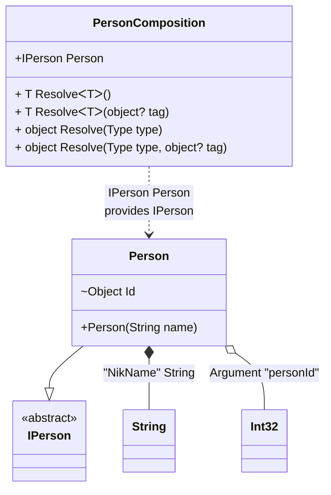

#### Custom attributes

[](../tests/Pure.DI.UsageTests/Attributes/CustomAttributesScenario.cs)

It's very easy to use your attributes. To do this, you need to create a descendant of the `System.Attribute` class and register it using one of the appropriate methods:
- `TagAttribute`
- `OrdinalAttribute`
- `TagAttribute`
You can also use combined attributes, and each method in the list above has an optional parameter that defines the argument number (the default is 0) from where to get the appropriate metadata for _tag_, _ordinal_, or _type_.

```c#
[AttributeUsage(
    AttributeTargets.Constructor
    | AttributeTargets.Method |
    AttributeTargets.Property |
    AttributeTargets.Field)]
class MyOrdinalAttribute(int ordinal) : Attribute;

[AttributeUsage(
    AttributeTargets.Parameter
    | AttributeTargets.Property
    | AttributeTargets.Field)]
class MyTagAttribute(object tag) : Attribute;

[AttributeUsage(
    AttributeTargets.Parameter
    | AttributeTargets.Property
    | AttributeTargets.Field)]
class MyTypeAttribute(Type type) : Attribute;

interface IPerson;

class Person([MyTag("NikName")] string name) : IPerson
{
    [MyOrdinal(1)]
    [MyType(typeof(int))]
    internal object Id = "";

    public override string ToString() => $"{Id} {name}";
}

DI.Setup(nameof(PersonComposition))
    .TagAttribute<MyTagAttribute>()
    .OrdinalAttribute<MyOrdinalAttribute>()
    .TypeAttribute<MyTypeAttribute>()
    .Arg<int>("personId")
    .Bind<string>("NikName").To(_ => "Nik")
    .Bind<IPerson>().To<Person>().Root<IPerson>("Person");

var composition = new PersonComposition(personId: 123);
var person = composition.Person;
person.ToString().ShouldBe("123 Nik");
```

<details open>
<summary>Class Diagram</summary>



</details>

<details>
<summary>Pure.DI-generated partial class PersonComposition</summary><blockquote>

```c#
/// <para>
/// <b>Composition roots</b><br/>
/// <list type="table">
/// <listheader>
/// <term>Root</term>
/// <description>Description</description>
/// </listheader>
/// <item>
/// <term>
/// <see cref="Pure.DI.UsageTests.Attributes.CustomAttributesScenario.IPerson"/> <see cref="Person"/><br/>or using <see cref="Resolve{T}()"/> method: <c>Resolve&lt;Pure.DI.UsageTests.Attributes.CustomAttributesScenario.IPerson&gt;()</c>
/// </term>
/// <description>
/// Provides a composition root of type <see cref="Pure.DI.UsageTests.Attributes.CustomAttributesScenario.Person"/>.
/// </description>
/// </item>
/// </list>
/// </para>
/// </summary>
/// <example>
/// This shows how to get an instance of type <see cref="Pure.DI.UsageTests.Attributes.CustomAttributesScenario.Person"/> using the composition root <see cref="Person"/>:
/// <code>
/// var composition = new PersonComposition(_argM03D14di_personId);
/// var instance = composition.Person;
/// </code>
/// </example>
/// <a href="https://mermaid.live/view#pako:eNqdU0tugzAUvIrldaVGsKDNjgCV2KRVy9IbAxZ1E9vIdiJVUe6Qu3TT6-QmxR_CJ1ErdfPkZ2bemxmZA6xETeASVlusVEpxIzFDEnHbgxcileCJYK1QVFPBAdotFtHKIMwpWOUO4pHDPSjAK1Fiuyfn03dxPn3Z6wdbH_-EifKDVNqcwyegcXNFc4Ce60jFZ0uA7so_0An4fWWUDqG8aUl5M_Q512FgWh-FZaZDjRI7NQN9VraNwTzmq2x9plauWwo4ZjN7Ufbs3OX1LbH5zdmhk5TgUmmJve3M18mUsad47Az4HC5u4Jpu1kYe7D-N-GJCtYn1xFg2O0a47ia0FtwZgQN1_vgCK9PVLtNppLPXaD2WEt07cCvFntbkEopZAu8gI5JhWnc_wQFB_U6MhSWCNZYbBI_w-ANHmRDg">Class diagram</a><br/>
/// This class was created by <a href="https://github.com/DevTeam/Pure.DI">Pure.DI</a> source code generator.
/// <seealso cref="Pure.DI.DI.Setup"/>
/// <seealso cref="Pure.DI.IConfiguration.Bind(object[])"/>
/// <seealso cref="Pure.DI.IConfiguration.Bind{T}(object[])"/>
[global::System.Diagnostics.CodeAnalysis.ExcludeFromCodeCoverage]
partial class PersonComposition
{
  private readonly PersonComposition _rootM03D14di;
  private readonly int _argM03D14di_personId;
  
  /// <summary>
  /// This parameterized constructor creates a new instance of <see cref="PersonComposition"/> with arguments.
  /// </summary>
  /// <param name="personId">The composition argument of type <see cref="int"/>.</param>
  public PersonComposition(int personId)
  {
    _rootM03D14di = this;
    _argM03D14di_personId = personId;
  }
  
  /// <summary>
  /// This constructor creates a new instance of <see cref="PersonComposition"/> scope based on <paramref name="baseComposition"/>. This allows the <see cref="Lifetime.Scoped"/> life time to be applied.
  /// </summary>
  /// <param name="baseComposition">Base composition.</param>
  internal PersonComposition(PersonComposition baseComposition)
  {
    _rootM03D14di = baseComposition._rootM03D14di;
    _argM03D14di_personId = baseComposition._argM03D14di_personId;
  }
  
  #region Composition Roots
  /// <summary>
  /// Provides a composition root of type <see cref="Pure.DI.UsageTests.Attributes.CustomAttributesScenario.Person"/>.
  /// </summary>
  /// <example>
  /// This shows how to get an instance of type <see cref="Pure.DI.UsageTests.Attributes.CustomAttributesScenario.Person"/>:
  /// <code>
  /// var composition = new PersonComposition(_argM03D14di_personId);
  /// var instance = composition.Person;
  /// </code>
  /// </example>
  public Pure.DI.UsageTests.Attributes.CustomAttributesScenario.IPerson Person
  {
    #if NETSTANDARD2_0_OR_GREATER || NETCOREAPP || NET40_OR_GREATER || NET
    [global::System.Diagnostics.Contracts.Pure]
    #endif
    get
    {
      string transientM03D14di1_String = "Nik";
      var transientM03D14di0_Person = new Pure.DI.UsageTests.Attributes.CustomAttributesScenario.Person(transientM03D14di1_String);
      transientM03D14di0_Person.Id = _argM03D14di_personId;
      return transientM03D14di0_Person;
    }
  }
  #endregion
  
  #region API
  /// <summary>
  /// Resolves the composition root.
  /// </summary>
  /// <typeparam name="T">The type of the composition root.</typeparam>
  /// <returns>A composition root.</returns>
  #if NETSTANDARD2_0_OR_GREATER || NETCOREAPP || NET40_OR_GREATER || NET
  [global::System.Diagnostics.Contracts.Pure]
  #endif
  public T Resolve<T>()
  {
    return ResolverM03D14di<T>.Value.Resolve(this);
  }
  
  /// <summary>
  /// Resolves the composition root by tag.
  /// </summary>
  /// <typeparam name="T">The type of the composition root.</typeparam>
  /// <param name="tag">The tag of a composition root.</param>
  /// <returns>A composition root.</returns>
  #if NETSTANDARD2_0_OR_GREATER || NETCOREAPP || NET40_OR_GREATER || NET
  [global::System.Diagnostics.Contracts.Pure]
  #endif
  public T Resolve<T>(object? tag)
  {
    return ResolverM03D14di<T>.Value.ResolveByTag(this, tag);
  }
  
  /// <summary>
  /// Resolves the composition root.
  /// </summary>
  /// <param name="type">The type of the composition root.</param>
  /// <returns>A composition root.</returns>
  #if NETSTANDARD2_0_OR_GREATER || NETCOREAPP || NET40_OR_GREATER || NET
  [global::System.Diagnostics.Contracts.Pure]
  #endif
  public object Resolve(global::System.Type type)
  {
    var index = (int)(_bucketSizeM03D14di * ((uint)global::System.Runtime.CompilerServices.RuntimeHelpers.GetHashCode(type) % 1));
    var finish = index + _bucketSizeM03D14di;
    do {
      ref var pair = ref _bucketsM03D14di[index];
      if (ReferenceEquals(pair.Key, type))
      {
        return pair.Value.Resolve(this);
      }
    } while (++index < finish);
    
    throw new global::System.InvalidOperationException($"Cannot resolve composition root of type {type}.");
  }
  
  /// <summary>
  /// Resolves the composition root by tag.
  /// </summary>
  /// <param name="type">The type of the composition root.</param>
  /// <param name="tag">The tag of a composition root.</param>
  /// <returns>A composition root.</returns>
  #if NETSTANDARD2_0_OR_GREATER || NETCOREAPP || NET40_OR_GREATER || NET
  [global::System.Diagnostics.Contracts.Pure]
  #endif
  public object Resolve(global::System.Type type, object? tag)
  {
    var index = (int)(_bucketSizeM03D14di * ((uint)global::System.Runtime.CompilerServices.RuntimeHelpers.GetHashCode(type) % 1));
    var finish = index + _bucketSizeM03D14di;
    do {
      ref var pair = ref _bucketsM03D14di[index];
      if (ReferenceEquals(pair.Key, type))
      {
        return pair.Value.ResolveByTag(this, tag);
      }
    } while (++index < finish);
    
    throw new global::System.InvalidOperationException($"Cannot resolve composition root \"{tag}\" of type {type}.");
  }
  #endregion
  
  /// <summary>
  /// This method provides a class diagram in mermaid format. To see this diagram, simply call the method and copy the text to this site https://mermaid.live/.
  /// </summary>
  public override string ToString()
  {
    return
      "classDiagram\n" +
        "  class PersonComposition {\n" +
          "    +IPerson Person\n" +
          "    + T ResolveᐸTᐳ()\n" +
          "    + T ResolveᐸTᐳ(object? tag)\n" +
          "    + object Resolve(Type type)\n" +
          "    + object Resolve(Type type, object? tag)\n" +
        "  }\n" +
        "  class String\n" +
        "  class Int32\n" +
        "  Person --|> IPerson : \n" +
        "  class Person {\n" +
          "    +Person(String name)\n" +
          "    ~Object Id\n" +
        "  }\n" +
        "  class IPerson {\n" +
          "    <<abstract>>\n" +
        "  }\n" +
        "  Person *--  String : \"NikName\"  String\n" +
        "  Person o-- Int32 : Argument \"personId\"\n" +
        "  PersonComposition ..> Person : IPerson Person<br/>provides IPerson";
  }
  
  private readonly static int _bucketSizeM03D14di;
  private readonly static global::Pure.DI.Pair<global::System.Type, global::Pure.DI.IResolver<PersonComposition, object>>[] _bucketsM03D14di;
  
  static PersonComposition()
  {
    var valResolverM03D14di_0000 = new ResolverM03D14di_0000();
    ResolverM03D14di<Pure.DI.UsageTests.Attributes.CustomAttributesScenario.IPerson>.Value = valResolverM03D14di_0000;
    _bucketsM03D14di = global::Pure.DI.Buckets<global::System.Type, global::Pure.DI.IResolver<PersonComposition, object>>.Create(
      1,
      out _bucketSizeM03D14di,
      new global::Pure.DI.Pair<global::System.Type, global::Pure.DI.IResolver<PersonComposition, object>>[1]
      {
         new global::Pure.DI.Pair<global::System.Type, global::Pure.DI.IResolver<PersonComposition, object>>(typeof(Pure.DI.UsageTests.Attributes.CustomAttributesScenario.IPerson), valResolverM03D14di_0000)
      });
  }
  
  #region Resolvers
  private sealed class ResolverM03D14di<T>: global::Pure.DI.IResolver<PersonComposition, T>
  {
    public static global::Pure.DI.IResolver<PersonComposition, T> Value = new ResolverM03D14di<T>();
    
    public T Resolve(PersonComposition composite)
    {
      throw new global::System.InvalidOperationException($"Cannot resolve composition root of type {typeof(T)}.");
    }
    
    public T ResolveByTag(PersonComposition composite, object tag)
    {
      throw new global::System.InvalidOperationException($"Cannot resolve composition root \"{tag}\" of type {typeof(T)}.");
    }
  }
  
  private sealed class ResolverM03D14di_0000: global::Pure.DI.IResolver<PersonComposition, Pure.DI.UsageTests.Attributes.CustomAttributesScenario.IPerson>
  {
    public Pure.DI.UsageTests.Attributes.CustomAttributesScenario.IPerson Resolve(PersonComposition composition)
    {
      return composition.Person;
    }
    
    public Pure.DI.UsageTests.Attributes.CustomAttributesScenario.IPerson ResolveByTag(PersonComposition composition, object tag)
    {
      switch (tag)
      {
        case null:
          return composition.Person;
      }
      throw new global::System.InvalidOperationException($"Cannot resolve composition root \"{tag}\" of type Pure.DI.UsageTests.Attributes.CustomAttributesScenario.IPerson.");
    }
  }
  #endregion
}
```

</blockquote></details>

