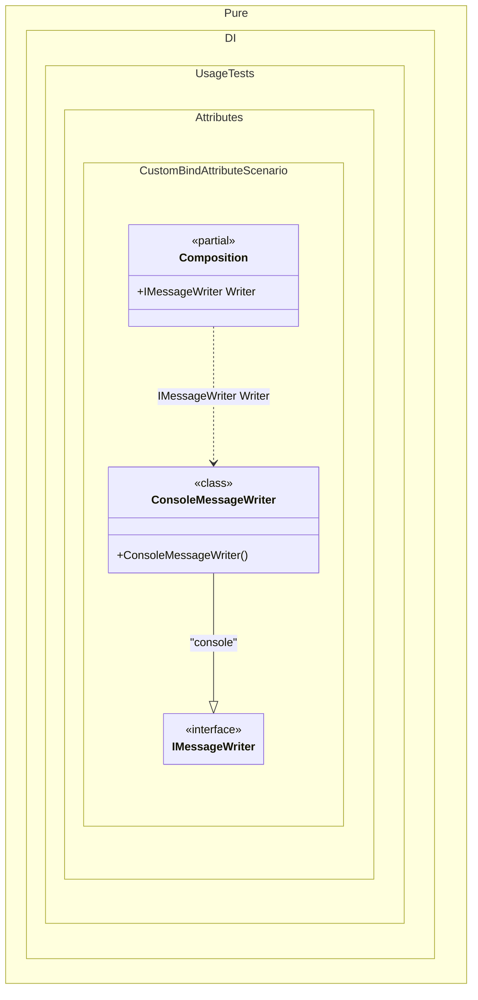

#### Custom bind attribute

Shows how to declare a binding directly on an implementation type with a custom attribute. A custom attribute can combine contract type, lifetime, and tag metadata by registering argument positions in the composition setup.


```c#
using Shouldly;
using Pure.DI;

DI.Setup(nameof(Composition))
    .TypeAttribute<ServiceAttribute<TT>>()
    .LifetimeAttribute<ServiceAttribute<TT>>()
    .TagAttribute<ServiceAttribute<TT>>(1)

    // Composition root
    .Root<IMessageWriter>("Writer", "console");

var composition = new Composition();
var writer = composition.Writer;
writer.Write("Pure.DI");

writer.ShouldBeOfType<ConsoleMessageWriter>();
writer.ShouldBeSameAs(composition.Writer);

[AttributeUsage(AttributeTargets.Class, AllowMultiple = true)]
class ServiceAttribute<T> : Attribute
{
    public ServiceAttribute(
        Lifetime lifetime = Lifetime.Transient,
        object? tag = null)
    {
    }
}

interface IMessageWriter
{
    void Write(string message);
}

[Service<IMessageWriter>(Lifetime.Singleton, "console")]
class ConsoleMessageWriter : IMessageWriter
{
    public void Write(string message) => Console.WriteLine(message);
}
```

<details>
<summary>Running this code sample locally</summary>

- Make sure you have the [.NET SDK 10.0](https://dotnet.microsoft.com/en-us/download/dotnet/10.0) or later installed
```bash
dotnet --list-sdk
```
- Create a net10.0 (or later) console application
```bash
dotnet new console -n Sample
```
- Add references to the NuGet packages
  - [Pure.DI](https://www.nuget.org/packages/Pure.DI)
  - [Shouldly](https://www.nuget.org/packages/Shouldly)
```bash
dotnet add package Pure.DI
dotnet add package Shouldly
```
- Copy the example code into the _Program.cs_ file

You are ready to run the example 🚀
```bash
dotnet run
```

</details>

>[!NOTE]
>Implementation-level binding attributes are useful when the implementation assembly should describe its DI role while keeping the composition concise. Custom attributes participate in the same merge rules as the built-in `Bind`, `Type`, `Tag`, and `Lifetime` attributes: attributes in one square-bracket group form one binding, while separate `Bind` groups create separate bindings.

<details>
<summary>The following partial class will be generated</summary>

```c#
partial class Composition
{
#if NET9_0_OR_GREATER
  private readonly Lock _lock = new Lock();
#else
  private readonly Object _lock = new Object();
#endif

  private ConsoleMessageWriter? _singletonConsoleMessageWriter2147482531;

  public IMessageWriter Writer
  {
    [MethodImpl(MethodImplOptions.AggressiveInlining)]
    get
    {
      if (_singletonConsoleMessageWriter2147482531 is null)
        lock (_lock)
          if (_singletonConsoleMessageWriter2147482531 is null)
          {
            _singletonConsoleMessageWriter2147482531 = new ConsoleMessageWriter();
          }

      return _singletonConsoleMessageWriter2147482531;
    }
  }
}
```

</details>

Class diagram:



See also:

- [Bind attribute](bind-attribute.md)

