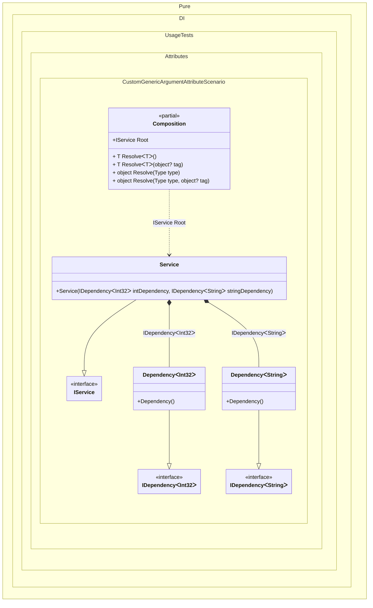

#### Custom generic argument attribute

[](../tests/Pure.DI.UsageTests/Attributes/CustomGenericArgumentAttributeScenario.cs)


```c#
using Pure.DI;
using Shouldly;

DI.Setup(nameof(Composition))
    // Registers custom generic argument
    .GenericTypeArgumentAttribute<MyGenericTypeArgumentAttribute>()
    .Bind<IDependency<TTMy>>().To<Dependency<TTMy>>()
    .Bind<IService>().To<Service>()

    // Composition root
    .Root<IService>("Root");

var composition = new Composition();
var service = composition.Root;
service.IntDependency.ShouldBeOfType<Dependency<int>>();
service.StringDependency.ShouldBeOfType<Dependency<string>>();

[AttributeUsage(AttributeTargets.Interface | AttributeTargets.Class | AttributeTargets.Struct)]
class MyGenericTypeArgumentAttribute : Attribute;

[MyGenericTypeArgument]
interface TTMy;

interface IDependency<T>;

class Dependency<T> : IDependency<T>;

interface IService
{
    IDependency<int> IntDependency { get; }

    IDependency<string> StringDependency { get; }
}

class Service(
    IDependency<int> intDependency,
    IDependency<string> stringDependency)
    : IService
{
    public IDependency<int> IntDependency { get; } = intDependency;

    public IDependency<string> StringDependency { get; } = stringDependency;
}
```


Class diagram:



