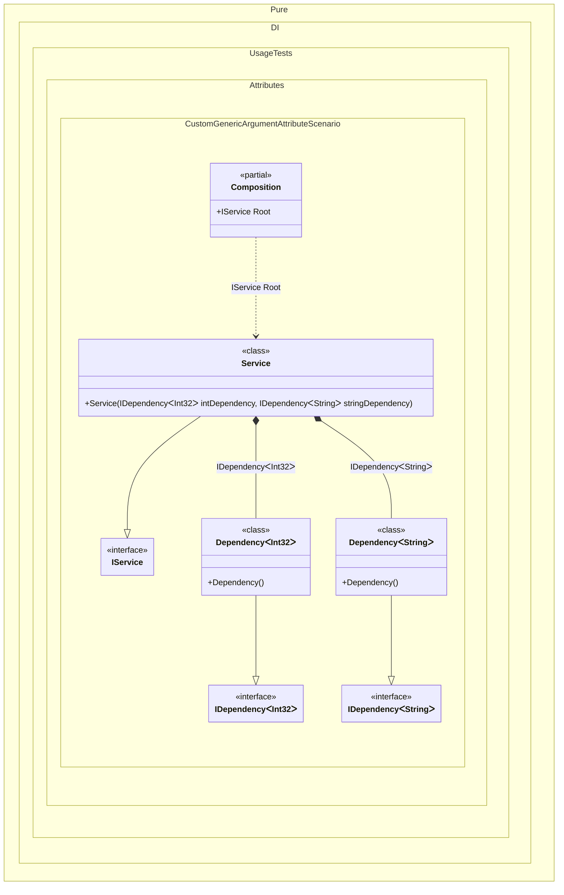

#### Custom generic argument attribute


```c#
using Shouldly;
using Pure.DI;

DI.Setup(nameof(Composition))
    // Registers custom generic argument
    .GenericTypeArgumentAttribute<MyGenericTypeArgumentAttribute>()
    .Bind<IDependency<TTMy>>().To<Dependency<TTMy>>()
    .Bind<IService>().To<Service>()

    // Composition root
    .Root<IService>("Root");

var composition = new Composition();
var service = composition.Root;
service.IntDependency.ShouldBeOfType<Dependency<int>>();
service.StringDependency.ShouldBeOfType<Dependency<string>>();

[AttributeUsage(AttributeTargets.Interface | AttributeTargets.Class | AttributeTargets.Struct)]
class MyGenericTypeArgumentAttribute : Attribute;

[MyGenericTypeArgument]
interface TTMy;

interface IDependency<T>;

class Dependency<T> : IDependency<T>;

interface IService
{
    IDependency<int> IntDependency { get; }

    IDependency<string> StringDependency { get; }
}

class Service(
    IDependency<int> intDependency,
    IDependency<string> stringDependency)
    : IService
{
    public IDependency<int> IntDependency { get; } = intDependency;

    public IDependency<string> StringDependency { get; } = stringDependency;
}
```

<details>
<summary>Running this code sample locally</summary>

- Make sure you have the [.NET SDK 9.0](https://dotnet.microsoft.com/en-us/download/dotnet/9.0) or later is installed
```bash
dotnet --list-sdk
```
- Create a net9.0 (or later) console application
```bash
dotnet new console -n Sample
```
- Add references to NuGet packages
  - [Pure.DI](https://www.nuget.org/packages/Pure.DI)
  - [Shouldly](https://www.nuget.org/packages/Shouldly)
```bash
dotnet add package Pure.DI
dotnet add package Shouldly
```
- Copy the example code into the _Program.cs_ file

You are ready to run the example 🚀
```bash
dotnet run
```

</details>

The following partial class will be generated:

```c#
partial class Composition
{
  [OrdinalAttribute(256)]
  public Composition()
  {
  }

  internal Composition(Composition parentScope)
  {
  }

  public IService Root
  {
    [MethodImpl(MethodImplOptions.AggressiveInlining)]
    get
    {
      return new Service(new Dependency<int>(), new Dependency<string>());
    }
  }
}
```

Class diagram:



