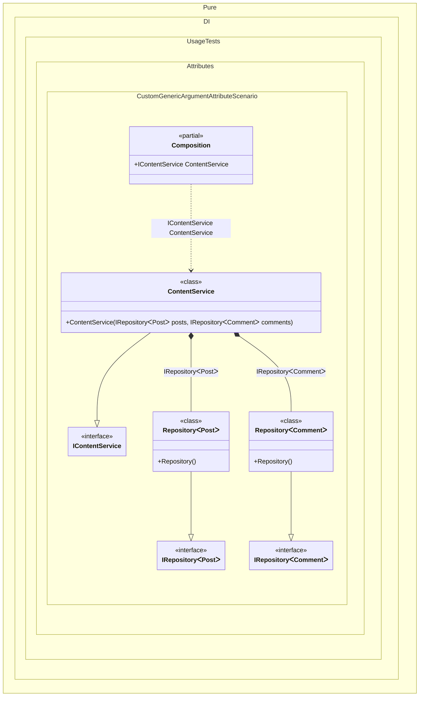

#### Custom generic argument attribute

Besides the built-in `TT` marker types, you can define your own generic type argument markers. Register a custom attribute with `GenericTypeArgumentAttribute<T>()`, apply it to a marker type like `TMy`, and use that marker in bindings: a single `Bind<IRepository<TMy>>().To<Repository<TMy>>()` then resolves `IRepository<T>` for any `T`, such as `IRepository<Post>` and `IRepository<Comment>`.


```c#
using Shouldly;
using Pure.DI;

DI.Setup(nameof(Composition))
    // Registers custom generic argument
    .GenericTypeArgumentAttribute<GenericArgAttribute>()
    .Bind<IRepository<TMy>>().To<Repository<TMy>>()
    .Bind<IContentService>().To<ContentService>()

    // Composition root
    .Root<IContentService>("ContentService");

var composition = new Composition();
var service = composition.ContentService;
service.Posts.ShouldBeOfType<Repository<Post>>();
service.Comments.ShouldBeOfType<Repository<Comment>>();

[AttributeUsage(AttributeTargets.Interface | AttributeTargets.Class | AttributeTargets.Struct)]
class GenericArgAttribute : Attribute;

[GenericArg]
interface TMy;

interface IRepository<T>;

class Repository<T> : IRepository<T>;

class Post;

class Comment;

interface IContentService
{
    IRepository<Post> Posts { get; }

    IRepository<Comment> Comments { get; }
}

class ContentService(
    IRepository<Post> posts,
    IRepository<Comment> comments)
    : IContentService
{
    public IRepository<Post> Posts { get; } = posts;

    public IRepository<Comment> Comments { get; } = comments;
}
```

<details>
<summary>Running this code sample locally</summary>

- Make sure you have the [.NET SDK 10.0](https://dotnet.microsoft.com/en-us/download/dotnet/10.0) or later installed
```bash
dotnet --list-sdk
```
- Create a net10.0 (or later) console application
```bash
dotnet new console -n Sample
```
- Add references to the NuGet packages
  - [Pure.DI](https://www.nuget.org/packages/Pure.DI)
  - [Shouldly](https://www.nuget.org/packages/Shouldly)
```bash
dotnet add package Pure.DI
dotnet add package Shouldly
```
- Copy the example code into the _Program.cs_ file

You are ready to run the example 🚀
```bash
dotnet run
```

</details>

>[!NOTE]
>Custom generic argument attributes are useful when you need to pass metadata specific to generic type parameters during binding resolution.

<details>
<summary>The following partial class will be generated</summary>

```c#
partial class Composition
{
  public IContentService ContentService
  {
    [MethodImpl(MethodImplOptions.AggressiveInlining)]
    get
    {
      return new ContentService(new Repository<Post>(), new Repository<Comment>());
    }
  }
}
```

</details>

Class diagram:


```mermaid
---
 config:
  class:
   hideEmptyMembersBox: true
---
classDiagram
	ContentService --|> IContentService
	RepositoryᐸPostᐳ --|> IRepositoryᐸPostᐳ
	RepositoryᐸCommentᐳ --|> IRepositoryᐸCommentᐳ
	Composition ..> ContentService : IContentService ContentService
	ContentService *-- RepositoryᐸPostᐳ : IRepositoryᐸPostᐳ
	ContentService *-- RepositoryᐸCommentᐳ : IRepositoryᐸCommentᐳ
	namespace Pure.DI.UsageTests.Attributes.CustomGenericArgumentAttributeScenario {
		class Composition {
		<<partial>>
		+IContentService ContentService
		}
		class ContentService {
				<<class>>
			+ContentService(IRepositoryᐸPostᐳ posts, IRepositoryᐸCommentᐳ comments)
		}
		class IContentService {
			<<interface>>
		}
		class IRepositoryᐸCommentᐳ {
			<<interface>>
		}
		class IRepositoryᐸPostᐳ {
			<<interface>>
		}
		class RepositoryᐸCommentᐳ {
				<<class>>
			+Repository()
		}
		class RepositoryᐸPostᐳ {
				<<class>>
			+Repository()
		}
	}
```

See also:

- [Custom generic argument](custom-generic-argument.md)

