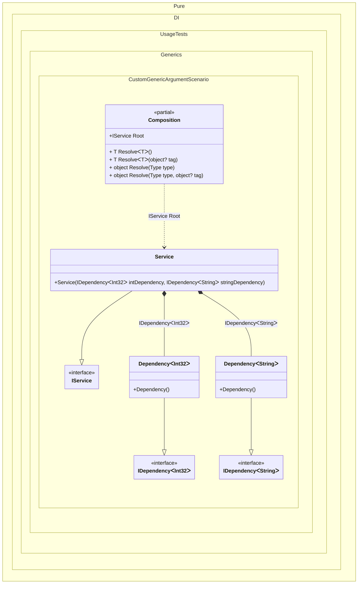

#### Custom generic argument

[](../tests/Pure.DI.UsageTests/Generics/CustomGenericArgumentScenario.cs)


```c#
using Shouldly;
using Pure.DI;

DI.Setup(nameof(Composition))
    // Registers custom generic argument
    .GenericTypeArgument<TTMy>()
    .Bind<IDependency<TTMy>>().To<Dependency<TTMy>>()
    .Bind<IService>().To<Service>()

    // Composition root
    .Root<IService>("Root");

var composition = new Composition();
var service = composition.Root;
service.IntDependency.ShouldBeOfType<Dependency<int>>();
service.StringDependency.ShouldBeOfType<Dependency<string>>();

interface TTMy;

interface IDependency<T>;

class Dependency<T> : IDependency<T>;

interface IService
{
    IDependency<int> IntDependency { get; }

    IDependency<string> StringDependency { get; }
}

class Service(
    IDependency<int> intDependency,
    IDependency<string> stringDependency)
    : IService
{
    public IDependency<int> IntDependency { get; } = intDependency;

    public IDependency<string> StringDependency { get; } = stringDependency;
}
```

<details>
<summary>Running this code sample locally</summary>

- Make sure you have the [.NET SDK 9.0](https://dotnet.microsoft.com/en-us/download/dotnet/9.0) or later is installed
- Create a net9.0 (or later) console application
- Add references to NuGet packages
  - [Pure.DI](https://www.nuget.org/packages/Pure.DI)
  - [Shouldly](https://www.nuget.org/packages/Shouldly)
- Copy the example code into the _Program.cs_ file

You are ready to run the example!

</details>


Class diagram:



