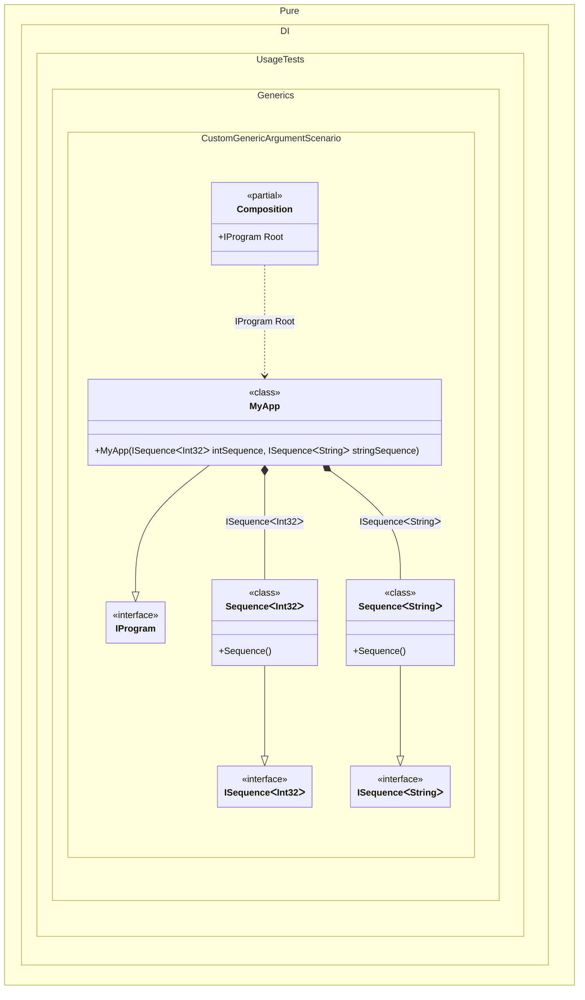

#### Custom generic argument


```c#
using Shouldly;
using Pure.DI;

DI.Setup(nameof(Composition))
    // Registers the "MyTT" interface as a custom generic type argument
    // to be used as a marker for generic bindings
    .GenericTypeArgument<MyTT>()
    .Bind<ISequence<MyTT>>().To<Sequence<MyTT>>()
    .Bind<IProgram>().To<MyApp>()

    // Composition root
    .Root<IProgram>("Root");

var composition = new Composition();
var program = composition.Root;
program.IntSequence.ShouldBeOfType<Sequence<int>>();
program.StringSequence.ShouldBeOfType<Sequence<string>>();

// Defines a custom generic type argument marker
interface MyTT;

interface ISequence<T>;

class Sequence<T> : ISequence<T>;

interface IProgram
{
    ISequence<int> IntSequence { get; }

    ISequence<string> StringSequence { get; }
}

class MyApp(
    ISequence<int> intSequence,
    ISequence<string> stringSequence)
    : IProgram
{
    public ISequence<int> IntSequence { get; } = intSequence;

    public ISequence<string> StringSequence { get; } = stringSequence;
}
```

<details>
<summary>Running this code sample locally</summary>

- Make sure you have the [.NET SDK 10.0](https://dotnet.microsoft.com/en-us/download/dotnet/10.0) or later is installed
```bash
dotnet --list-sdk
```
- Create a net10.0 (or later) console application
```bash
dotnet new console -n Sample
```
- Add references to NuGet packages
  - [Pure.DI](https://www.nuget.org/packages/Pure.DI)
  - [Shouldly](https://www.nuget.org/packages/Shouldly)
```bash
dotnet add package Pure.DI
dotnet add package Shouldly
```
- Copy the example code into the _Program.cs_ file

You are ready to run the example 🚀
```bash
dotnet run
```

</details>

The following partial class will be generated:

```c#
partial class Composition
{
  public IProgram Root
  {
    [MethodImpl(MethodImplOptions.AggressiveInlining)]
    get
    {
      return new MyApp(new Sequence<int>(), new Sequence<string>());
    }
  }
}
```

Class diagram:



