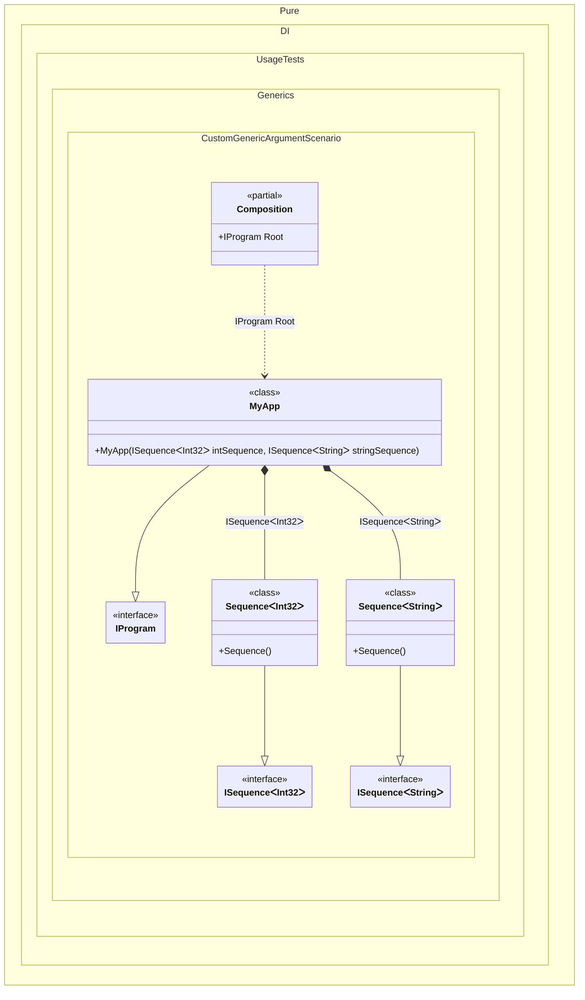

#### Custom generic argument

Besides the built-in marker types like `TT`, `TT1`, `TTS`, you can declare your own. Registering a type with `GenericTypeArgument<MyTT>()` turns it into a marker usable in generic bindings, such as `Bind<ISequence<MyTT>>().To<Sequence<MyTT>>()`.
Reach for this when the predefined markers are not enough — for example, to give markers meaningful names or specific type constraints.


```c#
using Shouldly;
using Pure.DI;

DI.Setup(nameof(Composition))
    // Registers the "MyTT" interface as a custom generic type argument
    // to be used as a marker for generic bindings
    .GenericTypeArgument<MyTT>()
    .Bind<ISequence<MyTT>>().To<Sequence<MyTT>>()
    .Bind<IProgram>().To<MyApp>()

    // Composition root
    .Root<IProgram>("Root");

var composition = new Composition();
var program = composition.Root;
program.IntSequence.ShouldBeOfType<Sequence<int>>();
program.StringSequence.ShouldBeOfType<Sequence<string>>();

// Defines a custom generic type argument marker
interface MyTT;

interface ISequence<T>;

class Sequence<T> : ISequence<T>;

interface IProgram
{
    ISequence<int> IntSequence { get; }

    ISequence<string> StringSequence { get; }
}

class MyApp(
    ISequence<int> intSequence,
    ISequence<string> stringSequence)
    : IProgram
{
    public ISequence<int> IntSequence { get; } = intSequence;

    public ISequence<string> StringSequence { get; } = stringSequence;
}
```

<details>
<summary>Running this code sample locally</summary>

- Make sure you have the [.NET SDK 10.0](https://dotnet.microsoft.com/en-us/download/dotnet/10.0) or later installed
```bash
dotnet --list-sdk
```
- Create a net10.0 (or later) console application
```bash
dotnet new console -n Sample
```
- Add references to the NuGet packages
  - [Pure.DI](https://www.nuget.org/packages/Pure.DI)
  - [Shouldly](https://www.nuget.org/packages/Shouldly)
```bash
dotnet add package Pure.DI
dotnet add package Shouldly
```
- Copy the example code into the _Program.cs_ file

You are ready to run the example 🚀
```bash
dotnet run
```

</details>

>[!NOTE]
>Custom generic arguments provide flexibility for complex generic scenarios beyond standard marker types.

<details>
<summary>The following partial class will be generated</summary>

```c#
partial class Composition
{
  public IProgram Root
  {
    [MethodImpl(MethodImplOptions.AggressiveInlining)]
    get
    {
      return new MyApp(new Sequence<int>(), new Sequence<string>());
    }
  }
}
```

</details>

Class diagram:


```mermaid
---
 config:
  class:
   hideEmptyMembersBox: true
---
classDiagram
	MyApp --|> IProgram
	SequenceᐸInt32ᐳ --|> ISequenceᐸInt32ᐳ
	SequenceᐸStringᐳ --|> ISequenceᐸStringᐳ
	Composition ..> MyApp : IProgram Root
	MyApp *-- SequenceᐸInt32ᐳ : ISequenceᐸInt32ᐳ
	MyApp *-- SequenceᐸStringᐳ : ISequenceᐸStringᐳ
	namespace Pure.DI.UsageTests.Generics.CustomGenericArgumentScenario {
		class Composition {
		<<partial>>
		+IProgram Root
		}
		class IProgram {
			<<interface>>
		}
		class ISequenceᐸInt32ᐳ {
			<<interface>>
		}
		class ISequenceᐸStringᐳ {
			<<interface>>
		}
		class MyApp {
				<<class>>
			+MyApp(ISequenceᐸInt32ᐳ intSequence, ISequenceᐸStringᐳ stringSequence)
		}
		class SequenceᐸInt32ᐳ {
				<<class>>
			+Sequence()
		}
		class SequenceᐸStringᐳ {
				<<class>>
			+Sequence()
		}
	}
```

See also:

- [Custom generic argument attribute](custom-generic-argument-attribute.md)
- [Generics](generics.md)

