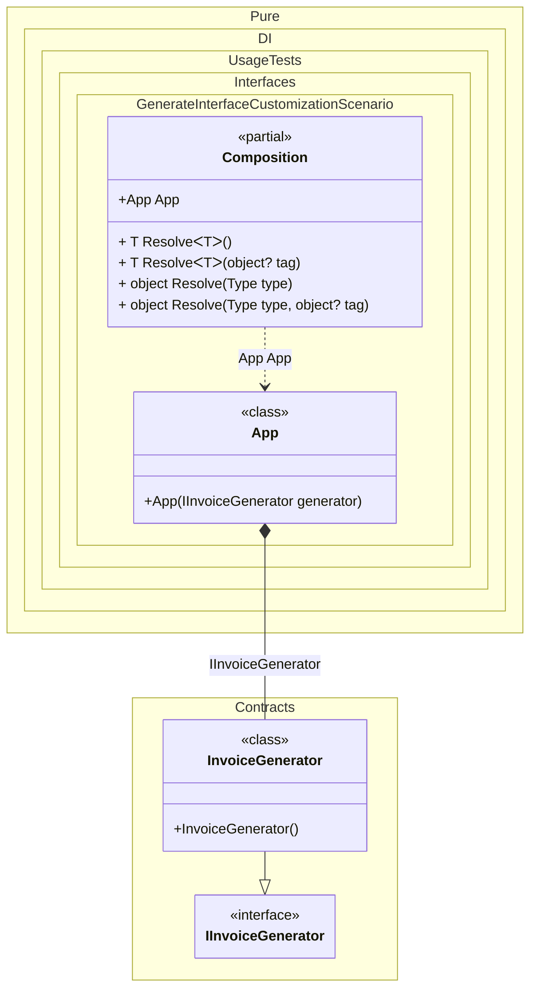

#### Customize the generated interface

This example shows how to place a generated contract in a dedicated Contracts namespace.


```c#
using Pure.DI;

DI.Setup(nameof(Composition))
    .Bind().To<InvoiceGenerator>()
    .Root<App>(nameof(App));

var composition = new Composition();
var app = composition.App;

app.InvoiceId.ShouldBe("INV-0042");

public class App(IMyInvoiceGenerator generator)
{
    public string InvoiceId { get; } = generator.Format(42);
}

namespace Contracts
{
    public partial interface IMyInvoiceGenerator;

    [GenerateInterface(namespaceName: "Contracts", interfaceName: nameof(IMyInvoiceGenerator))]
    public class InvoiceGenerator : IMyInvoiceGenerator
    {
        public string Format(int number) => $"INV-{number:0000}";
    }
}
```

<details>
<summary>Running this code sample locally</summary>

- Make sure you have the [.NET SDK 10.0](https://dotnet.microsoft.com/en-us/download/dotnet/10.0) or later installed
```bash
dotnet --list-sdk
```
- Create a net10.0 (or later) console application
```bash
dotnet new console -n Sample
```
- Add a reference to the NuGet package
  - [Pure.DI](https://www.nuget.org/packages/Pure.DI)
```bash
dotnet add package Pure.DI
```
- Copy the example code into the _Program.cs_ file

You are ready to run the example 🚀
```bash
dotnet run
```

</details>

The example shows how to:
- Generate an interface into a custom namespace
- Rename the generated interface
- Keep the contract separate from implementation details


Class diagram:



