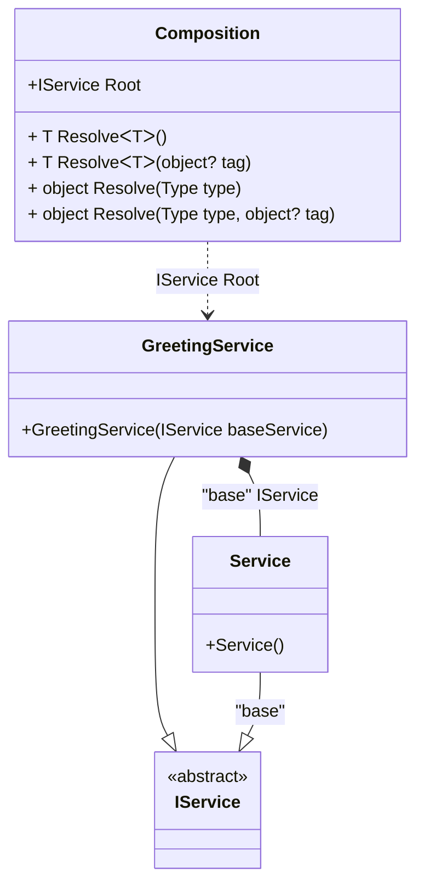

#### Decorator

[](../tests/Pure.DI.UsageTests/Interception/DecoratorScenario.cs)

_Decorator_ is a well-known and useful design pattern. It is convenient to use tagged dependencies to build a chain of nested decorators, as in the example below:

```c#
interface IService { string GetMessage(); }

class Service : IService
{
    public string GetMessage() => "Hello World";
}

class GreetingService : IService
{
    private readonly IService _baseService;

    public GreetingService([Tag("base")] IService baseService) =>
        _baseService = baseService;

    public string GetMessage() => $"{_baseService.GetMessage()} !!!";
}


DI.Setup("Composition")
    .Bind<IService>("base").To<Service>()
    .Bind<IService>().To<GreetingService>().Root<IService>("Root");

var composition = new Composition();
var service = composition.Root;
service.GetMessage().ShouldBe("Hello World !!!");
```

<details open>
<summary>Class Diagram</summary>



</details>

<details>
<summary>Pure.DI-generated partial class Composition</summary><blockquote>

```c#
partial class Composition
{
  private readonly System.IDisposable[] _disposableSingletonsM09D23di;
  
  public Composition()
  {
    _disposableSingletonsM09D23di = new System.IDisposable[0];
  }
  
  internal Composition(Composition parent)
  {
    _disposableSingletonsM09D23di = new System.IDisposable[0];
  }
  
  #region Composition Roots
  public Pure.DI.UsageTests.Interception.DecoratorScenario.IService Root
  {
    [global::System.Runtime.CompilerServices.MethodImpl((global::System.Runtime.CompilerServices.MethodImplOptions)0x300)]
    get
    {
      var transientM09D23di121 = new Pure.DI.UsageTests.Interception.DecoratorScenario.Service();
      var transientM09D23di120 = new Pure.DI.UsageTests.Interception.DecoratorScenario.GreetingService(transientM09D23di121);
      return transientM09D23di120;
    }
  }
  #endregion
  
  #region API
  #if NETSTANDARD2_0_OR_GREATER || NETCOREAPP || NET40_OR_GREATER
  [global::System.Diagnostics.Contracts.Pure]
  #endif
  [global::System.Runtime.CompilerServices.MethodImpl((global::System.Runtime.CompilerServices.MethodImplOptions)0x300)]
  public T Resolve<T>()
  {
    return ResolverM09D23di<T>.Value.Resolve(this);
  }
  
  #if NETSTANDARD2_0_OR_GREATER || NETCOREAPP || NET40_OR_GREATER
  [global::System.Diagnostics.Contracts.Pure]
  #endif
  [global::System.Runtime.CompilerServices.MethodImpl((global::System.Runtime.CompilerServices.MethodImplOptions)0x300)]
  public T Resolve<T>(object? tag)
  {
    return ResolverM09D23di<T>.Value.ResolveByTag(this, tag);
  }
  
  #if NETSTANDARD2_0_OR_GREATER || NETCOREAPP || NET40_OR_GREATER
  [global::System.Diagnostics.Contracts.Pure]
  #endif
  [global::System.Runtime.CompilerServices.MethodImpl((global::System.Runtime.CompilerServices.MethodImplOptions)0x300)]
  public object Resolve(global::System.Type type)
  {
    var index = (int)(_bucketSizeM09D23di * ((uint)global::System.Runtime.CompilerServices.RuntimeHelpers.GetHashCode(type) % 1));
    var finish = index + _bucketSizeM09D23di;
    do {
      ref var pair = ref _bucketsM09D23di[index];
      if (ReferenceEquals(pair.Key, type))
      {
        return pair.Value.Resolve(this);
      }
    } while (++index < finish);
    
    throw new global::System.InvalidOperationException($"Cannot resolve composition root of type {type}.");
  }
  
  #if NETSTANDARD2_0_OR_GREATER || NETCOREAPP || NET40_OR_GREATER
  [global::System.Diagnostics.Contracts.Pure]
  #endif
  [global::System.Runtime.CompilerServices.MethodImpl((global::System.Runtime.CompilerServices.MethodImplOptions)0x300)]
  public object Resolve(global::System.Type type, object? tag)
  {
    var index = (int)(_bucketSizeM09D23di * ((uint)global::System.Runtime.CompilerServices.RuntimeHelpers.GetHashCode(type) % 1));
    var finish = index + _bucketSizeM09D23di;
    do {
      ref var pair = ref _bucketsM09D23di[index];
      if (ReferenceEquals(pair.Key, type))
      {
        return pair.Value.ResolveByTag(this, tag);
      }
    } while (++index < finish);
    
    throw new global::System.InvalidOperationException($"Cannot resolve composition root \"{tag}\" of type {type}.");
  }
  #endregion
  
  public override string ToString()
  {
    return
      "classDiagram\n" +
        "  class Composition {\n" +
          "    +IService Root\n" +
          "    + T ResolveᐸTᐳ()\n" +
          "    + T ResolveᐸTᐳ(object? tag)\n" +
          "    + object Resolve(Type type)\n" +
          "    + object Resolve(Type type, object? tag)\n" +
        "  }\n" +
        "  GreetingService --|> IService : \n" +
        "  class GreetingService {\n" +
          "    +GreetingService(IService baseService)\n" +
        "  }\n" +
        "  Service --|> IService : \"base\" \n" +
        "  class Service {\n" +
          "    +Service()\n" +
        "  }\n" +
        "  class IService {\n" +
          "    <<abstract>>\n" +
        "  }\n" +
        "  GreetingService *--  Service : \"base\"  IService\n" +
        "  Composition ..> GreetingService : IService Root";
  }
  
  private readonly static int _bucketSizeM09D23di;
  private readonly static global::Pure.DI.Pair<global::System.Type, global::Pure.DI.IResolver<Composition, object>>[] _bucketsM09D23di;
  
  static Composition()
  {
    var valResolverM09D23di_0000 = new ResolverM09D23di_0000();
    ResolverM09D23di<Pure.DI.UsageTests.Interception.DecoratorScenario.IService>.Value = valResolverM09D23di_0000;
    _bucketsM09D23di = global::Pure.DI.Buckets<global::System.Type, global::Pure.DI.IResolver<Composition, object>>.Create(
      1,
      out _bucketSizeM09D23di,
      new global::Pure.DI.Pair<global::System.Type, global::Pure.DI.IResolver<Composition, object>>[1]
      {
         new global::Pure.DI.Pair<global::System.Type, global::Pure.DI.IResolver<Composition, object>>(typeof(Pure.DI.UsageTests.Interception.DecoratorScenario.IService), valResolverM09D23di_0000)
      });
  }
  
  #region Resolvers
  private sealed class ResolverM09D23di<T>: global::Pure.DI.IResolver<Composition, T>
  {
    public static global::Pure.DI.IResolver<Composition, T> Value = new ResolverM09D23di<T>();
    
    public T Resolve(Composition composite)
    {
      throw new global::System.InvalidOperationException($"Cannot resolve composition root of type {typeof(T)}.");
    }
    
    public T ResolveByTag(Composition composite, object tag)
    {
      throw new global::System.InvalidOperationException($"Cannot resolve composition root \"{tag}\" of type {typeof(T)}.");
    }
  }
  
  private sealed class ResolverM09D23di_0000: global::Pure.DI.IResolver<Composition, Pure.DI.UsageTests.Interception.DecoratorScenario.IService>
  {
    [global::System.Runtime.CompilerServices.MethodImpl((global::System.Runtime.CompilerServices.MethodImplOptions)0x300)]
    public Pure.DI.UsageTests.Interception.DecoratorScenario.IService Resolve(Composition composition)
    {
      return composition.Root;
    }
    
    [global::System.Runtime.CompilerServices.MethodImpl((global::System.Runtime.CompilerServices.MethodImplOptions)0x300)]
    public Pure.DI.UsageTests.Interception.DecoratorScenario.IService ResolveByTag(Composition composition, object tag)
    {
      if (Equals(tag, null)) return composition.Root;
      throw new global::System.InvalidOperationException($"Cannot resolve composition root \"{tag}\" of type Pure.DI.UsageTests.Interception.DecoratorScenario.IService.");
    }
  }
  #endregion
}
```

</blockquote></details>


Here an instance of the _Service_ type, labeled _"base"_, is embedded in the decorator _DecoratorService_. You can use any tag that semantically reflects the feature of the abstraction being embedded. The tag can be a constant, a type, or a value of an enumerated type.
